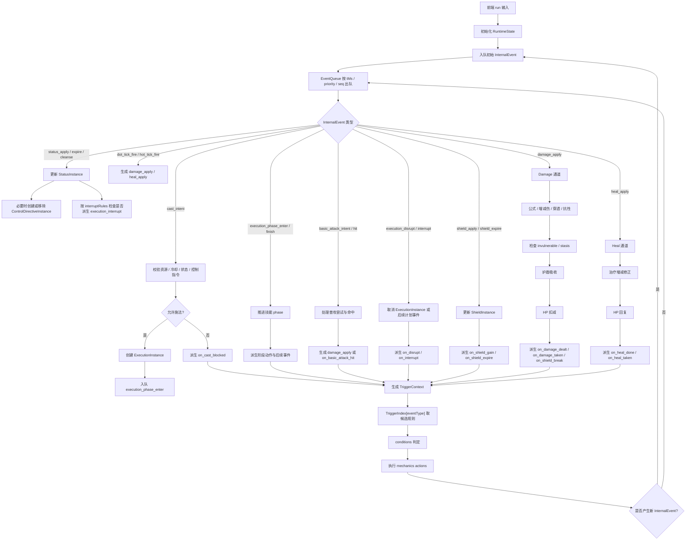

# WASM 内部事件流转概要设计（V2 草案）

## 1. 目标

本文重新整理 WASM 内部“事件如何流动与联动”的统一设计，覆盖当前已经规划的核心机制：

- 技能施法与阶段状态机
- 普攻与命中后联动
- 伤害 / 治疗 / 属性增减 / 护盾四通道
- 控制状态、强制行为、免控、解控、瞬时打断
- DoT / HoT / 护盾过期等持续效果调度

前提：

- 只做 1v1 纯伤害模拟
- 前端只负责组装输入，WASM 负责内部执行
- 事件流要服务于“可配置、可回放、可跨游戏切换规则”的引擎目标

---

## 2. 设计边界

本文只定义：

- 引擎内部运行时容器
- 事件队列与分发机制
- 关键内部事件与外部触发事件
- 几条核心结算链路

本文不展开：

- 公式 DSL 细节
- 具体 DB schema
- UI / Worker 协议细节

相关文档：

- [引擎协议与数据结构.md](/c:/project/damage_viewer_project_planning/wasm/引擎协议与数据结构.md)
- [概要设计-控制与打断状态机制.md](/c:/project/damage_viewer_project_planning/wasm/概要设计-控制与打断状态机制.md)
- [概要设计-护盾机制与跨游戏规则.md](/c:/project/damage_viewer_project_planning/wasm/概要设计-护盾机制与跨游戏规则.md)

---

## 3. 总体思路

引擎内部采用统一的事件驱动模型：

1. 外部输入先转为内部过程事件
2. 事件修改运行时状态，必要时继续入队新的内部事件
3. 当内部事件完成一次“语义稳定的状态变化”后，再派生出外部可见触发事件
4. 配置层只订阅外部触发事件，不直接操作内部过程事件

核心收益：

- 技能、被动、装备、状态、护盾、持续效果都复用同一事件总线
- 控制、打断、护盾、治疗不需要散落在不同分支里特判
- 事件顺序稳定，可复现，可回放

### 3.1 内部事件流总览图



说明：

- 配置层只订阅 `TriggerEvent`，不直接处理 `InternalEvent`
- `damage / heal / shield / status / execution` 都通过同一个事件队列推进
- 所有联动最终都回到“动作生成新内部事件，再次入队”的闭环

---

## 4. 运行时核心模型

## 4.1 `RuntimeState`

推荐运行时至少包含以下容器：

```ts
type RuntimeState = {
  combatants: Record<string, CombatantRuntime>
  cooldowns: Record<string, CooldownState>
  stacks: Record<string, StackState>
  modifiers: ModifierInstance[]
  dotInstances: DotInstance[]

  statusInstances: StatusInstance[]
  controlDirectives: ControlDirectiveInstance[]
  activeExecutions: ExecutionInstance[]
}

type CombatantRuntime = {
  attrs: Record<string, number>
  hp: number
  resource?: number
  shields: ShieldInstance[]
}
```

语义分工：

- `combatants`：单位当前属性快照、资源、生命、护盾实例
- `cooldowns`：技能冷却与充能
- `stacks`：独立叠层系统
- `modifiers`：属性修正类持续效果
- `dotInstances`：持续伤害 / 持续治疗实例
- `statusInstances`：控制、免控、沉默、眩晕、压制等状态
- `controlDirectives`：`fear / taunt / charm / airborne` 这类强制行为 / 强制位移组件
- `activeExecutions`：当前执行中的技能实例

## 4.2 `EventQueue`

内部事件队列使用最小堆：

- 排序键：`(tMs, priority, seq)`
- `tMs`：事件发生时刻
- `priority`：同刻事件优先级
- `seq`：全局递增序号，保证稳定顺序

要求：

- 同一输入下事件出队顺序稳定
- 所有自动派生事件都必须显式入队，不能隐式递归执行

## 4.3 `TriggerIndex`

初始化时把全部 `mechanicsConfig.triggers` 编译为索引：

```ts
type TriggerIndex = Record<string, TriggerRuleRef[]>
```

`TriggerRuleRef` 至少记录：

- 来源：英雄 / 装备 / 被动 / 其他 ownerType
- 事件类型
- 条件树
- 动作列表

作用：

- 降低每次事件分发时的扫描成本
- 保持“事件 -> 候选规则”的稳定查找路径

---

## 5. 事件类型分层

## 5.1 外部可见触发事件（配置层可订阅）

这些事件用于被 `mechanics_config.triggers` 订阅：

```ts
type TriggerEvent =
  | { type: "on_spell_cast" }
  | { type: "on_basic_attack_hit" }
  | { type: "on_damage_dealt" }
  | { type: "on_damage_taken" }
  | { type: "on_heal_done" }
  | { type: "on_heal_taken" }
  | { type: "on_shield_gain" }
  | { type: "on_shield_break" }
  | { type: "on_shield_expire" }
  | { type: "on_tick"; tickKey: string }
  | { type: "on_stack_change"; stackId: string }
  | { type: "on_cast_blocked" }
  | { type: "on_disrupt" }
  | { type: "on_interrupt" }
  | { type: "on_channel_start" }
  | { type: "on_channel_end" }
  | { type: "on_status_gain" }
  | { type: "on_status_expire" }
  | { type: "on_status_cleanse" }
```

说明：

- 外部可见事件是“配置语义稳定点”
- 配置层不直接感知 `cast_intent / damage_apply / shield_expire_internal` 这类内部过程事件

## 5.2 内部过程事件（引擎自用）

这些事件驱动状态推进，不直接暴露给配置层：

```ts
type InternalEvent =
  | { type: "cast_intent"; actorId: string; skillId: string }
  | { type: "execution_phase_enter"; executionId: string; phaseKey: string }
  | { type: "execution_phase_finish"; executionId: string; phaseKey: string }
  | { type: "basic_attack_intent"; actorId: string; targetId: string }
  | { type: "basic_attack_hit"; actorId: string; targetId: string }
  | { type: "damage_apply"; packet: DamagePacket }
  | { type: "heal_apply"; heal: HealPacket }
  | { type: "shield_apply"; shield: ShieldApplyRequest }
  | { type: "shield_expire"; instanceId: string }
  | { type: "status_apply"; status: StatusApplyRequest }
  | { type: "status_expire"; instanceId: string }
  | { type: "status_cleanse"; ownerId: string; cleanseTags: string[] }
  | { type: "directive_expire"; directiveId: string }
  | { type: "execution_disrupt"; targetId: string; effectTag: string }
  | { type: "execution_interrupt"; targetId: string; causeKind: "status_tag" | "effect_tag"; causeKey: string }
  | { type: "dot_tick_fire"; instanceId: string }
  | { type: "hot_tick_fire"; instanceId: string }
```

说明：

- 内部过程事件只负责推进引擎状态
- 是否派生出外部触发事件，由内部处理逻辑决定
- `HealPacket / ShieldApplyRequest / StatusApplyRequest` 等为内部逻辑对象占位，具体字段以对应机制文档为准

---

## 6. 统一分发机制

## 6.1 基本流程

每次循环执行：

1. 从 `EventQueue` 取出最早事件
2. 执行该事件的内部逻辑，修改 `RuntimeState`
3. 若该事件产出了“外部可见语义结果”，生成对应 `TriggerContext`
4. 根据 `TriggerIndex[eventType]` 取候选规则
5. 对规则逐条做 `conditions` 判定
6. 命中后执行 `actions`
7. `actions` 可继续修改状态或入队新的内部事件

## 6.2 关键约束

- 内部事件优先，外部触发后置
- 一次状态变化只在语义稳定后触发一次外部事件
- 同一个结果不要同时从多个内部事件重复触发

示例：

- `damage_apply` 完成护盾吸收和 HP 扣减后，再触发 `on_damage_dealt / on_damage_taken`
- `shield_expire` 移除实例后，再触发 `on_shield_expire`
- `execution_interrupt` 确定取消了哪些执行实例后，再触发 `on_interrupt`

---

## 7. 四通道与事件流关系

## 7.1 Damage 通道

职责：

- 处理所有会最终影响 HP 下降的效果

内部核心事件：

- `damage_apply`

标准管线：

1. 公式计算 `rawAmount`
2. 增减伤修正
3. 穿透 / 抗性结算，得到 `postMitigationAmount`
4. 检查 `invulnerable / stasis / untargetable` 等特殊状态
5. 检查 `ignoreShield`
6. 进入护盾吸收步骤
7. 剩余伤害结算到 HP
8. 触发：
   - `on_damage_dealt`
   - `on_damage_taken`
   - 必要时 `on_shield_break`

## 7.2 Heal 通道

职责：

- 处理直接治疗、HoT、吸血等生命回复

内部核心事件：

- `heal_apply`
- `hot_tick_fire`

标准管线：

1. 公式计算治疗量
2. 治疗增减修正
3. HP 回复并截断到上限
4. 触发：
   - `on_heal_done`
   - `on_heal_taken`

## 7.3 Modifier 通道

职责：

- 处理攻击力、法强、双抗、治疗增减等属性修正

内部核心事件：

- `apply_modifier`
- `modifier_expire`（若落地为内部事件）

说明：

- `modifier` 不走护盾
- `modifier` 本身通常不直接触发 damage/heal 事件

## 7.4 Shield 通道

职责：

- 处理护盾实例创建、刷新、叠加、过期、移除

内部核心事件：

- `shield_apply`
- `shield_expire`

外部触发事件：

- `on_shield_gain`
- `on_shield_break`
- `on_shield_expire`

说明：

- 护盾吸收步骤嵌在 damage 通道内部
- 护盾生命周期事件属于 shield 通道

---

## 8. 状态 / 控制 / 打断链路

## 8.1 状态进入链路

`status_apply` 的标准流程：

1. 解析 `StatusProfile`
2. 先做免控判定
3. 若未被免疫：
   - 创建 `StatusInstance`
   - 若配置了 `linkedDirective`，则创建 `ControlDirectiveInstance`
4. 派生：
   - `on_status_gain`
5. 根据 `interruptRules(causeKind = status_tag)` 判断是否继续触发 `execution_interrupt`

## 8.2 强制行为链路

适用对象：

- `fear / taunt / charm / berserk`
- `airborne` 的强制位移部分

流程：

1. 状态进入时创建 `ControlDirectiveInstance`
2. 若已存在同 `overrideGroup` directive，则旧 directive 结束
3. 若被要求执行的动作当前被禁用：
   - 不制造非法动作
   - 只保留“失去自由动作权”的语义
4. 到期后触发 `directive_expire`

## 8.3 瞬时打断链路

适用对象：

- `disrupt`

流程：

1. 某动作 / 效果发出 `execution_disrupt`
2. 不创建 `StatusInstance`
3. 直接按 `effect_tag` 查询 `interruptRules`
4. 派生 `execution_interrupt`
5. 触发 `on_disrupt`

## 8.4 执行打断链路

`execution_interrupt` 的标准流程：

1. 找到目标当前可打断的 `ExecutionInstance`
2. 按 `selection = highest_priority | all` 决定命中的实例集合
3. 标记 `state = cancelled`
4. 根据 `cancelScheduledOnInterrupt` 取消未来事件
5. 触发 `on_interrupt`

---

## 9. 技能生命周期链路

## 9.1 施法尝试

`cast_intent` 的标准流程：

1. 检查资源
2. 检查冷却
3. 检查施法者自身 `statusInstances + controlDirectives`
4. 读取技能的 `castPermission`
5. 若被拦截：
   - 触发 `on_cast_blocked`
   - 流程结束
6. 若通过：
   - 创建 `ExecutionInstance`
   - 入队 `execution_phase_enter`

## 9.2 阶段推进

`execution_phase_enter`：

1. 更新 `currentPhaseKey`
2. 执行该阶段 `onEnterEmit`
3. 若阶段种类为 `channel`，触发 `on_channel_start`
4. 若阶段有持续时间，则入队 `execution_phase_finish`

`execution_phase_finish`：

1. 执行该阶段 `onFinishEmit`
2. 若阶段正常结束且为 `channel`，触发 `on_channel_end`
3. 决定进入下一阶段、`cast_resolved` 或 `finished`

说明：

- `cast_resolved` 不是外部触发事件，而是内部生命周期语义点
- 外部 `on_spell_cast` 应在技能被接受并进入执行链路后触发一次

---

## 10. 普攻链路

## 10.1 普攻尝试

1. 入队 `basic_attack_intent`
2. 检查动作权限：
   - 是否被 `disarm / stun / suppression / taunt` 等影响
   - 是否存在允许或强制普攻的 directive
3. 若允许，安排命中时刻并入队 `basic_attack_hit`

## 10.2 普攻命中

1. 执行基础伤害的 `damage_apply`
2. 派生 `on_basic_attack_hit`
3. 命中后特效可继续：
   - 追加伤害
   - 附加状态
   - 添加护盾
   - 叠层变化

---

## 11. DoT / HoT / 持续效果调度

## 11.1 实例模型

持续效果不做“每毫秒扫描”，统一事件驱动：

- DoT：`dot_tick_fire`
- HoT：`hot_tick_fire`
- 持续护盾：通过 `shield_expire`
- 持续状态：通过 `status_expire`

## 11.2 结算循环

以 DoT 为例：

1. 事件到时执行 `dot_tick_fire`
2. 本次 tick 生成 `damage_apply`
3. 更新剩余次数 / 下次时刻
4. 若未结束，重新入队
5. 否则销毁实例

同理：

- HoT 生成 `heal_apply`
- 持续状态到期生成 `status_expire`
- 护盾到期生成 `shield_expire`

---

## 12. `TriggerContext` 建议

外部触发事件分发时，建议统一携带：

```ts
type TriggerContext = {
  tMs: number
  eventType: string
  sourceId: string
  sourceOwnerType?: string
  targetId?: string

  rawDamage?: number
  finalDamage?: number
  damageType?: string
  shieldAbsorbed?: number

  rawHeal?: number
  finalHeal?: number

  shieldKey?: string
  shieldAmount?: number
  shieldScope?: string

  statusId?: string
  statusTags?: string[]

  executionId?: string
  skillId?: string
  phaseKey?: string
}
```

要求：

- 同一种事件上下文字段稳定
- 不要求一次事件填满所有字段
- 只携带与该事件相关的最小必要信息

---

## 13. 一致性与可复现

要保证：

- 随机模式使用固定 `seed`
- 同刻事件按 `(priority, seq)` 稳定排序
- 同一 `bundle + input + seed` 结果一致
- 公式读取时机固定：快照或动态必须显式约定

额外建议：

- 对关键内部事件保留简化日志
- 至少能回放：
  - 技能进入哪个 phase
  - 哪次伤害被多少护盾吸收
  - 哪个状态导致了哪次打断

---

## 14. 当前版本建议优先级

1. 先打通 `cast_intent -> execution phase -> on_spell_cast`
2. 再打通 `damage / heal / modifier / shield` 四通道
3. 然后补 `status / controlDirective / interrupt`
4. 再实现 `DoT / HoT / shield_expire / status_expire`
5. 最后补齐日志与回放校验

---

## 15. 与现有文档关系

- 协议层： [引擎协议与数据结构.md](/c:/project/damage_viewer_project_planning/wasm/引擎协议与数据结构.md)
- 控制机制： [概要设计-控制与打断状态机制.md](/c:/project/damage_viewer_project_planning/wasm/概要设计-控制与打断状态机制.md)
- 护盾机制： [概要设计-护盾机制与跨游戏规则.md](/c:/project/damage_viewer_project_planning/wasm/概要设计-护盾机制与跨游戏规则.md)
- 规划层： `wasm/需要可以完成的挑战.md`

本文档定位：

- 定义 WASM 内部事件流转主线
- 作为“状态机制、护盾机制、四通道结算”之间的胶水文档
- 不单独承载公式和 DB 细节
