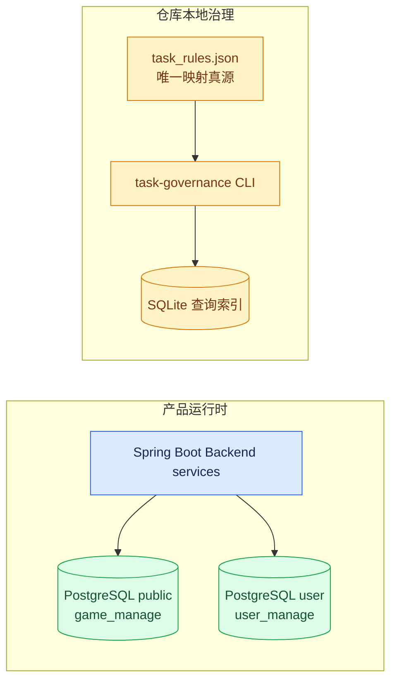
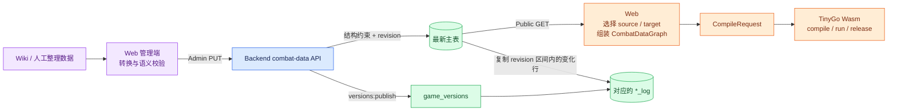
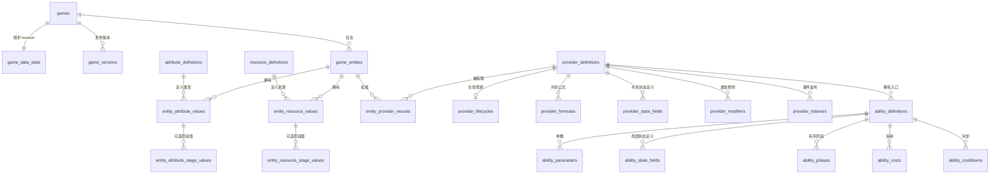
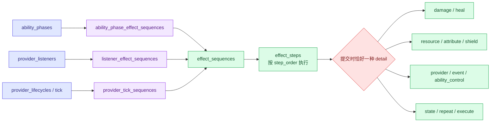
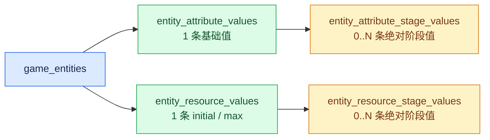
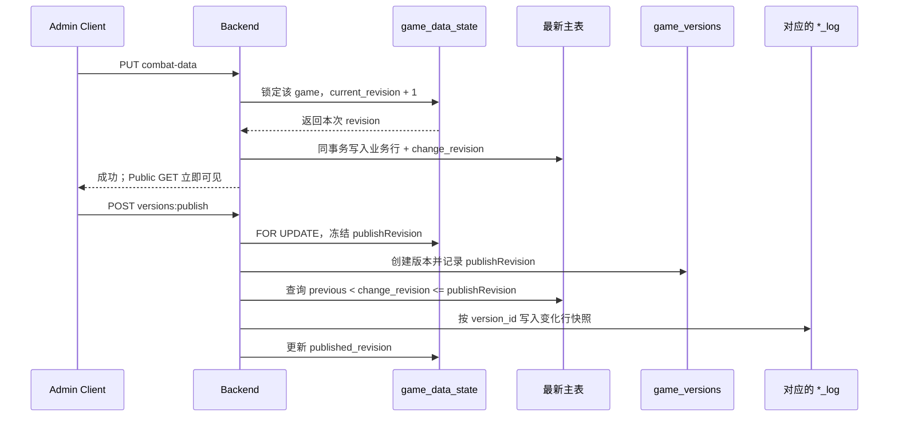

# Damage Viewer 数据库设计导览

本文面向第一次接手 Damage Viewer 数据层的开发者，回答三个问题：`db` 下各目录分别负责什么、`game_manage/schema.sql` 为什么会拆成这些表、数据怎样从编辑态进入 Web 和 Wasm。

本文是架构导览，不替代 DDL。字段、约束和默认值以当前仓库中的 [`game_manage/schema.sql`](game_manage/schema.sql) 与 [`game_manage/triggers.sql`](game_manage/triggers.sql) 为准；已部署数据库还可能受历史迁移影响，不能只凭本文判断线上结构。

更细的契约见：

- [通用 1v1 战斗数据模型替换方案](../文档记录/概要设计/server/通用1v1战斗数据模型替换方案.md)：模块边界和关键决策。
- [通用 1v1 战斗数据模型 DDL 与接口详细设计](../文档记录/详细设计/server/game_manage/通用1v1战斗数据模型DDL与接口详细设计.md)：表、字段、发布和接口契约。
- [后端接口定义](../文档记录/详细设计/server/game_manage/接口定义.md)：Public/Admin HTTP API。
- [Backend README](../server/data_manage/README.md)：启动、迁移和当前专项验证命令。

## 1. `db` 目录不是一套数据库

| 目录 | 数据库 / Schema | 谁使用 | 主要职责 |
| --- | --- | --- | --- |
| [`game_manage`](game_manage/) | PostgreSQL `public` | Backend 运行时 | 游戏元数据、通用 1v1 战斗数据、revision、发布记录 |
| [`user_manage`](user_manage/) | PostgreSQL `user` | 用户管理相关服务 | 账号、权限标记、编辑日志、PV/UV |
| [`task_doc_governance`](task_doc_governance/) | 本地 SQLite | 仓库治理工具 | 任务与文档映射的查询索引，不属于产品运行时 |



最重要的边界是：`task_doc_governance.sqlite` 只是从规则文件重建出来的本地索引，不能把它当成业务数据库，也不要直接修改。任务状态与文档映射的唯一真源是 [`task_doc_governance/task_rules.json`](task_doc_governance/task_rules.json)。

## 2. `game_manage` 想解决什么问题

早期按 hero、item、skill、status 分表的模型很容易把某一个游戏的分类方式写死，也容易把一整套机制塞进 JSON。当前模型改成通用战斗图，核心目标是：

1. **与实体类别解耦**：角色、装备、符文、强化、召唤物都先是 `game_entities`，具体类别由 type 关系表达。
2. **结构化保存机制**：Provider、Ability、Phase、Listener、Effect 等分别建模，便于细粒度读取、覆盖写、约束和发布。
3. **保留必要的开放结构**：递归公式 AST、事件 payload 等形状不稳定的内容仍使用 JSONB，避免为了“全关系化”制造大量脆弱表。
4. **编辑立即可见，发布可追溯**：主表保存最新状态；发布时把本次 revision 区间内的变化行复制到 `_log`。
5. **多游戏隔离**：大部分业务表按 `game_id` 做 PostgreSQL LIST 分区，稳定自然键也都带 `game_id`。
6. **明确执行边界**：数据库保存作者态结构，Web 负责语义校验和组装，TinyGo Wasm 负责实际计算；数据库不保存模拟 session 或运行态状态。

当前数据模型只面向通用 **1v1**。`self`、`opponent`、`source`、`target` 等 selector 是稳定词表；群体、空间、随机目标查询不在这套 DDL 的目标内。

## 3. 数据在系统中的位置



这张图解释了两个常见误区：

- `_log` 是发布时记录的**变化行快照**，不是 Web/Wasm 的直接输入，也不是每次 PUT 的事件流水。
- Backend 不生成 Bundle 或 Wasm Catalog。Web 从最新结构化数据中选择两个实体，完成命名空间、阶段值和机制图投影后才生成 `CompileRequest`。

## 4. 核心关系图

### 4.1 Entity、Provider 与 Ability



最常用的阅读链路是：

```text
Entity
  └─ entity_provider_mounts
       └─ Provider（一个完整机制）
            ├─ Formula / Lifecycle / State / Modifier / Listener
            └─ Ability（可执行入口）
                 └─ Phase / Cost / Cooldown
```

#### 为什么 Entity 挂 Provider，而不是直接挂 Ability

`Provider` 是一个可复用的**机制容器**，负责公式、共享状态、层数、持续时间、modifier、listener、tick 和一组 ability。`Ability` 是该机制内部的**可执行入口**，负责参数、施放条件、阶段、消耗和冷却。

这种分层让同一机制下的多个 Ability 可以共享计数器、层数和生命周期，也让整个机制能够作为一个整体被挂载、刷新或失效。Provider 同时提供稳定命名空间，避免不同机制中同名 Ability 或 formula 冲突。

### 4.2 Effect 执行图



这里没有使用 `owner_kind + owner_id` 这样的软引用。Ability phase、Listener 和 Provider tick 各自通过明确的桥接表连接 `effect_sequences`，Sequence 再拥有按 `step_order` 排序的 `effect_steps`。

每个 Step 的公共字段只描述 operation、target selector、condition 和顺序；不同 operation 的专属字段放入 11 个 detail 家族之一：

| Detail 家族 | 表达内容 |
| --- | --- |
| `damage_effect_details` / `heal_effect_details` | 伤害与治疗 |
| `resource_effect_details` / `attribute_effect_details` | 资源与属性变化 |
| `shield_effect_details` | 护盾引用、数值与持续时间 |
| `provider_effect_details` | Provider 应用、刷新、移除等动作 |
| `event_effect_details` | 事件类型、引用和开放 payload |
| `ability_control_effect_details` | Ability 冷却等控制动作 |
| `state_effect_details` | Provider/Ability 等作用域的状态变化 |
| `repeat_effect_details` | 有界重复触发 |
| `execute_effect_details` | 生命比例阈值处决 |

[`game_manage/triggers.sql`](game_manage/triggers.sql) 使用 `DEFERRABLE INITIALLY DEFERRED` 的 constraint trigger，在事务提交时检查每个 Step **恰好有一条** detail。延迟到提交时检查，是为了允许同一事务先写 Step 再写 Detail，或安全地更换 operation 家族，而不会在中间状态过早失败。

## 5. 主要表族速查

| 表族 | 关键表 | 设计意图 |
| --- | --- | --- |
| 游戏与 revision | `games`, `game_data_state`, `game_versions`, `game_progression_schema` | 游戏边界、成长阶段和发布边界 |
| 图片 | `images` | 保存小图标 Base64；业务行只保存同游戏 `image_uri` |
| 属性与资源 | `attribute_definitions`, `resource_definitions`, `entity_*_values`, `entity_*_stage_values` | 区分可修饰属性与可消耗资源，并支持可选成长阶段 |
| Type | `reserved_type`, `reserved_type_relation`, `types`, `type_relations` | 跨模块稳定词表、游戏内扩展和分类挂载 |
| Provider | `provider_definitions`, `provider_formulas`, `provider_lifecycles`, `provider_state_fields`, `entity_provider_mounts` | 完整机制及其共享状态、公式、生命周期和实体挂载 |
| Ability | `ability_definitions`, `ability_parameters`, `ability_state_fields`, `ability_phases`, `ability_costs`, `ability_cooldowns` | Provider 内部的执行入口及施放结构 |
| 被动反应 | `provider_modifiers`, `provider_listeners`, `listener_match_types` | 属性修饰、事件监听和 any/all/none type 匹配 |
| Effect | `effect_sequences`, `effect_steps`, 三类 owner 桥接表、11 类 detail 表 | 把触发来源连接到有序、可验证的操作序列 |
| 发布日志 | 各业务表对应的 `*_log` | 记录某次发布所包含的变化行状态 |

大部分业务表看起来都有一份“重复”的 `_log`，这是刻意的作者态 / 发布态分离，不是重复建模。没有 `_log` 的主要对象包括：`games`、`game_data_state`、`game_versions`、`images`、`reserved_type` 和 `reserved_type_relation`。

## 6. 几组容易误解的设计

### 6.1 Attribute 与 Resource 为什么分开

- **Attribute** 是攻击力、护甲、移速、暴击率等可被 modifier 解析和叠加的数值。
- **Resource** 是生命、法力、能量、怒气等具有 initial/max、会被消耗或回复的槽位。

二者在 Wasm 运行时的行为不同，因此数据库不使用一个带大量可空列的通用 value 表把它们混在一起。

### 6.2 为什么同时有基础值表和阶段值表



这是 `1 → 0..N` 的父子关系：静态装备可以只有基础值，随等级/星级成长的角色可以再拥有阶段行。阶段行保存该阶段的**绝对值**，不是增量。

拆表可以避免 `stage = 0` 哨兵值、`stage IS NULL` 的双重语义，也避免为了 18 个等级复制 18 份基础身份行。复合外键确保阶段值一定隶属于已存在的基础值。Web 选择阶段后，再把对应绝对值物化到运行时输入。

### 6.3 Reserved Type、Game Type 与 Type Relation

| 概念 | 含义 |
| --- | --- |
| `reserved_type` | Backend/Web/Wasm 共同理解的稳定词表，例如 operation、selector、event、phase、value policy |
| `reserved_type_relation` | reserved type 的层级或分组 |
| `types` | 某个游戏自己的 type，也可映射到一个 reserved type |
| `type_relations` | 把 type 挂到 entity、provider、ability、phase、modifier、listener、effect step 等对象 |

跨模块语义以稳定的 `type_key` 为主，数字 `type_id` 主要用于数据库引用。新增一条 type 数据并不会自动让 Wasm 获得新的 handler；Web 仍需确认当前 runtime 是否支持对应语义。

`type_relations` 是有意保留的多态关系：`target_category + target_id` 可以指向多种目标表，`type_id` 也可能来自 reserved 或 game-local type。PostgreSQL 无法用一个普通 FK 同时指向多张表，因此这部分完整性主要由 Web/应用层解析。DDL 中仍保留少量旧 `target_category` 值作为迁移兼容，不应把它们当作新模型的首选分类。

### 6.4 为什么不是一整块 Mechanics JSON

关系表适合表达稳定身份、顺序、所有权、唯一性、跨游戏隔离和可独立更新的节点；JSONB 适合表达递归或开放形状。当前取舍是：

- Provider、Ability、Phase、Listener、Effect 等稳定结构使用关系表。
- `provider_formulas.expression` 保存递归公式 AST。
- `event_effect_details.payload` 与 `type_relations.extend` 保存开放扩展。

这样既能获得 FK/UNIQUE/CHECK 约束和细粒度 revision，也不会为了每一种公式节点或事件字段不断改 DDL。

## 7. Revision 与发布生命周期



设计理由：

1. **主表只表达现在**：每个稳定自然键只有一行最新状态，Public GET 不需要计算版本有效区间。
2. **revision 用于一致性与失效**：一次 Admin PUT 事务只增加一次 revision，该请求写入的行共享它。
3. **发布只记录变化范围**：`_log` 保存该发布版本涉及的变化行，而不是复制整个数据库。
4. **PUT 与 publish 串行化**：二者锁定同一条 `game_data_state`，避免发布边界落在一次写入中间。

`_log` 行以 `version_id` 关联 `game_versions`，通常不再反向外键到当前业务表。这样历史发布记录不会与最新作者态形成依赖环，也不会因为后续调整当前结构而意外破坏历史边界。

当前模型没有通用 DELETE API，也没有 tombstone；`_log` 因而不能表达删除。机制图也没有通用的跨请求原子保存，多次 PUT 之间可能短暂出现半成品。Web 读取复杂图时应比较前后 revision，不一致则重新加载。

## 8. 分区与完整性边界

### 8.1 为什么按游戏分区

`images`、战斗主表和对应 `_log` 大多使用 `PARTITION BY LIST (game_id)`。这样可以让不同游戏的数据物理分开，并为按游戏查询、维护和后续扩容提供明确边界。

[`game_manage/triggers.sql`](game_manage/triggers.sql) 中的 `ensure_game_partitions` 维护统一父表清单：

- 插入 `games` 后，触发器自动为新 `game_id` 建立所有现存父表的分区，并初始化 `game_data_state`。
- 重跑脚本会为已有游戏补齐缺失分区和 state，创建逻辑是幂等的。
- `games.game_id` 只允许小写字母、数字和下划线，因为它也参与分区表命名。

不分区的主要是全局或单行元数据：`games`、`game_data_state`、`game_versions`、`game_progression_schema` 及其 log、`reserved_type`、`reserved_type_relation`。

### 8.2 数据库保证什么，应用层保证什么

| 层次 | 当前保证 |
| --- | --- |
| PostgreSQL | NOT NULL、CHECK、PK/UNIQUE、同游戏复合 FK、revision 大小关系、effect step 恰好一种 detail |
| Backend | 请求基本结构、事务、revision 分配、最新表读写、发布复制 |
| Web | formula/type/operation 语义、引用闭包、1v1 业务约束、当前 Wasm 能力、source/target 投影 |
| Wasm | 编译后的确定性执行、运行态 session/state/cooldown/effect 处理 |

需要特别留意的逻辑引用包括：多态 `type_relations`、部分 `formula_key`、目标 Provider/Ability 引用，以及 Sequence 与桥接 owner 是否属于同一 Provider。它们不能全部由普通 FK 表达，接手时不要看到“有字符串 key”就假设数据库已经验证了完整可执行闭包。

## 9. `user_manage` 的边界

[`user_manage/schema.sql`](user_manage/schema.sql) 使用独立 PostgreSQL `user` schema，目的是把身份/权限数据与公开的游戏战斗数据形成清晰的逻辑边界，并允许部署侧单独配置权限：

- `email`：唯一邮箱、密码哈希、支付/编辑权限标记、订单引用。
- `edit_log`：编辑行为记录；脚本依赖 `pg_cron`，每天清理 7 天以前的记录。
- `pv_uv`：按小时聚合的 PV/UV。

这一套 schema 不参与 `game_id` 分区、combat-data revision 或 `_log` 发布流程。部署时还要确认 PostgreSQL 实例允许安装和调度 `pg_cron`；不要把真实凭据或明文密码写入 SQL/仓库。

## 10. `task_doc_governance` 的边界

[`task_doc_governance/schema.sql`](task_doc_governance/schema.sql) 是 SQLite 重建结构，包含 task、doc、status、索引、更新时间触发器和概览 view。它服务于仓库治理，而不是 Backend：

```text
task_rules.json（唯一真源）
  └─ tools/task-governance/cli.mjs rebuild
       └─ task_doc_governance.sqlite（可重建查询索引）
```

默认只做只读检查：

```powershell
node tools/task-governance/cli.mjs check
```

只有明确要重建索引时才运行 `rebuild`；不要手改 SQLite 文件，也不要仅为了修一篇普通 README 执行 `--fix-headers`。

## 11. 初始化与升级时怎么读这些 SQL

### 新建 game database

按顺序执行：

1. [`game_manage/schema.sql`](game_manage/schema.sql)：当前完整基线表结构。
2. [`game_manage/triggers.sql`](game_manage/triggers.sql)：分区/state 自动化与 effect detail 约束。
3. [`game_manage/seeds/reserved_types_seed.sql`](game_manage/seeds/reserved_types_seed.sql)：Backend/Web/Wasm 共同使用的稳定词表。

`game_manage/seeds/lol_*.sql` 是具体数据集，不是建库基线。应根据目标数据批次和前置依赖选择执行。

### 升级已有 database

不要把 `schema.sql` 当成自动迁移器：`CREATE TABLE` 或 `CREATE TABLE IF NOT EXISTS` 无法替你修改已存在的列、约束和历史数据。已有库必须按 [Backend README 的迁移说明](../server/data_manage/README.md#sql-初始化与兼容迁移) 选择 `migrations/compatibility/**`，并在需要时刷新 `triggers.sql` 和 reserved type seed。

`migrations/legacy/**` 只服务明确的旧数据回填场景；遇到未知依赖时不要使用 `CASCADE` 猜测性清理。

## 12. 接手者的推荐阅读路径

如果要追一项技能或装备机制，按下面顺序通常最快：

1. 在 `game_entities` 找稳定 `entity_id`。
2. 在 attribute/resource 表确认基础值和可选 stage 绝对值。
3. 通过 `entity_provider_mounts` 找该实体启用的 Provider。
4. 在 Provider 下查看 formula、lifecycle、state、modifier、listener 和 Ability。
5. 从 Ability phase、Listener 或 Provider tick 的桥接表进入 `effect_sequences`。
6. 按 `effect_steps.step_order` 阅读操作，再进入唯一的 detail 表。
7. 用 `reserved_type.type_key` / `types.type_key` 还原数字 type 的语义。
8. 最后回到 Web 映射，确认这些作者态数据怎样成为 `CompileRequest`；“能存入数据库”不等于“当前 Wasm 已支持”。

修改数据库结构时，至少同步核对：基线 schema、对应 `_log`、分区清单、兼容迁移、reserved type seed、Backend mapper/service/test，以及上方链接的接口与详细设计。具体命令和完成定义以最近层 [`server/data_manage/AGENTS.md`](../server/data_manage/AGENTS.md) 和 [Backend README](../server/data_manage/README.md) 为准。
