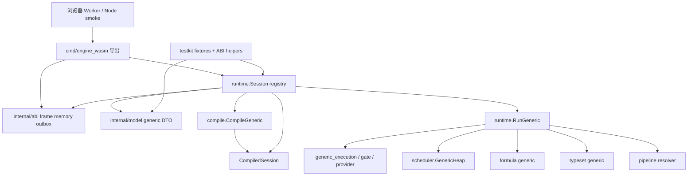
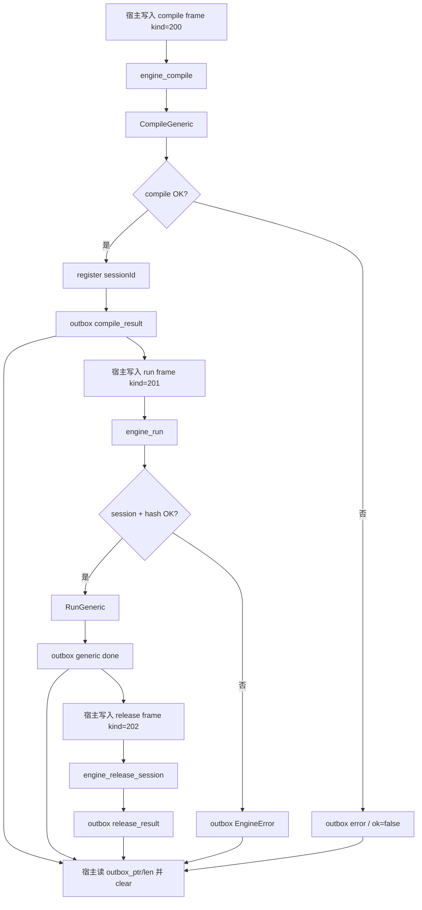
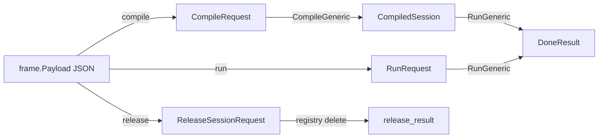
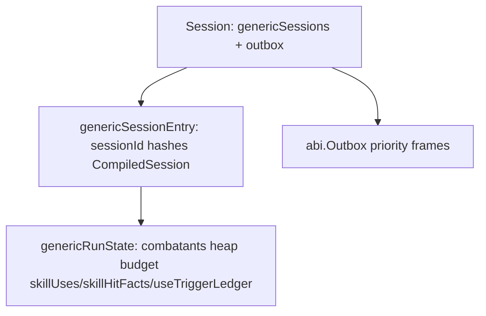

# TinyGo Engine V2 当前架构图

按当前 generic ABI 实现生成，用于快速 review 边界。使用基础 `graph TD/LR`，避免部分预览器不识别复杂 Mermaid 语法。

## 模块依赖图

## 控制流时序图

## 数据形态转换图

## CompiledSession 职责（glance）

| 对象 | 职责 |
| --- | --- |
| `CompiledSession` | 只读规则快照：schema/rules hash、combatants、providers、abilities、operations、formulas、settings、abilityRefIndex |
| `CompiledCombatant` | combatant 模板与 provider mounts |
| `CompiledProvider` / `CompiledAbility` | capability 与 ability 定义；含 `instanceScope`、`statusContributions` 与治疗组计算方式 |
| `CompiledOperation` | 执行期 operation IR；`resolve_skill_hit` 携带编译后的命中计划；`outputRef` 导出同帧伤害口径 |
| `CompiledSkillHit` | 命中候选、阻挡范围、供值条件与候选 operations 切片 |
| `formula.GenericRegistry` | 已编译公式程序 |
| `typeset.CatalogResult` | flat type key / matcher 输入 |

## 运行时状态（glance）

## Review 建议

1. 先看 `internal/model/generic*.go` 与 `ARCHITECTURE` 本图，确认 ABI 边界。
2. 再看 `compile/generic.go` → `session.go` → `RunGeneric`，确认 call chain。
3. 新机制落在 provider/ability/operation + gate/execution；legacy step-loop/DPS 源码与导出已删除。
4. 验证契约：`generic_p0_basic_damage.json` + `smoke-node.mjs` + `go run ./cmd/bench`。

## 主动过程运行链

`model/generic_process.go` 固定第4项过程、控制事实与实例快照；`compile/generic_process.go` 编译步骤时间、逐笔成本和有序时点操作。`runtime/generic_process.go` 负责单次控制入口、暂存付款、统一时点和终结；`runtime/generic_process_snapshot.go` 负责严格恢复与计时重建。

首次控制使用一个执行帧检查全部成本，再生成稳定使用归属的实例。阶段推进复用首次拥有者、挂载、目标和能力分类，数值仍经现有操作与管道；时点帧提交后按首次完整能力引用累计伤害和治疗。成本供值仅在所属完成/失败时点开放。

过程计时采用独立事件类别，同刻先于推进。实例索引与步骤版本让旧事件失效；拥有者、挂载、过程和使用组成可重建的同刻排序键，因此中途恢复与连续执行顺序一致。死亡结算先冻结全部受影响实例，再执行失败效果并检查连带死亡。

实例快照保存活动和终结记录，独立预算不遗忘已开始的使用。恢复只重建当前步骤所需计时，不恢复整个事件堆；到期等于快照时间仍入队处理，过去期限拒绝。过程相关运行拒绝任何过去驱动，避免普通伤害或第5项命中使时间倒退。
