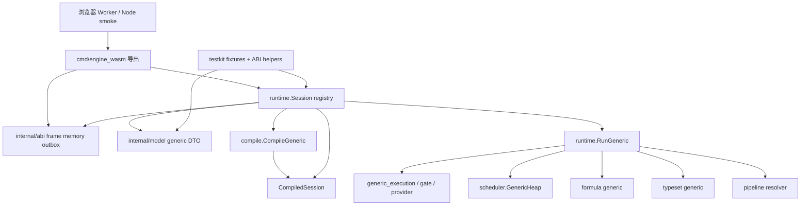
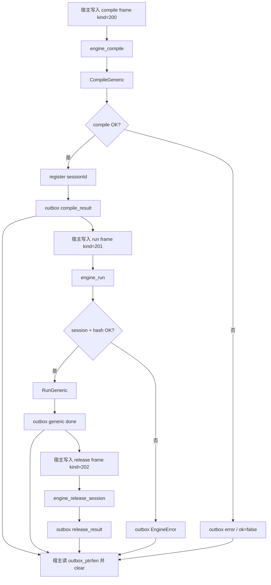
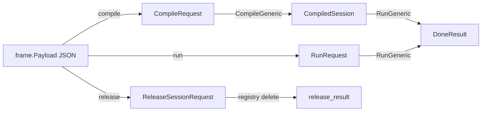
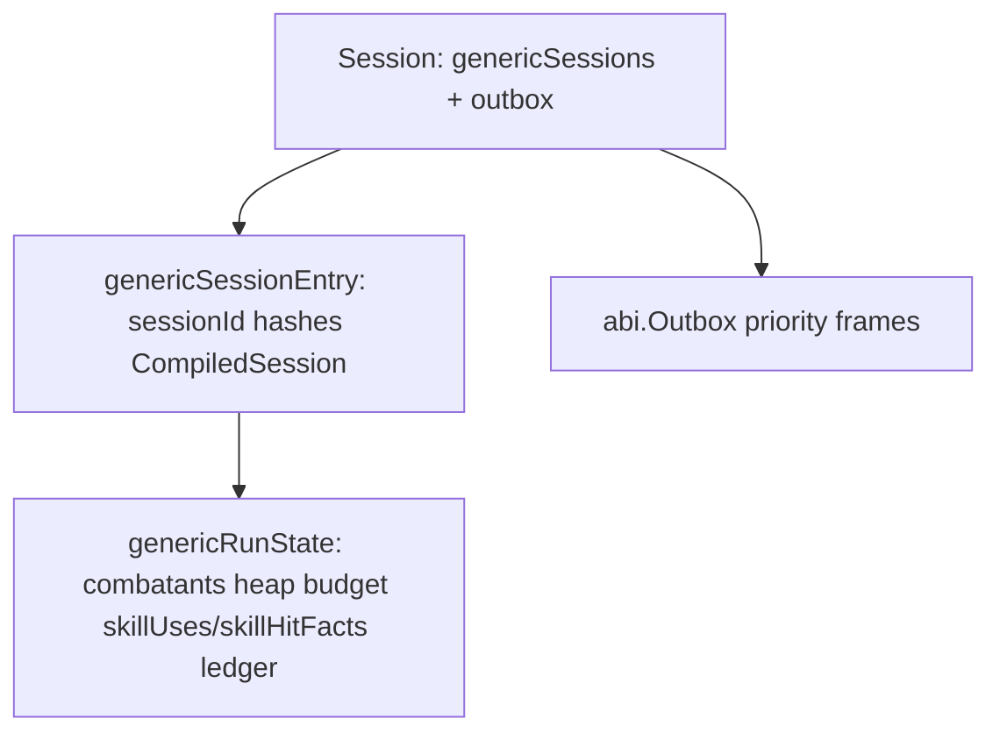

# TinyGo Engine V2 当前架构图

按当前 generic ABI 实现生成，用于快速 review 边界。使用基础 `graph TD/LR`，避免部分预览器不识别复杂 Mermaid 语法。

## 模块依赖图

## 控制流时序图

## 数据形态转换图

## CompiledSession 职责（glance）

| 对象 | 职责 |
| --- | --- |
| `CompiledSession` | 只读规则快照：schema/rules hash、combatants、providers、abilities、operations、formulas、settings、abilityRefIndex |
| `CompiledCombatant` | combatant 模板与 provider mounts |
| `CompiledProvider` / `CompiledAbility` | capability 与 ability 定义；含 `instanceScope`、`statusContributions` 与治疗组计算方式 |
| `CompiledOperation` | 执行期 operation IR；`resolve_skill_hit` 携带编译后的命中计划 |
| `CompiledSkillHit` | 命中候选、阻挡范围、供值条件与候选 operations 切片 |
| `formula.GenericRegistry` | 已编译公式程序 |
| `typeset.CatalogResult` | flat type key / matcher 输入 |

## 运行时状态（glance）

## Review 建议

1. 先看 `internal/model/generic*.go` 与 `ARCHITECTURE` 本图，确认 ABI 边界。
2. 再看 `compile/generic.go` → `session.go` → `RunGeneric`，确认 call chain。
3. 新机制落在 provider/ability/operation + gate/execution；legacy step-loop/DPS 源码与导出已删除。
4. 验证契约：`generic_p0_basic_damage.json` + `smoke-node.mjs` + `go run ./cmd/bench`。
