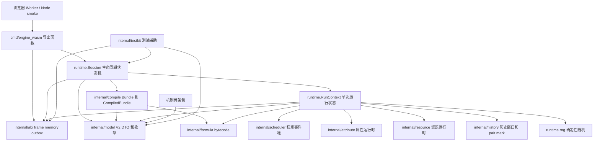
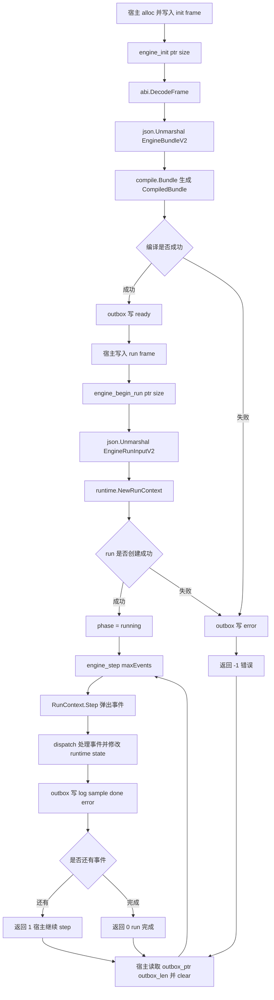
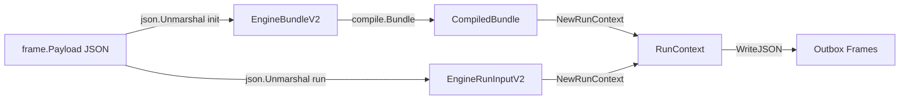
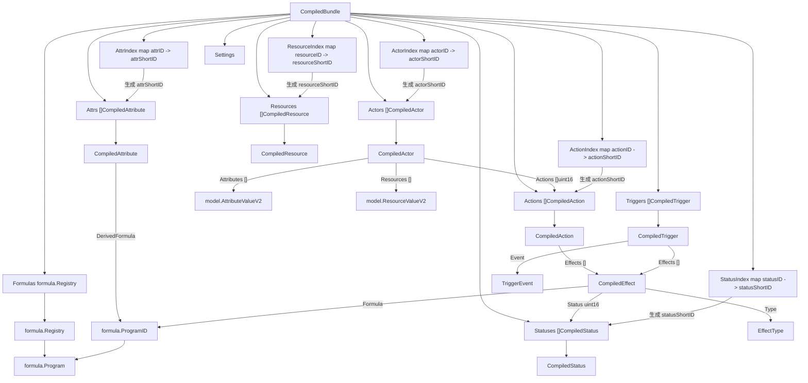
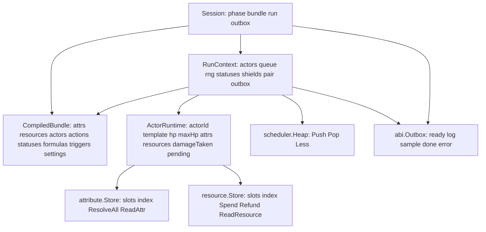

# TinyGo Engine V2 当前架构图

本文档按当前代码实现生成，用于 review 代码边界。这里全部使用 Mermaid 最基础的 `graph TD/LR` 写法，避免部分预览器不识别 `flowchart`、`sequenceDiagram` 或 `classDiagram`。

## 模块依赖图

## 控制流时序图

## 数据形态转换图

## CompiledBundle 对象关系图

## CompiledBundle 对象职责表

| 对象 | 当前职责 | 主要引用关系 |
| --- | --- | --- |
| `CompiledBundle` | 编译后的只读规则快照，`Session` 初始化成功后保存一份，`RunContext` 每次 run 复用 | 持有所有编译后数组、索引、公式注册表和设置 |
| `CompiledAttribute` | 编译后的属性定义，保存默认 base/current/max、clamp 和派生公式引用 | `CompiledActor.Attributes` 按同一顺序保存每个 actor 的属性初值 |
| `AttrIndex` | 属性字符串 ID 到短 ID 的映射 | 公式编译、actor 属性校验、runtime snapshot 都依赖这个顺序 |
| `CompiledResource` | 编译后的资源定义，保存默认 current/max | `CompiledActor.Resources` 按同一顺序保存每个 actor 的资源初值 |
| `ResourceIndex` | 资源字符串 ID 到短 ID 的映射 | resource 公式读取和 actor 资源校验使用 |
| `CompiledActor` | 编译后的 actor 模板，保存 HP、属性初值、资源初值和可用 action 短 ID | `RunContext` 创建 `[2]ActorRuntime` 时读取 |
| `ActorIndex` | actor 模板 ID 到短 ID 的映射 | `begin_run` 根据 `TemplateID` 找 actor 模板 |
| `CompiledAction` | 编译后的 action 模板，保存 cooldown、effect 列表和 mark gate | scheduler 事件里的 `Action uint16` 指向它 |
| `ActionIndex` | action ID 到短 ID 的映射 | 初始 action 请求和 actor action 列表校验使用 |
| `CompiledStatus` | 编译后的 status 模板，保存 duration、control、shield 等基础字段 | status/shield arena 里的实例通过短 ID 指向它 |
| `StatusIndex` | status ID 到短 ID 的映射 | 初始状态、apply_status、grant_shield 校验使用 |
| `formula.Registry` | 公式 bytecode 注册表 | effect、attribute derived formula 用 `ProgramID` 指向公式 |
| `CompiledTrigger` | 编译后的 trigger 规则，当前按 event 枚举和 effects 表达 | runtime 当前遍历 triggers，后续应升级成 `TriggerIndex` |
| `CompiledEffect` | 编译后的 effect，保存 effect type、formula 短 ID、status 短 ID和 source/target role | action 和 trigger 共享这一结构 |
| `Settings` | 编译后的运行限制和默认值 | runtime 使用 `MaxEvents`、`MaxCommandsPerEvent` 等限制 |

## 当前运行时状态图

## 当前机制落点状态

```mermaid
graph TD
    Ready["已接入主流程"]
    Skeleton["已有骨架 待完整接入"]

    Ready --> ABI["ABI frame outbox memory"]
    Ready --> Session["session 生命周期"]
    Ready --> Compile["bundle 编译和 fail-fast"]
    Ready --> Formula["公式 bytecode"]
    Ready --> Scheduler["稳定事件堆"]
    Ready --> Attribute["属性 Store"]
    Ready --> Resource["资源 Store"]
    Ready --> Runtime["基础 action effect status shield history mark 竖切"]

    Skeleton --> Command["command"]
    Skeleton --> Pipeline["value pipeline"]
    Skeleton --> Trigger["trigger index"]
    Skeleton --> Status["status"]
    Skeleton --> Shield["shield"]
    Skeleton --> Control["control"]
    Skeleton --> Cadence["cadence"]
    Skeleton --> Counter["counter"]
    Skeleton --> Mark["mark"]
    Skeleton --> Crit["crit"]
    Skeleton --> Augment["augment"]
```

## Review 建议

1. 先看 `internal/model`、`internal/abi` 和本图，确认输入输出边界。
2. 再看 `internal/compile`、`internal/formula`、`internal/attribute`、`internal/resource`，确认 DTO 到 runtime 的转换方式。
3. 最后看 `internal/runtime`、`internal/scheduler`，确认当前 step 主循环和事件顺序。
4. `command/pipeline/trigger/status/shield/control/cadence/counter/mark/crit/augment` 当前主要是骨架，适合 review 包边界。
