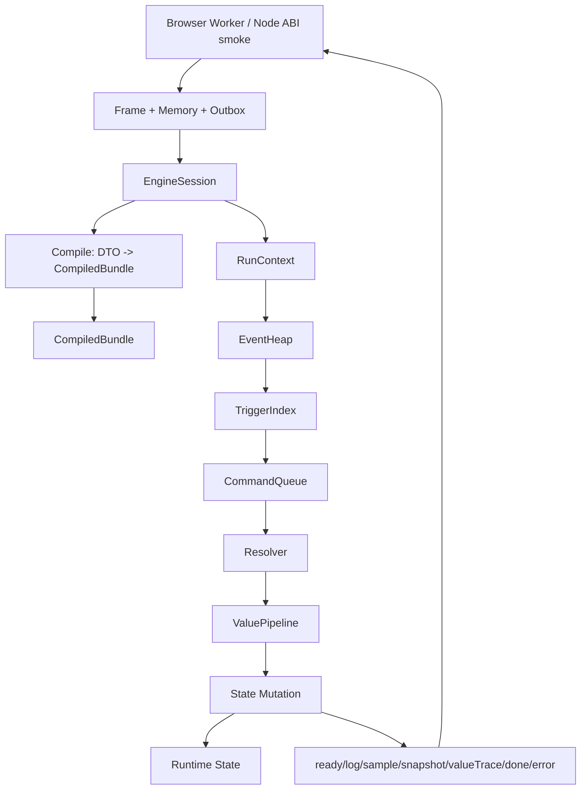
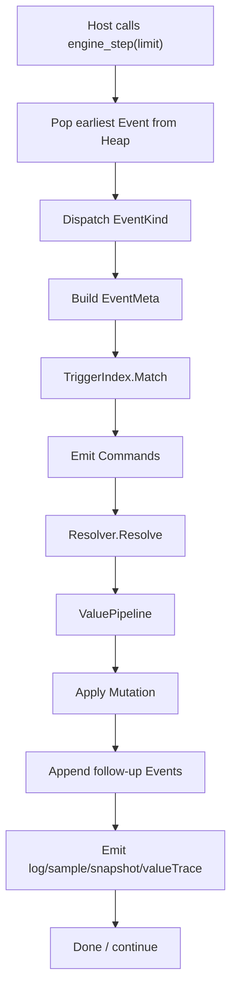

# TinyGo Engine V2 设计复核与详细设计报告

## Superseded / 历史参考

本文是早期外部 review 原文，保留用于追溯，不再作为当前 TinyGo V2 事实入口。文中关于 TypeList/Matcher、resource/cooldown、action ownership、snapshot/action_snapshot 和前端宿主接入的缺口判断已有部分被当前代码与文档替代；当前事实以 `wasm/tinygo_engine_v2/README.md`、`AGENTS.md`、`internal/**` 和 `文档记录/**/wasm/**` 为准。

---

## 执行摘要

这次审阅的实际设计基线，不应再以用户口述的旧根文档 `wasm/概要设计-TinyGo事件管线与对象化数据流.md` 作为唯一入口，因为仓库中的当前需求文档已经明确说明：旧的 `概要设计-*.md` 根文档已被合并进 `WASM需求澄清.md`、`WASM机制覆盖需求.md`、`WASM概要设计.md`、`WASM详细设计.md`，后续 review 只看这些主文档。也就是说，这次设计复核应以这四份主文档和 `wasm/tinygo_engine_v2` 当前代码为准。 fileciteturn18file0L1-L1 fileciteturn19file0L1-L1 fileciteturn16file0L1-L1 fileciteturn17file0L1-L1 fileciteturn66file0L1-L1

结论先说在前面：**可以继续沿用现有仓库结构、ABI 边界、Session 生命周期、Compile/Runtime 分层、稳定事件堆、公式字节码、属性/资源底座这些框架继续做；但不建议在当前 `runtime.go` 的“直接改状态”路径上叠功能。** 当前实现更像“可运行的骨架内核”，而不是已经成型的“可长期承载机制扩展的正式框架”。这一判断来自两方面：一是主文档已经明确要求“trigger 只产 command、所有数值变化必须走 pipeline、TypeList 网络与对象化状态是一等能力”；二是当前代码虽然已经实现 ABI、compile、scheduler、formula、attribute/resource/store 等基础设施，但大量核心机制仍停留在 skeleton，运行时仍在直接 `applyEffect -> dealDamage/heal/applyStatus/grantShield`。 fileciteturn16file0L1-L1 fileciteturn17file0L1-L1 fileciteturn19file0L1-L1 fileciteturn20file0L1-L1 fileciteturn21file0L1-L1 fileciteturn23file0L1-L1 fileciteturn26file0L1-L1 fileciteturn29file0L1-L1

当前最关键的结构性缺口有五个。第一，**TypeList/TypeRegistry/TypeSet/Matcher** 未实现，意味着文档里要求的“按 type/tag 精确匹配、去重 fanout、模式扩展能力”还没有落地。第二，**TriggerIndex + Command/Resolver + ValuePipeline** 没有形成闭环，当前运行时直接改 HP/状态，与设计主线不一致。第三，**ActionRuntimeState** 没有接入，动作授权、资源消耗、冷却、充能、重排、重试这些机制大都还没真正进入运行时。第四，**对象化状态仍不完整**，尤其是 mark/counter/control/execution/augment/crit 目前大都只是骨架。第五，**宿主链路未真正接入 V2**：仓库里虽然已经有 `TinyGoV2Bridge`，但页面 Hook 仍在走旧的 `MvpEngineClient + BenchmarkBundle` 路线，Node smoke 也只做实例化，没有做真实 ABI round-trip。 fileciteturn17file0L1-L1 fileciteturn19file0L1-L1 fileciteturn21file0L1-L1 fileciteturn29file0L1-L1 fileciteturn42file0L1-L1 fileciteturn43file0L1-L1 fileciteturn44file0L1-L1 fileciteturn48file0L1-L1 fileciteturn51file0L1-L1 fileciteturn52file0L1-L1 fileciteturn56file0L1-L1 fileciteturn59file0L1-L1 fileciteturn60file0L1-L1 fileciteturn61file0L1-L1 fileciteturn70file0L1-L1

因此，最合适的推进方式不是推倒重来，而是做一次**“结构补口”优先的 P0 冲刺**：保留当前目录与 ABI 形状，先修复编译器健壮性、动作 gate、触发器索引、命令/管线回流、终态 outbox 保留与宿主接入，再开始补机制覆盖。这样返工最小，也最符合仓库现有主文档和 AGENTS 的工程意图。 fileciteturn20file0L1-L1 fileciteturn21file0L1-L1 fileciteturn66file0L1-L1

## 资料基线与审阅范围

本次报告只使用了同一仓库内的 GitHub 连接器内容，以及 TinyGo 官方文档用于核对 Wasm/TinyGo 事实口径。仓库侧重点审阅了四份主设计文档、`wasm/tinygo_engine_v2` 的 README、ARCHITECTURE、AGENTS、所有核心 Go 代码、测试、构建脚本、Node 验证脚本以及前端桥接相关代码。官方资料只用于确认 TinyGo Wasm 导出、`wasm_exec.js` 同版本要求、浏览器运行方式，以及 `-scheduler=none` / `asyncify` 的语义。 fileciteturn16file0L1-L1 fileciteturn17file0L1-L1 fileciteturn18file0L1-L1 fileciteturn19file0L1-L1 fileciteturn20file0L1-L1 fileciteturn21file0L1-L1 fileciteturn66file0L1-L1 citeturn1search1turn1search0turn1search6

| 类别 | 主要资料 | 本报告中的用途 |
| --- | --- | --- |
| 需求/设计基线 | `WASM需求澄清.md`、`WASM机制覆盖需求.md`、`WASM概要设计.md`、`WASM详细设计.md` | 确认正式规范、P0/P1 边界、机制覆盖目标、运行时抽象和输出契约。 fileciteturn18file0L1-L1 fileciteturn19file0L1-L1 fileciteturn16file0L1-L1 fileciteturn17file0L1-L1 |
| 项目当前口径 | `README.md`、`ARCHITECTURE.md`、`AGENTS.md` | 确认当前代码定位是“V2 正式落点 + skeleton 逐层实现”，不是已完整收敛的最终形态。 fileciteturn20file0L1-L1 fileciteturn21file0L1-L1 fileciteturn66file0L1-L1 |
| 内核代码 | `cmd/**`、`internal/**`、`scripts/**`、`targets/**` | 识别已实现模块、骨架包、运行路径、错误处理、构建和测试覆盖面。 fileciteturn23file0L1-L1 fileciteturn26file0L1-L1 fileciteturn29file0L1-L1 fileciteturn55file0L1-L1 |
| 宿主接入 | `tinygoV2Bridge.ts`、`useSimulationEngine.ts`、`bundleCompiler.ts` | 判断 V2 Wasm ABI 是否已经真正接到前端实际运行链路。 fileciteturn59file0L1-L1 fileciteturn60file0L1-L1 fileciteturn61file0L1-L1 fileciteturn70file0L1-L1 |
| TinyGo 官方资料 | TinyGo WASM / build options / datatypes 文档 | 核对 `//export`、`wasm_exec.js`、`-scheduler=none`、WASM Asyncify 的官方事实。 citeturn1search1turn1search0turn1search6 |

## 当前实现审阅

从工程分层看，当前项目的**骨架是健康的**。`cmd/engine_wasm` 只导出 ABI；`internal/abi` 负责 frame、outbox、memory；`internal/model` 维持 DTO 与输出契约；`internal/compile` 负责 bundle 编译与引用校验；`internal/runtime` 负责 session/run 生命周期；`internal/scheduler` 提供 `(time, priority, seq)` 稳定堆；`internal/formula` 提供简单字节码；`internal/attribute` 和 `internal/resource` 已经是可复用底座；而 `command/pipeline/trigger/status/shield/control/cadence/counter/mark/crit/augment` 已被明确标为“机制骨架包”。这说明目录和职责边界本身是可继续投资的。 fileciteturn20file0L1-L1 fileciteturn21file0L1-L1 fileciteturn66file0L1-L1

| 模块 | 当前实现 | 关键类型/函数 | 复核结论 |
| --- | --- | --- | --- |
| ABI 导出 | 已实现 | `alloc/dealloc/engine_*`, `abi.EncodeFrame/DecodeFrame`, `abi.Outbox` | ABI 形状已经稳定，可继续沿用；但 outbox 终态保留策略仍有缺口。 fileciteturn23file0L1-L1 fileciteturn38file0L1-L1 fileciteturn40file0L1-L1 |
| DTO 与协议 | 已实现但不完整 | `EngineBundleV2`, `EngineRunInputV2`, `DonePayloadV2`, `SnapshotV2`, `ValueTraceV2` | 契约基础已经成型，但和主设计文档相比字段覆盖仍明显不足。 fileciteturn25file0L1-L1 fileciteturn17file0L1-L1 |
| 编译层 | 部分实现 | `compile.Bundle`, `CompiledBundle`, `compileEffects` | 已有短 ID、引用校验、公式注册；但 TypeList、items、augment、trigger 索引、resource/action 编译都未完成。 fileciteturn26file0L1-L1 fileciteturn17file0L1-L1 |
| 运行时 | 部分实现 | `Session`, `RunContext`, `Step`, `onCastIntent`, `applyEffect`, `dealDamage` | 可运行 1v1、可重放、可出日志；但仍是“直接变更状态”的简化内核。 fileciteturn28file0L1-L1 fileciteturn29file0L1-L1 |
| 调度器 | 基本实现 | `scheduler.Heap`, `Push/Pop/Less`, `Handle` | 稳定排序和 generation handle 已有；`MaxQueueEvents`、`MaxChainDepth` 等规范尚未接入。 fileciteturn32file0L1-L1 fileciteturn17file0L1-L1 |
| 数值子系统 | 部分实现 | `formula.Registry`, `attribute.Store`, `resource.Store`, `history.Window` | 基础计算已经有了，但尚未形成统一 pipeline。 fileciteturn33file0L1-L1 fileciteturn35file0L1-L1 fileciteturn36file0L1-L1 fileciteturn37file0L1-L1 |
| 机制包 | 大多为骨架 | `command`, `pipeline`, `trigger`, `status`, `shield`, `control`, `cadence`, `counter`, `mark`, `crit`, `augment` | 包边界是对的，但大部分尚未真正接入运行时。 fileciteturn42file0L1-L1 fileciteturn43file0L1-L1 fileciteturn44file0L1-L1 fileciteturn45file0L1-L1 fileciteturn46file0L1-L1 fileciteturn47file0L1-L1 fileciteturn48file0L1-L1 fileciteturn49file0L1-L1 fileciteturn50file0L1-L1 fileciteturn51file0L1-L1 fileciteturn52file0L1-L1 |
| 测试与宿主 | 部分实现 | `go test`, `cmd/bench`, `smoke-node.mjs`, `bench-node.mjs`, `TinyGoV2Bridge` | 单测和本地 benchmark 已有；但 Wasm ABI 真正 smoke、浏览器 Worker 真正接线仍不到位。 fileciteturn27file0L1-L1 fileciteturn31file0L1-L1 fileciteturn55file0L1-L1 fileciteturn56file0L1-L1 fileciteturn57file0L1-L1 fileciteturn59file0L1-L1 |

如果只看当前事件主循环，路径是清晰的：`engine_init` 解 frame 后反序列化 `EngineBundleV2`，调用 `compile.Bundle` 产生 `CompiledBundle`；`engine_begin_run` 反序列化 `EngineRunInputV2`，生成 `RunContext`；`engine_step` 从稳定堆弹出事件，当前只支持 `CastIntent / StatusExpire / ShieldExpire / IntentRecheck` 四类事件；动作执行后直接进入 `applyEffect`，然后在运行时中直接落到 `dealDamage`、治疗、加状态、加护盾，并在 `dealDamage` 前后做简单 trigger 回调。这个流程足够支撑 demo 级用例，但仍不是文档要求的“command -> resolver -> value pipeline -> mutation”规范流程。 fileciteturn28file0L1-L1 fileciteturn29file0L1-L1 fileciteturn32file0L1-L1 fileciteturn16file0L1-L1 fileciteturn17file0L1-L1

如果看“对象化数据流”，当前已经有一部分正确方向：`ActorRuntime`、`StatusInstance`、`ShieldInstance`、`history.Window`、`PendingIntent`、`RNG` 都是实际对象状态，而不是把一切塞进日志或临时变量里；但真正的“对象化状态”还没有完成，因为 `ControlDirectiveInstance`、`ExecutionInstance`、`ActionRuntimeState`、`CounterState`、定向 `MarkState`、`CritResult`、`Augment active policies` 要么不存在，要么只是独立骨架包，没有接入 `RunContext` 的主循环。 fileciteturn29file0L1-L1 fileciteturn37file0L1-L1 fileciteturn45file0L1-L1 fileciteturn47file0L1-L1 fileciteturn48file0L1-L1 fileciteturn49file0L1-L1 fileciteturn50file0L1-L1 fileciteturn51file0L1-L1 fileciteturn52file0L1-L1

并发与异步模型方面，当前项目的方向是对的：README 和 AGENTS 都要求单线程、显式 step、热路径禁止 goroutine/channel/lock/panic-recover 控制流；构建脚本也显式传入 `-scheduler=none`。TinyGo 官方文档说明，`-scheduler=none` 会禁用 goroutine 与 channel，适合在不需要并发时减小体积和 RAM；官方也说明 WASM 下常规调度是基于 Asyncify，而 Asyncify 在一些边缘情况下会有怪异行为。因此，这个项目把并发留给外层宿主、让内核坚持 host-driven stepping，本身是合理的。当前需要改的不是这个方向，而是把 target 文件里的 `"scheduler": "asyncify"` 和构建脚本里的 `-scheduler=none` 收敛成单一工程口径，避免未来阅读和 CI 配置歧义。 fileciteturn20file0L1-L1 fileciteturn55file0L1-L1 fileciteturn58file0L1-L1 fileciteturn66file0L1-L1 citeturn1search0turn1search6

WASM 宿主绑定方面，ABI exports 已经和 TinyGo 官方推荐的 `//export` 路线一致，桥接文件 `TinyGoV2Bridge` 也已经实现了 frame 编码、内存 copy、`engine_init` / `engine_begin_run` / `engine_step` / `engine_abort_run` / outbox 读取。TinyGo 官方文档也明确说明：若使用显式导出函数，可以直接通过 `wasm.exports` 调用；并且 `wasm_exec.js` 必须与 TinyGo 编译版本一致。然而，仓内搜索显示 `TinyGoV2Bridge` 目前只在其自身文件中出现，页面 Hook 仍然使用旧的 `MvpEngineClient`，而 `bundleCompiler.ts` 仍在编译旧的 `BenchmarkBundle`。这说明 V2 Wasm 内核虽然可实例化，但尚未成为前端正式运行主链。 fileciteturn23file0L1-L1 fileciteturn59file0L1-L1 fileciteturn60file0L1-L1 fileciteturn61file0L1-L1 fileciteturn70file0L1-L1 citeturn1search1

测试与验证方面，当前已经有 ABI 编解码测试、编译器短 ID/引用校验测试、公式执行测试、基础运行时集成测试以及原生 Go benchmark；但 README 和 AGENTS 给 Node 脚本的定位是“instantiate / ABI smoke / benchmark”，而当前 `smoke-node.mjs` 实际只做实例化与导出检查，没有真的走 init/run/step/outbox 协议。这意味着“能创建 Wasm 实例”和“能完成一次真实战斗 run”之间还缺一道非常关键的自动化验证。 fileciteturn20file0L1-L1 fileciteturn27file0L1-L1 fileciteturn31file0L1-L1 fileciteturn41file0L1-L1 fileciteturn56file0L1-L1 fileciteturn57file0L1-L1 fileciteturn66file0L1-L1

## 设计对照与差距

下表按“主设计文档规范”对照“当前实现状态”汇总。这里的“状态”只表示**当前代码相对于正式设计文档**的完成度，不代表代码有没有价值；很多“未实现”其实是仓库自己已经承认的 skeleton 区域。 fileciteturn16file0L1-L1 fileciteturn17file0L1-L1 fileciteturn21file0L1-L1

| 设计项 | 规范要点 | 实现文件/函数 | 状态 | 备注 |
| --- | --- | --- | --- | --- |
| ABI 显式导出 | `alloc/dealloc/init/begin_run/step/abort/outbox_*` 固定导出 | `cmd/engine_wasm/main.go` | 完成 | 导出形状与设计一致。 fileciteturn16file0L1-L1 fileciteturn23file0L1-L1 |
| Frame 协议 | 二进制 header + JSON payload | `internal/abi/frame.go` | 完成 | `magic/schemaVersion/kind/flags/payloadLen` 已实现。 fileciteturn16file0L1-L1 fileciteturn38file0L1-L1 |
| Outbox 终态保证 | `done/error` 必须优先保留 | `internal/abi/outbox.go` | 部分 | 终态帧在超容量时会尝试清空并重写，但如果单帧仍大于容量，则仍会被丢弃；这与“终态必须保留”的工程要求不一致。 fileciteturn40file0L1-L1 fileciteturn66file0L1-L1 |
| `EngineBundleV2` 完整性 | 文档要求 `TypeCatalog/Items/Augments/...` | `internal/model/types.go` | 部分 | 当前 DTO 只有 attributes/resources/actors/actions/statuses/formulas/triggers/damageProfiles/settings，缺 items、augment、type catalog、classifier。 fileciteturn17file0L1-L1 fileciteturn25file0L1-L1 |
| TypeList 网络 | `TypeRegistry/TypeSet/InvertedIndex/Matcher/DedupeScratch` | 当前无实现 | 未实现 | 搜索 `TypeRegistry`、`TypeSet` 只命中文档，不命中运行时代码。 fileciteturn17file0L1-L1 fileciteturn19file0L1-L1 fileciteturn62file0L1-L1 fileciteturn63file0L1-L1 |
| 编译层短 ID / 校验 | 编译成 `CompiledBundle`，collect-all 校验 | `internal/compile/compile.go` | 部分 | 已有 attr/resource/action/status/formula 编译，但 items、types、augment、resource cost、owner/matcher、pipeline binding 未编译；同时 attributes/resources 用 range 索引写 map，遇到前置无效项有越界风险。 fileciteturn17file0L1-L1 fileciteturn26file0L1-L1 |
| 公式运行时 | DTO -> bytecode -> eval | `internal/formula/formula.go` | 部分 | 已支持 const/attr/resource/counter/input/add/sub/mul/div/min/max/sign，但历史窗口、target/resource 侧读取、更多 opcode 尚未接入。 fileciteturn17file0L1-L1 fileciteturn33file0L1-L1 |
| 派生属性 / clamp / bonus 视图 | `base/current/max/resolved/dirty` + derived formula + clamp + bonus/missing/ratio | `internal/attribute/attribute.go`, `internal/compile/compile.go`, `runtime.actorFrom` | 部分 | store 已有 base/current/max/resolved/dirty 与 modifier，但 derived formula、定义级 clamp、bonus/missing/ratio 视图未真正进入运行时。 fileciteturn17file0L1-L1 fileciteturn26file0L1-L1 fileciteturn29file0L1-L1 fileciteturn35file0L1-L1 |
| 资源系统 | `current/max/spend/refund/regen/clamp` + action cost 接入 | `internal/resource/resource.go`, `model.ActionTemplateV2.ResourceCost` | 部分 | resource store 已有，但 `ResourceCostV2` 只在 model 里出现，compile/runtime 都没有消费它。 fileciteturn17file0L1-L1 fileciteturn25file0L1-L1 fileciteturn36file0L1-L1 fileciteturn67file0L1-L1 |
| 稳定事件堆 | `(time, priority, seq)`、generation handle、取消边界、stale lazy drop | `internal/scheduler/heap.go`, `runtime.onStatusExpire/onShieldExpire` | 部分 | 排序和 handle 已有；但 `MaxQueueEvents`、`MaxChainDepth`、更完整的 event kinds、execution handle 体系尚未接入。 fileciteturn17file0L1-L1 fileciteturn29file0L1-L1 fileciteturn32file0L1-L1 |
| Trigger 索引与匹配 | `TriggerIndex`、phase/type matcher、owner filter、once-per-event、ICD | `internal/trigger/trigger.go`, `runtime.fireTriggers` | 未实现 | 有 skeleton `trigger.Index`，但 runtime 仍线性扫描 `Bundle.Triggers`，且忽略 `OwnerRole/OwnerID/OncePerEvent/InternalCooldownMs`。 fileciteturn17file0L1-L1 fileciteturn25file0L1-L1 fileciteturn29file0L1-L1 fileciteturn44file0L1-L1 |
| Trigger -> Command -> Resolver | trigger 只产 command，不直接改状态 | `internal/command/command.go`, `internal/pipeline/pipeline.go`, `runtime.applyEffect` | 未实现 | `command` 和 `pipeline` 只是骨架；当前 trigger 直接调用 `applyEffect`，再直接改 HP/状态。 fileciteturn16file0L1-L1 fileciteturn17file0L1-L1 fileciteturn29file0L1-L1 fileciteturn42file0L1-L1 fileciteturn43file0L1-L1 |
| ValuePipeline | damage/heal/shield/resource/attribute 五通道 | `internal/pipeline/pipeline.go`, `runtime.dealDamage` | 未实现 | 运行时没有统一 pipeline，只有简化 damage + heal/status/shield 直接落地。 fileciteturn17file0L1-L1 fileciteturn29file0L1-L1 fileciteturn43file0L1-L1 |
| 状态对象化 | `StatusInstance/ControlDirectiveInstance/ExecutionInstance/PendingIntent` 分离 | `runtime.go`, `status/control` skeleton | 部分 | `StatusInstance` 和 `PendingIntent` 已有，但 `ControlDirectiveInstance`、`ExecutionInstance` 未接，当前阻断仍靠 status.BlocksActions。 fileciteturn17file0L1-L1 fileciteturn29file0L1-L1 fileciteturn45file0L1-L1 fileciteturn47file0L1-L1 |
| Cadence / Cooldown / Charge | `ActionRuntimeState`、`readyAt`、charges、recharge、reset/refund | `model.ActionTemplateV2.CooldownMs`, `internal/cadence/cadence.go` | 未实现 | 当前 action 只保存 `CooldownMs`，cadence skeleton 存在，但 runtime 不校验 cooldown、不消耗 charge、不处理 replay/requeue。 fileciteturn17file0L1-L1 fileciteturn25file0L1-L1 fileciteturn48file0L1-L1 fileciteturn69file0L1-L1 fileciteturn29file0L1-L1 |
| History / Counter / Mark | ring window + actor/pair/global counter + 定向 mark | `history.Window`, `history.PairState`, `counter`, `mark` | 部分 | history ring 可用；counter/mark 有 skeleton，但 runtime 只用了 pair 级无过期 mark，也没有真正接 `counter.State`。 fileciteturn17file0L1-L1 fileciteturn29file0L1-L1 fileciteturn37file0L1-L1 fileciteturn49file0L1-L1 fileciteturn50file0L1-L1 |
| Crit | execution 级 crit result / deterministic / expected / seeded random | `internal/crit/crit.go` | 未实现 | `crit` 有骨架，但 runtime/pipeline 没有接入；`RNG` 也没有用于暴击决定。 fileciteturn17file0L1-L1 fileciteturn30file0L1-L1 fileciteturn51file0L1-L1 |
| Augment | run 级 active policies 改写 attribute/crit/pipeline | `internal/augment/augment.go` | 未实现 | 只有 toggle 集合骨架，没有编译也没有运行时接入。 fileciteturn16file0L1-L1 fileciteturn17file0L1-L1 fileciteturn52file0L1-L1 |
| 输出契约 | ready/log/sample/done/error/snapshot/valueTrace | `internal/model/types.go`, `runtime.go` | 部分 | model 定义了 `SnapshotV2`/`ValueTraceV2`，README 也声明输出契约包含它们；但 runtime 实际只输出 `ready/log/sample/done/error`，且 sample 载荷不是 `SnapshotV2`。仓内检索 `ValueTraceV2` 也只命中 model/README。 fileciteturn20file0L1-L1 fileciteturn25file0L1-L1 fileciteturn29file0L1-L1 fileciteturn68file0L1-L1 fileciteturn68file1L1-L1 |
| 浏览器 Worker 正式宿主 | 生产宿主是 Worker；Node 仅 smoke/bench | `tinygoV2Bridge.ts`, `smoke-node.mjs`, `useSimulationEngine.ts`, `bundleCompiler.ts` | 部分 | Bridge 已存在，Node smoke 只 instantiate，不是 ABI smoke；页面 Hook 仍走旧 `MvpEngineClient`，bundle compiler 仍输出 `BenchmarkBundle`。 fileciteturn18file0L1-L1 fileciteturn56file0L1-L1 fileciteturn59file0L1-L1 fileciteturn60file0L1-L1 fileciteturn61file0L1-L1 fileciteturn70file0L1-L1 |

在所有差距里，最值得优先处理的不是“多做一个机制”，而是四个基础问题。其一，`compile.Bundle` 的 attrs/resources 索引写法有潜在越界风险，只要前面出现空 ID 或重复项，就可能把 `AttrIndex/ResourceIndex` 指到 `cb.Attrs/cb.Resources` 当前长度之外。其二，`resolveAction` 没有校验“这个 actor 是否真的拥有这个 action”，存在运行时越权调用风险。其三，`fireTriggers` 忽略 owner/once/icd/matcher，并且在 trigger effect 中继续直接改状态，后续一旦加机制，返工会非常大。其四，终态 outbox 不能保证保留 `done/error`，一旦日志很多导致终态帧超 256 KiB，宿主可能拿不到完成结果。 fileciteturn26file0L1-L1 fileciteturn29file0L1-L1 fileciteturn40file0L1-L1 fileciteturn66file0L1-L1

## 关键实现建议

**编译器稳健性先修。** 这是最低成本、最高收益的一组修补。当前 attrs/resources 在编译时把原始 `range` 索引写进 `AttrIndex/ResourceIndex`，但 append 的目标 slice 会跳过无效项，因此两者可能不再同序。这里应该统一改成“用 `len(currentSlice)` 作为短 ID”，并给 actor/action/status 增加重复检测。这个修复不改变任何 ABI，却能把一类潜在 panic 直接消掉。 fileciteturn26file0L1-L1

```go
func appendAttr(cb *CompiledBundle, attr model.AttributeDefinitionV2, problems *[]string) {
	if attr.ID == "" {
		*problems = append(*problems, "attribute id is empty")
		return
	}
	if _, exists := cb.AttrIndex[attr.ID]; exists {
		*problems = append(*problems, "duplicate attribute: "+attr.ID)
		return
	}
	shortID := uint16(len(cb.Attrs))
	cb.AttrIndex[attr.ID] = shortID
	cb.Attrs = append(cb.Attrs, CompiledAttribute{
		ID:                attr.ID,
		DefaultBase:       attr.DefaultBase,
		DefaultCurrent:    attr.DefaultCurrent,
		DefaultMax:        attr.DefaultMax,
		HasDefaultCurrent: attr.HasDefaultCurrent,
		HasDefaultMax:     attr.HasDefaultMax,
		ClampMin:          attr.ClampMin,
		HasClampMin:       attr.HasClampMin,
		ClampMax:          attr.ClampMax,
		HasClampMax:       attr.HasClampMax,
	})
}
```

**动作 gate 必须尽快从“能执行就执行”升级成“授权 + 资源 + 冷却 + 控制 + 标记”的统一入口。** 当前 `resolveAction` 只把字符串 actionID 映射成 bundle 索引，没有校验 actor 是否拥有该动作；`ResourceCostV2` 也没有编译和执行；`CooldownMs` 只是存着没用。这会让后续所有资源/冷却/重试/重排机制都堆到 `onCastIntent` 里，越来越难收束。建议先把 `CompiledAction` 加上 `Costs []CompiledResourceCost`，再把 `RunContext` 加上 `[actor][action]ActionRuntimeState`，然后把 `CanCast` 固定成唯一入口。 fileciteturn25file0L1-L1 fileciteturn26file0L1-L1 fileciteturn29file0L1-L1 fileciteturn48file0L1-L1 fileciteturn67file0L1-L1

```go
type CastBlockCode uint8

const (
	CastOK CastBlockCode = iota
	CastUnknownAction
	CastNotOwned
	CastBlockedByControl
	CastMarkMissing
	CastCooldown
	CastInsufficientResource
)

type CastGateResult struct {
	Code       CastBlockCode
	RetryAtMs  int64
	ResourceID uint16
}

func (ctx *RunContext) CanCast(actor uint8, action uint16, nowMs int64) CastGateResult {
	if !ctx.ActorOwnsAction(actor, action) {
		return CastGateResult{Code: CastNotOwned}
	}
	if control.BlocksAction(ctx.Controls, actor, nowMs) {
		return CastGateResult{Code: CastBlockedByControl}
	}
	if !ctx.ActionState(actor, action).Ready(nowMs) {
		return CastGateResult{
			Code:      CastCooldown,
			RetryAtMs: ctx.ActionState(actor, action).ReadyAtMs,
		}
	}
	for _, cost := range ctx.Bundle.Actions[action].Costs {
		if !ctx.Actors[actor].Resources.CanSpendByIndex(cost.Resource, cost.Amount) {
			return CastGateResult{Code: CastInsufficientResource, ResourceID: cost.Resource}
		}
	}
	return CastGateResult{Code: CastOK}
}
```

**把 Trigger 真的改成“产命令，不改状态”。** 这是现有框架能否长期继续用下去的分水岭。当前仓内已经有 `command`、`pipeline`、`trigger` 这些包，说明目录设计已经给好了；你现在需要做的是把 `runtime.applyEffect` 从“立即执行”改成“生成 `[]command.Command`”，然后由 resolver 统一进入 pipeline/mutation。这样后续 shield、heal、resource、attribute、mark、counter、crit、augment 才能共享一个事件回流点。 fileciteturn16file0L1-L1 fileciteturn17file0L1-L1 fileciteturn29file0L1-L1 fileciteturn42file0L1-L1 fileciteturn43file0L1-L1 fileciteturn44file0L1-L1

```go
type Resolver interface {
	Resolve(ctx *RunContext, cmd command.Command) ([]command.Command, *model.ErrorPayload)
}

type EngineResolver struct{}

func (r *EngineResolver) Resolve(ctx *RunContext, cmd command.Command) ([]command.Command, *model.ErrorPayload) {
	switch cmd.Kind {
	case command.KindDamage:
		res, err := ctx.Pipeline.ResolveDamage(ctx, pipeline.DamagePacket{
			Source:     cmd.Source,
			Target:     cmd.Target,
			Amount:     cmd.Amount,
			DamageType: cmd.Channel,
		})
		if err != nil {
			return nil, err
		}
		ctx.ApplyDamageResult(res)
		return ctx.TriggerState.AfterDamage(ctx, res), nil

	case command.KindHeal:
		res, err := ctx.Pipeline.ResolveHeal(ctx, pipeline.HealPacket{
			Source: cmd.Source,
			Target: cmd.Target,
			Amount: cmd.Amount,
		})
		if err != nil {
			return nil, err
		}
		ctx.ApplyHealResult(res)
		return nil, nil
	}
	return nil, &model.ErrorPayload{
		Code:    model.ErrUnsupported,
		Message: "unsupported command",
	}
}
```

**TriggerIndex 要尽快从“按事件线性扫全表”升级为“按 phase 预索引 + owner/type matcher + once/icd 运行态”。** 当前 skeleton 已经给了 `trigger.Index` 和 `Binding`，但 runtime 完全没用它。建议直接把 `CompiledTrigger` 收敛成 `trigger.Binding`，并在 run 级增加 `trigger.RuntimeState`，至少先支持 `phase -> triggerIDs`、`owner filter`、`RequiresDamage`、`OncePerEvent`、`InternalCooldownMs`。Type matcher 先留接口，待 TypeSet 实现后接上。 fileciteturn25file0L1-L1 fileciteturn29file0L1-L1 fileciteturn44file0L1-L1

```go
type TriggerRuntimeState struct {
	EventGen       uint64
	SeenThisEvent  []uint64 // triggerID -> last seen eventGen
	CooldownUntil  []int64  // triggerID -> next allowed time
}

func (idx Index) Match(meta EventMeta, rt *TriggerRuntimeState, nowMs int64) []uint16 {
	candidates := idx.ByPhase[meta.Phase]
	out := make([]uint16, 0, len(candidates))
	for _, id := range candidates {
		item := idx.Items[id]
		if item.RequiresDamage && meta.Damage <= 0 {
			continue
		}
		if !ownerMatch(item, meta) {
			continue
		}
		if item.OncePerEvent && rt.SeenThisEvent[id] == rt.EventGen {
			continue
		}
		if item.InternalCooldownMs > 0 && rt.CooldownUntil[id] > nowMs {
			continue
		}
		rt.SeenThisEvent[id] = rt.EventGen
		if item.InternalCooldownMs > 0 {
			rt.CooldownUntil[id] = nowMs + item.InternalCooldownMs
		}
		out = append(out, id)
	}
	return out
}
```

**把 mark/control/status/execution 真的变成对象，而不是继续“塞进 PairState 和 status flag 里凑合”。** 当前 `PairState` 的 mark 只有最多 8 个字符串，而且不区分 source/target 方向、没有过期也没有 lockout；这只够现在的极简 1v1。建议尽快切到短 ID + directed key + expire/lockout；控制与状态也分开，避免以后“霸体、免控、打断、施法中、被动层数”全挤在 `StatusTemplate`。 fileciteturn17file0L1-L1 fileciteturn29file0L1-L1 fileciteturn37file0L1-L1 fileciteturn45file0L1-L1 fileciteturn47file0L1-L1 fileciteturn50file0L1-L1

```go
type MarkID uint16

type MarkKey struct {
	Source uint8
	Target uint8
	ID     MarkID
}

type MarkEntry struct {
	Count       uint8
	ExpireAt    int64
	LockoutUntil int64
}

type MarkState struct {
	Items map[MarkKey]MarkEntry
}

func (s *MarkState) Apply(key MarkKey, nowMs, expireAt, lockoutUntil int64) {
	entry := s.Items[key]
	entry.Count++
	entry.ExpireAt = expireAt
	entry.LockoutUntil = lockoutUntil
	s.Items[key] = entry
}
```

**终态 outbox 要么可增长，要么终态 payload 必须瘦身。** 现在 `DonePayload` 会把 `Logs` 和 `RNG` 都打进终态帧，而 outbox 又只有 256 KiB 固定容量；这两个设计叠起来，意味着长 run 很可能在最需要 `done` 的时候把 `done` 自己挤掉。建议二选一：要么为 terminal record 允许 grow；要么把 `DonePayload` 改成摘要，不再内联全量 logs/valueTrace。对这个项目，我更推荐二者同时做：`done/error` 支持 grow，但默认 `DonePayload` 只带 summary 和最终 snapshot，把全量日志留给 streaming records。 fileciteturn20file0L1-L1 fileciteturn25file0L1-L1 fileciteturn29file0L1-L1 fileciteturn40file0L1-L1 fileciteturn66file0L1-L1

```go
func (o *Outbox) WriteTerminal(kind model.FrameKind, payload []byte) model.ErrCode {
	frame := EncodeFrame(kind, 0, payload)
	if cap(o.buf) < len(frame) {
		newCap := 1
		for newCap < len(frame) {
			newCap <<= 1
		}
		o.buf = make([]byte, 0, newCap)
	}
	o.buf = o.buf[:0]
	o.buf = append(o.buf, frame...)
	return model.ErrOK
}
```

## 完整概要设计

基于当前主设计文档与代码骨架，推荐收敛成下面这个统一架构：**宿主只负责 frame 与 step 驱动；`Session` 只负责生命周期；`Compile` 只生产只读规则快照；`RunContext` 只持有本次 run 的对象化状态；事件循环只分“事件匹配”和“状态落地”两段，中间严格通过 `TriggerIndex -> CommandQueue -> Resolver -> ValuePipeline` 回流。** 这个架构和现有目录边界兼容，不需要推翻现有工程。 fileciteturn16file0L1-L1 fileciteturn17file0L1-L1 fileciteturn21file0L1-L1 fileciteturn66file0L1-L1



在这个概要设计里，运行时状态建议统一拆成六类对象。第一类是**静态只读对象**，即 `CompiledBundle`、`FormulaRegistry`、`TriggerIndex`、`TypeRegistry`。第二类是**actor 运行时对象**，即 `ActorRuntime`、其属性/资源存储、以及 `[actor][action]ActionRuntimeState`。第三类是**实例对象**，即 `ExecutionInstance`、`StatusInstance`、`ShieldInstance`、`ControlDirectiveInstance`。第四类是**跨事件状态**，即 `HistoryWindow`、`CounterState`、`MarkState`。第五类是**基础设施对象**，即 `EventHeap`、`Outbox`、`RNG`、`ProblemCollector`。第六类是**策略对象**，即 `CritPolicySet`、`AugmentActiveSet`、`PipelineRegistry`。这样做的核心好处是：后续每个新机制都能准确落到“静态规则”“运行态实例”“跨事件记忆”“策略改写”四个维度之一，不会再无限膨胀 `runtime.go`。 fileciteturn16file0L1-L1 fileciteturn17file0L1-L1 fileciteturn19file0L1-L1

当前文档里有几项没有展开到足够细，可在详细设计中按下表作为默认值。如果以后你有新的业务约束，再把这些默认值替换成正式规则即可。这里明确标成“未指定”，避免把建议误当成既有规范。 fileciteturn16file0L1-L1 fileciteturn17file0L1-L1

| 未指定项 | 当前文档状态 | 建议默认方案 |
| --- | --- | --- |
| `TypeCatalogV2` 的继承/别名语法 | 未指定 | 仅支持 compile 时展开的 `aliases` 与 `extends`，runtime 不做递归。 |
| `ExecutionInstance` 具体阶段枚举 | 未指定 | P0 固定 `cast -> impact -> recovery` 三阶段；channel 与 projectile 作为 P1。 |
| 每 actor 的 pending intent 个数 | 未指定 | P0 使用固定 ring，长度 8；禁止单槽覆盖。 |
| `snapshot` 发射节奏 | 未指定 | 默认按处理事件数采样，不按 wall clock。 |
| 终态 outbox 超容量策略 | 未指定 | terminal record 允许 grow；log/sample/valueTrace 继续 drop。 |
| RNG stream 划分 | 未指定 | P0 至少拆成 `main`、`crit`、`trigger` 三个 stream，便于 replay 对齐。 |

## 可编码的详细设计

下面给出一份可以直接据此开工的详细设计。它尽量复用现有包结构，而不是另起炉灶；同时把当前缺掉的核心机制落成可以编写代码的接口和数据结构。

| 包 | 关键类型 | 直接职责 |
| --- | --- | --- |
| `internal/model` | `EngineBundleV2`, `ActionTemplateV2`, `StatusTemplateV2`, `TypeCatalogV2`, `ClassifierV2`, `EngineRunInputV2`, `DonePayloadV2` | 只承载 DTO、枚举和 outbox 契约，不包含运行时逻辑。 |
| `internal/compile` | `Compiler`, `CompiledBundle`, `CompiledActor`, `CompiledAction`, `CompiledStatus`, `CompiledItem`, `Problem` | 把字符串世界编译成短 ID、bitset、索引表和公式 bytecode。 |
| `internal/typeset` | `TypeID`, `TypeSet`, `TypeRegistry`, `TypeIndex`, `CompiledTypeMatcher`, `SelectionScratch` | 提供 TypeList 网络、inverted index、any/all/none matcher 和 fanout 去重。 |
| `internal/runtime` | `Session`, `RunContext`, `ActorRuntime`, `ExecutionInstance`, `PendingIntent`, `StepStatus` | 维护单次 run 的全部可变状态和 step 主循环。 |
| `internal/scheduler` | `Event`, `Heap`, `Handle`, `EventKind` | 统一时间推进和 stale handle lazy drop。 |
| `internal/trigger` | `Binding`, `Index`, `EventMeta`, `RuntimeState` | 按 phase/type/owner 匹配 trigger，并管理 once-per-event / ICD。 |
| `internal/command` | `Command`, `Kind`, `Queue` | 作为 Trigger 与 Resolver 之间的唯一产物。 |
| `internal/pipeline` | `DamagePacket`, `HealPacket`, `ShieldPacket`, `ResourcePacket`, `AttributePacket`, `DamageResult` | 统一五条数值通道与 trace 输出。 |
| `internal/attribute` | `Store`, `Slot`, `Modifier` | 属性读写、派生、modifier 聚合。 |
| `internal/resource` | `Store`, `Slot`, `Result` | 资源 spend/refund/regen/clamp。 |
| `internal/status` / `shield` / `control` | `Instance`, `Arena`, `Handle` | 表达状态、护盾、控制窗口的实例化对象。 |
| `internal/cadence` | `State`, `RechargeEntry` | 冷却、充能、requeue、auto-repeat。 |
| `internal/history` / `counter` / `mark` | `Window`, `State`, `Key`, `Entry` | 跨事件记忆能力。 |
| `internal/crit` / `augment` | `Spec`, `Result`, `ActiveSet` | 运行级策略改写。 |
| `internal/abi` | `Frame`, `Outbox` | 线性内存与宿主协议。 |

推荐把事件流和数据流都固定成下面两张图。它们分别回答“引擎一步里做什么”和“数据在系统中如何变形”。




下面这一组 Go 签名建议可以直接作为编码目标。它们的核心思想是：**compile 不返回半成品 runtime；runtime 不直接读字符串；trigger 不直接改状态；pipeline 不关心宿主；outbox 只接收结构化结果。**

```go
package compile

type Problem struct {
	Code    model.ErrCode
	Path    string
	Message string
}

func Bundle(input model.EngineBundleV2) (CompiledBundle, []Problem)

package runtime

type StepStatus struct {
	Code    model.ErrCode
	Message string
	Details []string
	More    bool
}

func NewSession() *Session
func (s *Session) InitFrame(frame []byte) int32
func (s *Session) BeginRunFrame(frame []byte) int32
func (s *Session) Step(limit uint32) int32
func (s *Session) AbortRun() int32

func NewRunContext(bundle compile.CompiledBundle, input model.EngineRunInputV2, outbox *abi.Outbox) (*RunContext, *model.ErrorPayload)
func (ctx *RunContext) Step(limit int) StepStatus
func (ctx *RunContext) Dispatch(ev scheduler.Event) *model.ErrorPayload
func (ctx *RunContext) QueueActionIntent(source, target uint8, action uint16, atMs int64) model.ErrCode

package trigger

type EventMeta struct {
	Phase         model.EventPhase
	TimeMs        int64
	Source        uint8
	Target        uint8
	Action        uint16
	Status        uint16
	Execution     execution.Handle
	Damage        float64
	EffectTags    typeset.TypeSet
	ActionTypes   typeset.TypeSet
	StatusTypes   typeset.TypeSet
	DamageTags    typeset.TypeSet
}

func (idx Index) Match(meta EventMeta, rt *RuntimeState, nowMs int64) []uint16

package command

type Kind uint8

const (
	KindQueueAction Kind = iota + 1
	KindResolveDamage
	KindResolveHeal
	KindGrantShield
	KindApplyStatus
	KindRemoveStatus
	KindSpendResource
	KindModifyAttribute
	KindAddMark
	KindConsumeMark
	KindInterruptExecution
)

type Command struct {
	Kind       Kind
	Source     uint8
	Target     uint8
	Action     uint16
	Status     uint16
	Resource   uint16
	Attr       uint16
	Execution  execution.Handle
	Amount     float64
	Tags       typeset.TypeSet
	Reason     string
}

package pipeline

type DamagePacket struct {
	Source     uint8
	Target     uint8
	Action     uint16
	Execution  execution.Handle
	Attempted  float64
	DamageTags typeset.TypeSet
	Crit       crit.Result
}

type DamageResult struct {
	Attempted         float64
	Raw               float64
	PostCrit          float64
	PostOutgoing      float64
	PostIncoming      float64
	PostMitigation    float64
	ShieldAbsorbed    float64
	HPLoss            float64
	ActualDamageDealt float64
	DeathCandidate    bool
}

type EnginePipeline interface {
	ResolveDamage(ctx *runtime.RunContext, pkt DamagePacket) (DamageResult, *model.ErrorPayload)
	ResolveHeal(ctx *runtime.RunContext, pkt HealPacket) (HealResult, *model.ErrorPayload)
	ResolveShield(ctx *runtime.RunContext, pkt ShieldPacket) (ShieldResult, *model.ErrorPayload)
	ResolveResource(ctx *runtime.RunContext, pkt ResourcePacket) (ResourceResult, *model.ErrorPayload)
	ResolveAttribute(ctx *runtime.RunContext, pkt AttributePacket) (AttributeResult, *model.ErrorPayload)
}
```

围绕这组接口，建议把动作执行重构成六个步骤。第一步是 `resolveActionRequest`，把 run 输入里的字符串 actor/action 解析成短 ID，并校验 actor 是否拥有 action。第二步是 `CanCast`，做控制、mark、resource、cooldown、charge gate。第三步是 `createExecutionInstance`，生成 execution handle，并决定 crit policy、effect tags、初始 phase。第四步是 `emitEventMeta(action_cast)`，交给 `TriggerIndex.Match` 产出 command。第五步是 `Resolver.Resolve` 处理 action 自身 effect 与 trigger command，统一进入 value pipeline。第六步是 mutation 之后再决定是否追加 `status_expire`、`recharge_ready`、`intent_requeue` 等后续事件。这样每条机制都能接在统一环上，而不是到处开洞。这个执行链与 `WASM详细设计.md` 的 `ActionRuntimeState`、`Trigger/Command`、`ValuePipeline`、`Status/Control/ExecutionInstance` 方向是一致的。 fileciteturn17file0L1-L1

错误处理策略建议分三层。**编译层**用 `[]Problem` collect-all，把可修复的数据问题一次性全部返回，避免“修一个错、下一次再报另一个”。**运行时层**用结构化 `ErrorPayload{Code, Message, Details}`，并明确把 `invalid input / rule conflict / numeric / queue overflow / unsupported` 区分开。**宿主层**则只负责把 `FrameKindError` 显示出来，不自己猜测引擎内部状态。当前 Session 已经做了结构化 error outbox，这个方向是正确的；只是 compile 还不够彻底，runtime 里也还有一些应当用更具体错误码替换 `ErrUnsupported` 的地方。 fileciteturn25file0L1-L1 fileciteturn26file0L1-L1 fileciteturn28file0L1-L1

测试计划建议按四层铺开。**单元测试**要覆盖 compile duplicate/empty bug、TypeSet matcher、SelectionScratch 去重、owner/once/icd trigger 匹配、resource cost、cooldown/charge、terminal outbox grow、valueTrace 输出。**子系统测试**要覆盖 damage/heal/shield/resource/attribute 五通道、mark directed consume、counter threshold、control interrupt、crit deterministic/expected。**集成测试**继续沿 Thornmail、Sett W、Akali E，但要另外补“资源不足不施放”“未拥有 action 不能施放”“同 event 下 type fanout 去重”“valueTrace 与 snapshot 输出”“same seed replay 一致”。**Wasm 宿主测试**则要新增真实 `alloc -> write frame -> engine_init -> begin_run -> step -> decode outbox` 的 Node 流程，不能只做 instantiate。 fileciteturn17file0L1-L1 fileciteturn31file0L1-L1 fileciteturn41file0L1-L1 fileciteturn53file0L1-L1 fileciteturn56file0L1-L1

构建与部署步骤建议维持现有流程，但要补两个增强点。第一，保留 `go test ./...`、`go run ./cmd/bench`、`build-wasm.ps1`、Node smoke/bench 这条链；同时补一个真正的 `abi-smoke-node.mjs`，做一轮 init/run/step/outbox 端到端。第二，发布产物时新增 `dist/manifest.json`，至少记录 `schemaVersion`、git SHA、TinyGo version、wasm file size、build flags。TinyGo 官方文档明确要求 `wasm_exec.js` 与 TinyGo 编译版本一致，当前 README、脚本和 AGENTS 也都强调了这一点，所以 manifest 里最好顺手记录 `wasm_exec.js` 来源版本，后续排查 ABI 不一致时会很省事。 fileciteturn20file0L1-L1 fileciteturn55file0L1-L1 fileciteturn56file0L1-L1 fileciteturn57file0L1-L1 fileciteturn66file0L1-L1 citeturn1search1

## 实施优先级与下一步

下面这张表是建议的直接开发任务清单。它按“先止血，再成骨架，再补机制，最后接宿主”排序。状态栏不是现状状态，而是**建议执行优先级**；工作量按 `low / med / high` 给出。

| 优先任务 | 目标 | 工作量 | 验收标准 |
| --- | --- | --- | --- |
| 修复 compile 索引与重复校验 | 消除 attrs/resources 潜在越界与重复覆盖问题 | low | `compile.Bundle` 对空 ID、重复 ID、前置跳过项都不会 panic；新增对应单测。 |
| 增加 actor-action 授权校验 | 防止 run 输入调用 actor 不拥有的 action | low | 未授权 action 返回结构化 `ErrUnknownAction` 或 `ErrInvalidInput`；新增集成测试。 |
| 接入 resource cost | 让 `ResourceCostV2` 从 DTO 进入 compile 与 runtime | med | 资源不足时 action 不执行；资源成功消耗时可在 snapshot 看见变化；新增 `spend/refund` 测试。 |
| 接入 cooldown / charge / retry 队列 | 完成 `ActionRuntimeState` 基线 | med | 同 action 重复施放遵守 `CooldownMs`；被 block 的动作进入 pending ring 并在释放后重试。 |
| 用 `TriggerIndex` 替换线性扫描 | 落地 phase/owner/requiresDamage/once/icd | med | `runtime.fireTriggers` 被移除；所有 trigger 统一经 `trigger.Index.Match`；新增 once/icd 测试。 |
| 正式引入 command/resolver | 把 trigger 和 runtime 直接改状态的路径切断 | high | trigger 只产 command；resolver 是唯一 mutation 入口；`applyEffect` 不再直接改 HP。 |
| 正式引入五通道 pipeline | 统一 damage/heal/shield/resource/attribute | high | runtime 不再直接 `HP -=`；所有数值变化都产生 pipeline result；`valueTrace` 可输出。 |
| 实现 TypeList 网络 | 支撑 type/tag 匹配、fanout 与去重 | high | `TypeRegistry/TypeSet/TypeIndex/SelectionScratch` 可用；至少完成 any/all/none matcher 与 action fanout dedupe。 |
| 完成对象化状态 | 接入 execution/control/counter/mark/crit/augment 运行态 | high | `RunContext` 不再只靠 `StatusInstance + PairState` 承担所有机制；Akali E、控制阈值、crit policy 有独立状态。 |
| 修正输出契约 | 补 `snapshot/valueTrace`，sample 不再复用 done 载荷 | med | outbox 中有独立 `snapshot` 与 `valueTrace`；`ReadyPayload` 填满 attribute/resource count。 |
| 终态 outbox 保证 | 保证 `done/error` 永不静默丢失 | low | terminal 帧即使超默认容量也能保留；新增大日志量集成测试。 |
| 接通前端正式宿主 | 把 `TinyGoV2Bridge` 真正接到 Worker 页面主链 | high | `useSimulationEngine` 不再走 `MvpEngineClient + BenchmarkBundle`；V2 Wasm 能在页面上完成真实运行。 |
| 补强 Node ABI smoke | 从“只 instantiate”升级到“真实协议回合” | med | CI 可自动完成 init/begin_run/step/outbox round-trip，并校验结果快照。 |

如果问“是否可以继续按照现有框架去完善实现”，答案是：**可以，但前提是你把“框架”理解成当前目录和 ABI/生命周期边界，而不是当前 `runtime.go` 里的直接变更逻辑。** 可以保留的部分包括：目录结构、显式 ABI、Session 状态机、Compile/Runtime 分层、稳定堆、公式字节码、属性/资源底座、测试/脚本骨架。必须尽快替换的部分包括：trigger 线性扫描、direct mutation、无动作授权、无 resource/cooldown gate、无 TypeList 网络、无 terminal outbox guarantee、未接入正式前端主链。只要先补这几块，后面的机制扩展就能顺着主文档自然长出来，而不是越做越回不去。 fileciteturn20file0L1-L1 fileciteturn21file0L1-L1 fileciteturn26file0L1-L1 fileciteturn29file0L1-L1 fileciteturn40file0L1-L1 fileciteturn59file0L1-L1 fileciteturn60file0L1-L1 fileciteturn70file0L1-L1

建议的实际落地顺序是这样的。先做一个很短的“止血 patch”：修 compile 索引、actor-action 授权、terminal outbox、ReadyPayload 完整填充。然后做一个“结构补口 sprint”：接 resource cost、cooldown、TriggerIndex、command/resolver/pipeline。接着做“对象化状态 sprint”：mark/counter/control/execution/crit。最后才做“类型网络与宿主接入 sprint”：TypeList、valueTrace/snapshot、Worker 主链替换。按这个顺序推进，你就能在最小返工下把当前代码从“能跑的骨架”推成“可持续迭代的正式内核”。 fileciteturn25file0L1-L1 fileciteturn26file0L1-L1 fileciteturn29file0L1-L1 fileciteturn44file0L1-L1 fileciteturn48file0L1-L1 fileciteturn59file0L1-L1
