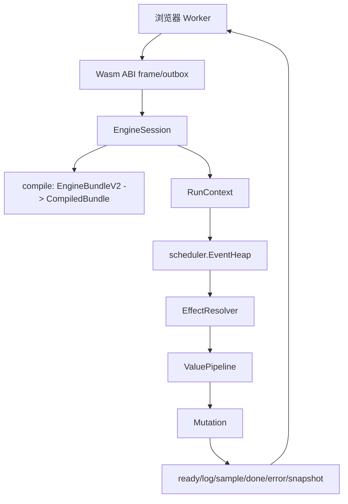

TASK_KEY: wasm-engine-v2-architecture
DOC_TYPE: 概要设计
WORKSTREAM: wasm
STATUS: tracked
EXECUTION_MODEL: gpt-5.4
LAST_TRACKED_AT: 2026-05-10

# WASM 概要设计

本文是 TinyGo V2 Wasm 计算引擎的概要设计入口。目标是把旧 Rust/V1/MVP 草案、Java demo 验证结论和 TinyGo deep research 收束成当前实现口径。

## 1. 总体架构



## 2. 生命周期

1. `engine_init` 接收 init frame。
2. ABI 解 frame，JSON payload 反序列化为 `EngineBundleV2`。
3. compile 层生成 `CompiledBundle`，并 fail-fast 输出所有校验问题。
4. session 进入 `ready`。
5. M1 初始属性验证可调用 `engine_snapshot_initial`，接收 `EngineRunInputV2` 的 run frame/payload，初始化 self/enemy runtime 后输出 `snapshot`，不推进 scheduler。
6. `engine_begin_run` 接收 `EngineRunInputV2`。
7. runtime 创建 `RunContext`，初始化 1v1 actor、pair state、事件队列、RNG、arena 和 outbox。
8. 宿主重复调用 `engine_step(maxEvents)`。
9. run 完成、取消或失败后输出 `done/error`。

## 3. 分层

### 3.1 静态 DTO 层

静态 DTO 面向传输、编辑和调试，允许字符串 ID：

1. `EngineBundleV2`
2. `ActorTemplateV2`
3. `ActionTemplateV2`
4. `ItemTemplateV2`
5. `StatusTemplateV2`
6. `FormulaDefinitionV2`
7. `TriggerDefinitionV2`
8. `AugmentDTO`

### 3.2 编译快照层

编译快照面向运行时，禁止热路径字符串查找：

1. `CompiledBundle`
2. `FormulaRegistry`
3. `TypeRegistry`
4. `TriggerIndex`
5. `ModifierIndex`
6. `PipelineBinding`
7. `SymbolTable`

### 3.3 运行时层

运行时只保存单次 run 的可变状态：

1. `[2]ActorRuntime`
2. `PairRuntime`
3. `ActionRuntimeState`
4. `ExecutionInstance`
5. `StatusInstance`
6. `ShieldInstance`
7. `ControlDirectiveInstance`
8. `HistoryWindow`
9. `CounterState`
10. `MarkState`
11. `RngRuntime`

## 4. 核心原则

1. 调度中心化：所有时间推进由 scheduler 控制。
2. 数值管线化：damage/heal/shield/resource/attribute 必须走 ValuePipeline。
3. 机制命令化：trigger 只产 command，不直接修改 HP 或状态。
4. 状态对象化：状态、护盾、控制、执行实例、pending intent 分开建模。
5. 类型索引化：type/tag 在编译期转短 ID、bitset 和反向索引。
6. 日志只用于观察，不用于机制判断。
7. 所有随机数由中央 RNG 分配并记录用途。
8. TinyGo 热路径优先使用数组、短 ID、arena、generation handle。

## 5. ABI 与协议

导出函数固定为：

```text
alloc(size)
dealloc(ptr, size)
engine_init(ptr, size)
engine_snapshot_initial(ptr, size)
engine_snapshot_actions_initial(ptr, size)
engine_begin_run(ptr, size)
engine_step(maxEvents)
engine_abort_run()
engine_outbox_ptr()
engine_outbox_len()
engine_outbox_clear()
```

首期 payload 为 JSON。frame header 包含：

1. `magic`
2. `schemaVersion`
3. `kind`
4. `flags`
5. `payloadLen`

二进制 payload kind 从第一版预留，但首期不实现 MessagePack/CBOR。

## 6. TypeList 网络概要

实体通过 type list 声明自己属于哪些玩法分类：

1. actor types
2. action types
3. item types
4. status types
5. effect tags
6. damage profile tags

编译后生成：

1. `TypeRegistry`：字符串 type/tag 到短 ID。
2. `TypeSet`：实体持有的 bitset。
3. `InvertedIndex`：type -> entity IDs。
4. `Matcher`：any/all/none 匹配条件。
5. `DedupeScratch`：多个 type 合并选中实体时去重。

这可以支持 A action 触发 B type action，也触发 C type action，且 B/C 重叠 action 只进入执行链一次。

## 7. 属性与资源概要

属性使用：

1. `base`
2. `current`
3. `max`
4. `resolved`
5. `dirty`

常用衍生读取应纳入公共能力：

1. `missing`
2. `current_ratio`
3. `missing_ratio`
4. `bonus`

资源独立于属性：

1. `current`
2. `max`
3. `spend`
4. `refund`
5. `regen`
6. `clamp`

HP 可以被视为内建生命资源或特殊属性，但 HP 变动必须走 HP/ValuePipeline，不允许任意机制直接改。

## 8. 机制子系统概要

### 8.1 Damage Pipeline

顺序为：

1. raw
2. crit
3. outgoing
4. incoming
5. mitigation/penetration
6. zero-damage/window immunity
7. shield
8. HP mutation
9. after damage triggers

### 8.2 Shield / Heal / Lifesteal

1. Shield 独立于 StatusInstance，但可以由 status/action/item/augment 产生。
2. 多实例 shield 支持 scope、priority、refresh、expire。
3. heal 输出 attempted/applied/overheal。
4. lifesteal 基于 actual damage dealt。

### 8.3 Control / Interrupt

1. 控制是状态或控制指令，不是技能特判。
2. action gate 读取控制状态，不暂停 scheduler。
3. interrupt 取消 execution 后续事件。
4. cleanse/immunity 通过矩阵表达。

### 8.4 Cadence / Cooldown / Charge

1. action state 保存 readyAt、charges、recharge timers。
2. 支持 cooldown reduce/reset/refund。
3. 支持 auto-repeat blocked/requeue。

### 8.5 History / Counter / Mark

1. HistoryWindow 用 ring 保存近期事件。
2. CounterState 支持 actor/pair/global scope。
3. MarkState 支持 source-target 方向、过期、消耗和 lockout。

### 8.6 Crit

1. 暴击是 execution-level scalar，不只是 damage 专用机制。
2. source-side scalar 在同一次 execution 内复用。
3. target reactive 不继承 source crit。
4. P0 支持 deterministic/expected crit，P1 补 seeded random。

### 8.7 Augment

1. augment 是模式级策略开关，不是状态实例。
2. active policies 在编译期或 run 初始化时生成。
3. augment 改写 attribute/crit/pipeline 策略，但不改变核心事件类型。

## 9. 输出

输出分为：

1. `ready`
2. `log`
3. `sample`
4. `done`
5. `error`
6. `snapshot`
7. `actionSnapshot`
8. `valueTrace`（DTO 预留；当前 runtime 未稳定产出）

前端页面摘要由 adapter 派生，不作为 Wasm 核心输出契约。

## 10. Review Gate

1. Gate 1：`EngineBundleV2`、输出日志契约、ABI frame。
2. Gate 2：runtime/scheduler/attribute/resource/formula/TypeList 底座。
3. Gate 3：trigger/command/pipeline 回流。
4. Gate 4：shield/resource/control/cadence/history/counter/mark/crit/augment。
5. Gate 5：端到端样例、浏览器 Worker、性能门禁。
