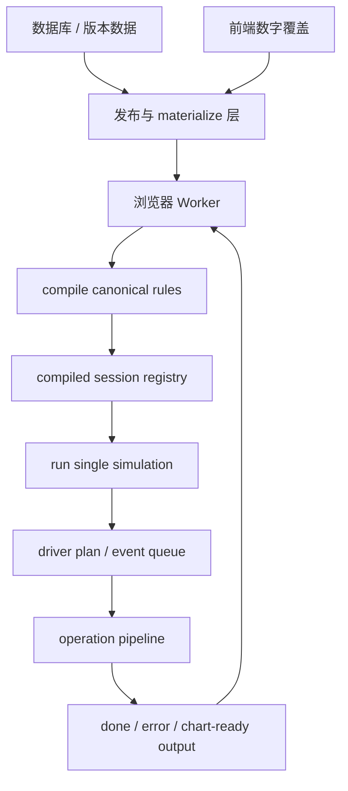

TASK_KEY: wasm-engine-v2-architecture
DOC_TYPE: 概要设计
WORKSTREAM: wasm
STATUS: tracked
EXECUTION_MODEL: multi-model
LAST_TRACKED_AT: 2026-07-06

# WASM 概要设计

本文是 Wasm 通用计算引擎的系统级概要设计，回答能力放在系统哪里、模块如何协作、边界如何划分。需求边界以 [WASM通用计算引擎需求对齐记录.md](../../需求澄清/wasm/WASM通用计算引擎需求对齐记录.md) 为准；跨后端/前端的 W0 对齐方案见 [WASM前后端对齐整改方案.md](./WASM前后端对齐整改方案.md)；可执行实现契约见 [WASM详细设计.md](../../详细设计/wasm/WASM详细设计.md)。

本次重写后的设计直接采用 canonical `Combatant -> Provider -> Ability` 模型。旧 Git 历史里的 V2 DTO、专用 DPS lane 和逐步推进 ABI 只作为 stale reference，不再作为本文的增量修补基线。

## 1. 总体定位

Wasm 是独立、确定性、数据驱动的计算引擎：

1. 不读取数据库，不持有业务缓存，不承担前端编辑器职责。
2. 不把具体游戏、装备、英雄或符文机制硬编码成引擎分支。
3. 只消费 publish/materialize 层产出的 canonical JSON。
4. 在 compile 阶段把规则和对象定义编译成只读 session。
5. 在 run 阶段基于只读 session 与单次初始 snapshot 生成结果。

P0 固定为 1v1、single-run、deterministic/expected 模拟。多单位战场、随机分布模拟、续跑、暂停恢复、批量 sweep ABI 都是后续能力，不进入 P0 runtime 语义。

`single_attacker_dps` 只保留为 legacy/compat lane：它可以支撑旧页面和历史回归，但不再接收新机制。所有新机制进入通用 provider、ability、listener、operation pipeline。

## 2. 系统边界



分层职责：

1. 发布/materialize 层负责把数据库实体、用户选择、版本信息和允许的数字覆盖转换成 canonical payload。
2. Worker 负责持有 Wasm 实例、sessionId、超时保护、对比类模拟编排和 UI 侧桥接。
3. Wasm compile 负责 schema 校验、引用解析、type/tag 编译、公式编译、索引构建和只读 session 生成。
4. Wasm run 负责离散事件调度、ability attempt、operation pipeline、runtime state、采样和结果输出。
5. 前端图表消费 summary、series 和 comparison row，不从底层日志二次拼接主时间线。

旧表名、旧 DTO 名和页面展示词可以留在后端或前端迁移层，但进入 Wasm 前必须转换为 canonical 概念。Wasm ABI 不同时接受两套术语。

## 3. Compile / Run 生命周期

P0 生命周期分成两个显式阶段：

1. `compile` 消费 canonical rules/object，生成只读 compiled session。
2. `run` 消费 `sessionId`、`expectedRulesHash`、run config、`initialSnapshot`、采样配置和安全预算，输出 `done` 或 `error`。

session 由 Worker/Wasm 内部持有，JS 侧只保存 opaque `sessionId` 和轻量元数据。compile 成功至少返回：

1. `sessionId`
2. `schemaVersion`
3. `schemaHash`
4. `rulesHash`
5. `warnings[]`

run 前必须检查：

1. session 存在。
2. `expectedRulesHash` 与 session 匹配。
3. `initialSnapshot` 携带的 hash 与 session 匹配。
4. run config 有明确 stop policy，默认必须有 `durationMs` 上限。

同一个 compiled session 可以被多次 run 复用，但每次 run 的 mutable runtime state 必须完全隔离。HP、resource、cooldown、dynamic provider、shield、event queue、series、warnings、evidence 都不跨 run 继承。

P0 不支持把某次 `finalSnapshot` 作为下一次 `initialSnapshot` 续跑。snapshot 只表达战斗状态，不携带 event queue、driver 进度、series、warnings、evidence 或临时 pipeline frame。

## 4. Canonical 对象模型

P0 canonical 实体模型为：

```text
Combatant
  -> CapabilityProvider[]
       -> Ability[]
       -> Modifier[]
       -> Listener[]
       -> provider state
  -> AttributeSlot[]
  -> ResourceSlot[]
  -> ShieldInstance[]
  -> combatant vars
```

核心规则：

1. `Combatant` 是能力和状态的调度容器，不是只有 HP 的扁平对象。
2. `CapabilityProvider.kind` 至少包括 `champion`、`item`、`rune`、`talent`、`status`、`system`。
3. `Ability.kind` 至少包括 `active`、`passive_listener`、`aura_modifier`、`tick`、`stateful`。
4. 普攻是带 `basic_attack` type/tag 的 active ability，不是独立硬编码系统。
5. ability 引用使用 `providerRef + local ability key`，不使用裸全局 ability id。
6. persistent provider 使用 `kind:stableId`；dynamic provider 在 stable id 后追加 runtime instance id。
7. status/temporary/dot 等动态对象以 provider 形态进入 runtime；shield 是一等 runtime object，不强制 provider 化。

运行态值分三类：

1. `AttributeSlot` 负责 `base/current/max/resolved`、modifier、bucket resolver 和 dirty/resolve。
2. `ResourceSlot` 负责 `current/max`、spend、refund、clamp。
3. `ValueSlot` 负责 provider state、ability state、combatant var、计数器等通用 typed value。

前端仍可向用户展示“技能”等领域词，但 Wasm schema 的路径根统一使用 `ability`，例如 `ability.param.baseDamage`。

## 5. Driver 与离散事件

P0 driver 不自动扫描所有 active ability，也不要求前端逐次触发 action。run config 必须显式提供 driver plan：

1. entry 指定 `abilityRef`、source/target selector、priority、`firstAtMs`。
2. repeat entry 使用 interval。
3. while-ready entry 根据 cooldown、resource、condition 的下一次可能 ready 时间重新入队。
4. condition 使用受限 bool 公式，只允许读取 source/target attr/resource、ability param 和 gate 相关数据。

runtime 以离散事件优先队列推进，按 `timeMs + event category + priority + stable order` 弹出事件。它跳到下一个事件点，不做固定 tick 或逐毫秒扫描。

同一 `timeMs` 的默认事件类别顺序固定为：

```text
expire/cleanup -> provider_tick -> scheduled ability_attempt -> triggered events/pipeline continuations -> sample
```

事件类别顺序是引擎语义，不能由用户配置覆盖；同类内部才允许使用 priority 与 stable order。

## 6. Ability 执行与触发

P0 active ability 只支持 instant cast。一次 attempt 的生命周期：

1. 做 cooldown、resource、condition、target gate。
2. gate 失败时记录 `attempt_skipped` evidence，并按 driver 规则安排下一次尝试。
3. gate 成功后创建 execution frame。
4. lifecycle 先 staged cost/CD，并对后续 operation 读取可见。
5. ability operations 进入同一个 staged frame。
6. frame 成功后原子提交 runtime state。
7. 父 frame 提交后才 enqueue listener/子 ability 事件。

父子触发使用独立 execution frame。子 frame 的 fatal error 可以终止当前 run，但不能回滚已经提交的父 frame。listener 读取父事件 payload 和父 frame 提交后的 committed state，不暴露完整 old/new state 双快照。

compile 阶段需要识别触发环：无界循环是 error，有界循环可以通过但必须产生 warning/evidence。runtime 仍保留 `maxChainDepth`、`maxCommandsPerEvent`、`maxEvents` 等硬保护。

## 7. Operation Pipeline

所有运行态数值变更都进入 command/operation pipeline。机制不能绕过 pipeline 直接写 HP、资源、冷却或 provider state。

P0 runtime 必须闭环的 operation：

1. `damage`
2. `heal`
3. `shield`
4. `resource_change`
5. `attribute_change`
6. `cooldown_change`
7. `apply_provider`
8. `refresh_provider`
9. `expire_provider`
10. `emit_event`

P0 schema/compile 预留、runtime 可后段补齐的 operation：

1. `ability_state_change`
2. `provider_state_change`
3. `combatant_var_change`
4. `pipeline_guard`
5. `execute_threshold`
6. `interrupt/control`

HP 不提供直接 raw set 语义；HP 变化只能来自 damage、heal、shield 或 pipeline guard 约束后的语义命令。普通 ability cost 与基础 cooldown 是 lifecycle，不需要由规则作者重复写成 operation。

## 8. Modifier、Resolver 与 Type

P0 modifier 分两类：

1. attribute modifier：只作用于属性 resolver，挂载即生效，不带运行时条件。
2. pipeline modifier：只修改当前 command 的数值、标签或结算标记，不产生额外 command。

bucket/乘区是 resolver policy，不是 slot storage。bucket 按 domain/channel 定义，stage/phase 顺序显式固定，同一 stage 内按 priority + stable order。

type/tag 使用 canonical key，例如：

```text
ability/basic_attack
ability/dash
status/stun
provider/item
event/damage_dealt
damage/physical
```

Wasm matcher 只消费 canonical key 编译出的短 ID。type relation 主要服务配置编辑器，不作为 Wasm 自动推导语义；实体实际拥有的 type 必须在 canonical payload 中显式列出。Wasm 不做父子闭包展开。

## 9. 输出与图表契约

P0 `done` 必须包含 chart-ready 输出，而不是只给 final snapshot：

1. `ok`
2. `summary`
3. `finalSnapshot`
4. `series[]`
5. `warnings[]`
6. `evidence`
7. `seriesSamplingEvidence`

summary 是图表和对比视图的稳定行数据，至少覆盖：

1. `durationMs`
2. `stopReason`
3. 双方 final HP
4. 双方伤害统计
5. `abilityAttemptCount`
6. `abilityCastCount`
7. `attemptSkippedCount`
8. `warningCount`
9. `evidenceTruncated`
10. `seriesDownsampled`
11. `abilityStats[]`

`summary.stopReason` 使用固定枚举：`duration_reached`、`target_dead`、`source_dead`、`both_dead`、`no_events`、`budget_exceeded`。fatal error 不属于 done stop reason，而是 error 通道。

`series[]` 至少覆盖 `timeMs`、双方 HP 当前值、双方累计伤害、双方累计 DPS、双方窗口 DPS。sample 是 scheduled event，同一时间点默认最后执行，记录该时刻所有战斗变化结算后的状态。

对比类图表首期由前端/Worker 编排多次 single run 汇总。Wasm core P0 只保证单次 run 稳定；后续在性能压力明确后再设计 batch/sweep ABI。

## 10. 错误、Warning 与 Evidence

compile 错误分两层：

1. 协议/结构类错误可以 fast-fail。
2. 进入已知 schema 后，语义错误尽量 collect-all。

compile error 存在时不生成可运行 session。compile warning 不阻止 session，适用于有界触发链、可降级配置、确定性近似或兼容迁移提示。

run 阶段 fatal error 返回单个主 error，不同时返回正常 done，也不输出可作为下一次 run 输入的 final snapshot。

`warnings[]` 是面向用户的摘要提示；`evidence` 是机器可追踪事实明细。P0 evidence 至少支持 `attempt_skipped`、`budget_exceeded`、`downsampled`、`guard_applied`、`hash_mismatch`、`session_missing`、`runtime_warning`。

## 11. P0 验收竖切

P0 集成验收按代表性竖切收口，而不是按所有 operation 清单逐项宣称完成：

1. 基础伤害：active ability 造成 damage，经 pipeline 扣 target HP，并输出 summary、finalSnapshot、series[]。
2. 资源 + 冷却：active ability 消耗 resource 并进入 cooldown；再次施放被 gate 阻止，输出可解释 evidence。
3. 临时 provider + 属性/护盾：ability apply provider，provider 提供 attribute modifier 或 shield，到期后清理。
4. fixed interval tick provider：temporary/status provider 按固定 tick 间隔触发 DOT/HOT/资源变化，直到过期或移除。

这些竖切是新通用引擎的首批垂直闭环。legacy DPS lane 不作为新机制验收入口。

## 12. Cursor 协作边界

后续落代码按仓库根 `AGENTS.md` 的 Cursor 协同流程执行。驱动模型先收敛范围，再把单个 slice 交给 Cursor；Cursor 只负责受限编码，不负责重新解释需求或扩大设计。

概要层给 Cursor worker 的系统边界只有以下几条：

1. 新通用引擎的主线是 canonical `Combatant -> Provider -> Ability`。
2. 旧专用 DPS lane 是 legacy/compat，不是新机制入口。
3. Wasm core P0 只保证单次 deterministic run；对比类模拟由 Worker/前端编排多次 run。
4. 目标 ABI 是 compile/run 分离；现有导出函数如仍需保留，只能作为迁移兼容包装，不得反向定义新语义。
5. 所有数值状态变更走 operation pipeline；不能因为实现方便绕过 pipeline 写 HP、资源、冷却或 provider state。
6. 图表主数据来自 `summary` 与 `series[]`，不能要求前端从日志二次拼主时间线。

实际编码任务、字段契约、fixture、验证命令和 Cursor prompt 模板必须以详细设计为准；概要设计不承担具体文件编辑顺序。
