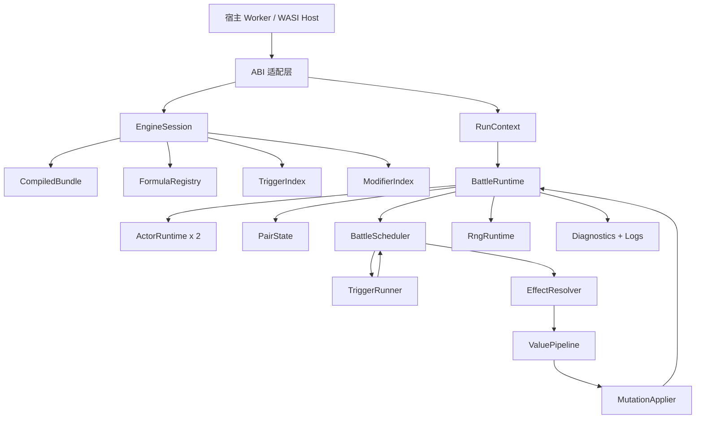
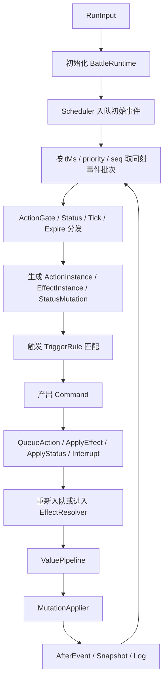

# TinyGo WASM 事件管线与对象化数据流概要设计研究报告

## 执行摘要

本报告以 `文档记录/概要设计/wasm/概要设计-TinyGo事件管线与对象化数据流.md` 为核心，综合同目录已检索到并纳入的扩展文档《概要设计-WASM内部事件流》《概要设计-控制与打断状态机制》《概要设计-护盾机制与跨游戏规则》《概要设计-移动速度机制》《概要设计-数据流转》《概要设计-通用战斗引擎V2对象化建模适配》，并参考协议、详细设计与需求澄清文档，形成一份适合直接进入实现阶段的增强版概要设计。资料获取首先通过已启用的 entity["company","GitHub","developer platform"] 连接器完成，且仅覆盖用户指定仓库 `JeanbartBiubiu/damage_viewer_project_planning`；随后补充 TinyGo、WebAssembly、浏览器加载、测试与 CI/CD 的官方资料。fileciteturn26file0L1-L1 fileciteturn27file0L1-L1 fileciteturn29file0L1-L1 fileciteturn30file0L1-L1 fileciteturn33file0L1-L1 citeturn1search1turn2search1turn3search0

现有文档的架构方向已经相当明确，核心共识可以概括为一句话：**运行时状态对象化，执行拓扑中心化，数值结算管线化，外部协议数据化**。也就是说，`ActorRuntime / PairState / ActionRuntimeState / ExecutionInstance / StatusInstance` 用来承载归属与状态，`BattleScheduler` 负责唯一时序推进，`TriggerIndex` 与 `ModifierIndex` 负责规则查找，`EffectResolver -> ValuePipeline -> Mutation` 负责所有数值和状态落地，而前端与 Wasm 之间保持固定 `init/run/cancel/result` 协议。这个方向是正确的，且与 TinyGo 在 WebAssembly 上“单线程、确定性、避免热路径分配和复杂反射”的现实约束天然一致。fileciteturn26file0L1-L1 fileciteturn27file0L1-L1 fileciteturn30file0L1-L1 fileciteturn33file0L1-L1 citeturn2search1turn7search0turn7search1

问题不在于“架构方向是否成立”，而在于“哪些实现决策还没有完全拍板”。从仓库文档看，当前最需要补强的不是理念，而是五类具体决策：其一，**热路径容器**究竟采用 `map` 还是稠密数组/句柄池；其二，**状态与护盾的归属边界**究竟统一为 `StatusInstance`，还是做专门 `ShieldInstance`；其三，**ABI 与序列化**应该继续以 JSON 为唯一协议，还是保留二进制快路径；其四，**公式执行表示**是继续 AST 直译，还是编译为轻量字节码；其五，**浏览器宿主交互**是否以 `syscall/js` 为中心，还是尽量保持导出函数 + Worker 编排。基于仓库文档与官方资料，本报告建议的默认落地方案是：**单 Worker + 单调度器 + 稠密 ID 表 + 结构化错误 + JSON 调试协议 + 预留二进制快路径 + 最小化 `syscall/js` 依赖**。fileciteturn26file0L1-L1 fileciteturn31file0L1-L1 fileciteturn33file0L1-L1 fileciteturn36file0L1-L1 citeturn1search1turn2search5turn3search1turn6search2

同时需要明确，仓库目前**尚未正式指定**以下目标：可量化性能指标、内存预算、跨 JS 之外宿主的正式 ABI、日志保留策略、数值精度规约、版本兼容策略。对此，本报告都给出默认建议值与可选路径，但会明确标注为“未指定”。fileciteturn32file0L1-L1 fileciteturn33file0L1-L1 fileciteturn36file0L1-L1

## 仓库研读结论

围绕主文档与扩展文档，当前设计已经形成一个较清晰的骨架：静态层由 `EngineBundle / CompiledBundle / FormulaRegistry / TriggerIndex / ModifierIndex` 构成，运行时层由 `BattleRuntime / ActorRuntime / PairState / ActionRuntimeState / ExecutionInstance / StatusInstance / RngRuntime / LogEntry` 构成，执行链由 `ScheduledEvent -> ActionIntent -> ActionGate -> Trigger -> Command -> EffectInstance -> ValuePipeline -> Mutation -> AfterEvent` 构成；并且已经对控制、打断、护盾、移动速度、四通道结算、Worker 协议、历史窗口、PairState、PendingIntent 等关键机制给出了扩展文档。fileciteturn26file0L1-L1 fileciteturn27file0L1-L1 fileciteturn28file0L1-L1 fileciteturn29file0L1-L1 fileciteturn31file0L1-L1 fileciteturn32file0L1-L1

下表整理的是“当前文档已经基本拍板”的内容。表中的“建议延续”不是新增方向，而是对现有文档结论的收束。

| 维度 | 当前文档已明确的核心结论 | 建议延续 |
|---|---|---|
| 执行拓扑 | 单线程、确定性、`BattleScheduler` 串行推进，不依赖浏览器 Wasm 多线程 | 保持不变，作为 TinyGo/WASM 第一性约束 |
| 对象边界 | `ActorRuntime` 负责归属，`BattleScheduler` 负责顺序，禁止对象互调越权改状态 | 保持不变，并进一步形式化句柄与所有权 |
| 事件/数值分层 | `EventPhase` 监听触发联动，`ValuePhase` 仅改当前数值，不直接派生 Action | 保持不变，避免“触发-数值-触发”递归污染 |
| 统一落地通道 | `EffectResolver -> Mutation` 为唯一状态变更落点 | 保持不变，并把 HP/护盾/资源/属性统一纳入 |
| 控制系统 | `StatusInstance + ControlDirectiveInstance + ExecutionInstance` 三分模型 | 保持不变，补完善法权限矩阵 |
| 护盾系统 | 护盾是实例，不是面板属性；护盾定义与交互矩阵分离 | 保持不变，避免退化为单数值 shield |
| 移动速度 | 分桶聚合优先于巨型公式，软上限用精确分段公式 | 保持不变，并作为“派生属性样板” |
| 前后端协议 | 前端编排输入，WASM 固定协议，Worker 会话复用已初始化实例 | 保持不变，细化成稳定 ABI 契约 |

这些结论彼此之间是兼容的，而且相互增强。比如，`PairState` 的引入解决了 mark、每目标冷却、局部增伤窗口的归属问题；`PendingIntent` 解决了“控制结束立即恢复动作”的时序问题；`HistoryState / CounterState` 把“回扫日志做机制判断”从架构层面排除了；`FormulaRegistry` 将公式对象显式提升为初始化阶段编译产物，从根上避免运行时反复解析表达式。fileciteturn26file0L1-L1 fileciteturn27file0L1-L1 fileciteturn31file0L1-L1 fileciteturn37file0L1-L1

不过，仓库文档也明确暴露出一条非常重要的信息：**当前概设的广度已经超过现有引擎实现深度**。需求澄清文档指出，乘区机制、暴击、完整控制状态体系、派生属性流水线、多实例护盾、移动速度、技能状态机、资源系统扩展等都属于“已设计但未完整实现”的能力，其中不少还是 P0/P1 级差距。这说明新的概要设计不应再继续扩面，而应把实现口径收束成一条分阶段可落地路径。fileciteturn36file0L1-L1

## 完整概要设计

### 总体架构

建议将引擎拆成两个寿命层级：**`EngineSession`** 与 **`RunContext`**。`EngineSession` 在 `init` 阶段创建，只包含不可变、可复用的数据，例如 `CompiledBundle`、`FormulaRegistry`、`TriggerIndex`、`ModifierIndex`、静态字符串表、调试符号表与复用缓冲区；`RunContext` 在每次 `run` 时创建，只包含本轮对局的 `BattleRuntime`、事件队列、随机数状态、日志缓冲与对象池。这样可以将“版本初始化成本”和“单次模拟成本”解耦，完全契合仓库中 `init -> ready -> 多次 run` 的 Worker 会话模型。fileciteturn32file0L1-L1 fileciteturn33file0L1-L1

下面这张图给出建议的模块关系。



这个架构延续了主文档“对象化负责归属、中央管线负责时序和数值”的原则，并把协议层、编译层、运行层、日志层与宿主层彻底分开，有利于后续同时接浏览器 JS 宿主与非浏览器宿主。fileciteturn26file0L1-L1 fileciteturn30file0L1-L1 fileciteturn33file0L1-L1

### 模块划分

建议最小模块集如下。该划分不是为了“包数量好看”，而是为了把生命周期、热路径与跨语言边界分开。

| 模块 | 职责 | 是否热路径 | 备注 |
|---|---|---|---|
| `abi` | 管理导出函数、指针拷贝、错误编码、句柄表 | 否 | 与宿主绑定最紧 |
| `compile` | `EngineBundle -> CompiledBundle`，生成短 ID 和索引 | 初始化热路径 | 一次 init，多次复用 |
| `runtime` | `EngineSession / RunContext / BattleRuntime` | 是 | 生命周期核心 |
| `scheduler` | 事件堆、批次取出、时刻推进、取消/失效判定 | 是 | 唯一全局序 |
| `trigger` | `EventPhase` 匹配、条件求值、`Command` 产出 | 是 | 不直接改状态 |
| `pipeline` | damage/heal/resource/attribute 四通道与 `ValuePhase` | 是 | 唯一数值结算入口 |
| `status` | 状态实例、控制指令、护盾实例、过期处理 | 是 | 与 scheduler 紧耦合 |
| `formula` | 公式对象执行、上下文读取、常量折叠 | 是 | 必须无副作用 |
| `history` | ring buffer、计数器、PairState 查询服务 | 次热路径 | 只暴露查询接口 |
| `diagnostics` | LogEntry、Snapshot、统计指标、重放记录 | 可切换 | 默认支持降采样 |

该模块划分直接对应仓库中已经确定的概念：`FormulaRegistry`、`TriggerIndex`、`ModifierIndex`、`BattleScheduler`、`ActionQueueManager`、`ExecutionInstance`、`Mutation`、`HistoryState`、`RngRuntime`。不同之处是，本报告进一步把“编译期”和“运行期”拆出了清晰壳层，并明确建议将 `diagnostics` 从热路径中做成开关式能力。fileciteturn26file0L1-L1 fileciteturn27file0L1-L1 fileciteturn37file0L1-L1

### 数据模型

建议把运行时数据模型正式定为“三类寿命、四类句柄、两层索引”。

**三类寿命**如下：

| 寿命层 | 对象 | 生命周期 |
|---|---|---|
| 会话级 | `CompiledBundle`、`FormulaRegistry`、字符串表、类型表 | `init` 到 session 销毁 |
| 对局级 | `BattleRuntime`、`ActorRuntime`、`PairState`、`RngRuntime` | 单次 `run` |
| 事件级 | `ActionInstance`、`EffectInstance`、`ValueContext`、`Mutation` | 单个事件或链路内 |

**四类句柄**建议固定为 `ActorID / ActionID / StatusID / InstanceID`，热路径不再依赖字符串查表。字符串 ID 只保留在边界层、日志层和调试视图中。主文档已经建议“字符串 ID 可保留在边界层，热路径优先使用数字 ID”；TinyGo 文档又明确提醒 `map` 可能比预期慢、接口与某些比较路径可能退回反射实现，GC 在 WebAssembly 上也会更慢。因此，在 TinyGo/WASM 下把热路径数据组织为稠密数组或小整数句柄表，不只是优化建议，几乎是架构性要求。fileciteturn26file0L1-L1 citeturn2search1turn7search0

建议的核心结构如下：

```go
type EngineSession struct {
    VersionMeta      VersionMeta
    Bundle           *CompiledBundle
    Formulas         *FormulaRegistry
    TriggerIndex     *TriggerIndex
    ModifierIndex    *ModifierIndex
    Symbols          *DebugSymbolTable
    Scratch          *SharedScratch
}

type RunContext struct {
    Runtime          BattleRuntime
    Pools            RuntimePools
    Outbox           MessageOutbox
}

type BattleRuntime struct {
    NowMs            int64
    Actors           [2]ActorRuntime
    Pair             PairState
    Scheduler        EventHeap
    RNG              RngRuntime
    Diagnostics      DiagnosticsState
}
```

这一版与仓库文档最大的差异，是把 `Actors map[ActorID]*ActorRuntime` 建议性地收紧为 `[2]ActorRuntime`。这是因为当前边界明确是 `1v1`，而 `1v1` 场景下保留 `map` 形式没有架构收益，却持续带来 GC 与查找成本。若未来扩展到多单位，再把 `ActorStore` 升级为 `[]ActorRuntime + HandleTable` 即可；现阶段不必为未发生的多单位复杂度支付热路径代价。fileciteturn26file0L1-L1 fileciteturn32file0L1-L1 fileciteturn37file0L1-L1 citeturn7search0turn2search1

### 事件管线设计

建议将事件处理正式固定为“**同刻批处理 + 出队时合法性再判定 + 一切派生行为都重新入队**”。这与《WASM 内部事件流转概要设计》提出的最小堆模型、`PendingIntent`、`intent_recheck`、`drop/cancel/transform/run` 四分结果完全一致，也比“对象 inbox + 互相消息”更符合确定性重放需求。fileciteturn27file0L1-L1

事件主链推荐如下图。



在这条主链中，建议明确以下顺序约束：

其一，**`EventPhase` 与 `ValuePhase` 严格分层**。`TriggerRule` 只订阅外层事件，不得在数值阶段中直接排 Action；`ValueModifier` 只修改当前 `ValueContext`，不得直接派生 Trigger。这样既保留了被动/装备联动能力，也避免把所有副作用混进 damage pipeline。fileciteturn26file0L1-L1

其二，**`Mutation` 是唯一状态落点**。Action 不直接扣血、回血、加蓝、加状态；它只生成 `EffectInstance`。Effect 也不直接改 `ActorRuntime`；它只输出 `Mutation`。最终由 `MutationApplier` 写运行时并回发 after-event。这样可以天然支撑日志、回放、断言、撤销式调试与对账。fileciteturn26file0L1-L1

其三，**控制与打断必须作用于正确对象**。眩晕、沉默、fear、taunt、sleep 等持续语义归 `StatusInstance`；被迫行动或位移语义归 `ControlDirectiveInstance`；可取消、可中断的施法/引导/弹道过程归 `ExecutionInstance`。这样才能正确表达“状态存在但执行已取消”“执行结束但持续伤害还在”“净化状态但不一定删除位移组件”这类情况。fileciteturn31file0L1-L1

其四，**护盾必须是 damage pipeline 的一个阶段，不是并行系统**。推荐顺序固定为：公式求值、来源增减伤、目标增减伤、抗性/穿透、免伤/不可选取检查、护盾吸收、HP 变更、after damage。主文档和护盾扩展文档对这一点已经高度一致，本报告只进一步建议把 `ShieldAbsorbMutation` 与 `HpDamageMutation` 明确拆成两个可观察 mutation 类型。fileciteturn26file0L1-L1 fileciteturn29file0L1-L1

### 接口定义与 ABI 约定

仓库当前对外协议已明确到 Worker 消息层：`init / run / cancel` 输入，`ready / tick / done / error` 输出；Worker session 绑定一个初始化后的引擎实例；同一 session 可多次 run。这个协议非常适合保留。需要补强的是 **Wasm 导出 ABI**，即 Worker 与 `.wasm` 之间的真实内存约定。fileciteturn33file0L1-L1

建议把 ABI 分成两层：

**协议层**继续沿用消息模型：
- `init(meta, bundle, config)`
- `run(runId, input)`
- `cancel(runId)`
- `poll()` 或 `drainMessages()`

**二进制层**固定为“长缓冲区输入、长缓冲区输出、宿主负责拷贝与释放”的 C-like 约定：
- `engine_alloc(size) -> ptr`
- `engine_free(ptr, size)`
- `engine_init(ptr, len) -> status`
- `engine_run(ptr, len) -> status`
- `engine_cancel(ptr, len) -> status`
- `engine_drain(out_ptr, out_cap) -> written`

这样做有三个好处。第一，协议层与 ABI 层解耦，未来从 JSON 切换到二进制时不影响上层控制平面。第二，Worker 与 Wasm 间不需要把控制语义绑定到 `syscall/js` 回调。第三，宿主可以非常自然地扩展到 JS 之外环境。TinyGo 官方文档确认 WebAssembly 构建支持显式导出函数、JavaScript 侧可通过 `wasm.exports` 调用；同时官方也明确要求浏览器加载时保证 `wasm_exec.js` 版本与编译器版本匹配，并正确设置 `application/wasm` MIME 类型。MDN 则指出 `WebAssembly.instantiateStreaming()` 是加载 Wasm 的高效方式，但 CSP 可能影响编译执行。citeturn1search1turn3search0

对于浏览器宿主，默认建议仍是 **WebWorker + `instantiateStreaming` + 版本匹配的 `wasm_exec.js`**。这样既符合仓库当前协议设计，也符合 TinyGo 官方推荐用法。对于非浏览器宿主，如果未来明确有 Go/其他语言宿主需求，则建议把核心 runtime 做成“与宿主无关的纯核心包”，并追加一个 `wasip1/wasip2` 适配层，因为 TinyGo 官方已经支持 WASI Preview 1 与 Preview 2。当前仓库尚未正式指定此方向，因此此处只作为可选集成路径。fileciteturn33file0L1-L1 citeturn2search6turn1search1

## 关键决策与风险

当前文档最需要补齐的，是一批“如果不拍板，实现就会左右摇摆”的设计决策。下表给出建议。

| 设计决策 | 方案一 | 方案二 | 建议 |
|---|---|---|---|
| 热路径容器 | `map` + 指针对象，开发快 | 稠密数组 + 小整数 ID，开发稍复杂 | 选方案二 |
| 状态与护盾 | 全部并入 `StatusInstance` | `StatusInstance` 与 `ShieldInstance` 分离 | 选方案二 |
| 公式执行 | AST 直译，调试好 | 编译轻量字节码/节点数组，热路径更稳 | 初期 AST，近期转轻字节码 |
| ABI 序列化 | JSON 唯一协议 | JSON 调试协议 + 二进制快路径 | 选混合方案 |
| 调度模型 | 中央堆 | actor 本地队列 + 归并 | 选中央堆 |
| 宿主交互 | 重依赖 `syscall/js` | 导出函数为主，`syscall/js` 只做必要桥接 | 选后者 |

这些建议并非抽象偏好，而是直接由仓库文档与 TinyGo/WASM 约束推导出来。

### 热路径容器

主文档在概念上允许 `map[ActorID]*ActorRuntime` 一类结构，但同样已强调热路径应转为数字 ID。需求澄清文档则反复出现 `EventQueue`、`PairState`、`HistoryWindow`、`CounterState`、`Packet` 等对象的高频访问。TinyGo 官方又明确提示：WebAssembly 上 GC 更慢，`map` 修改、接口装箱、字符串/字节切换、goroutine 启动等都容易触发分配或额外成本。因此，在实现层继续大面积使用 `map`，虽然“概念上正确”，但“性能上方向错误”。推荐做法是：**编译后所有定义表、实例池、日志池、状态池都用切片 + 句柄表组织；只有边界层与诊断层保留 map**。fileciteturn26file0L1-L1 fileciteturn37file0L1-L1 citeturn7search0turn2search1

### 状态与护盾

护盾扩展文档已经明确提出：护盾不是状态的一个普通数值，不应该退化成 `shieldValue` 面板属性；它是可被伤害逐步消耗、可过期、可区分范围、可有优先级的运行时实例。控制扩展文档则把状态系统定义为“动作权限 + 强制行为 + 持续时间修正 + 净化/免控规则”的语义容器。所以，虽然部分实现上可以让 `StatusInstance` “关联”护盾，但不建议把护盾直接并入状态统一处理。**推荐模型是：`StatusInstance` 可拥有 `ShieldRef`，但真正的护盾资源由 `ShieldInstance` 管理。**fileciteturn29file0L1-L1 fileciteturn31file0L1-L1

### 公式执行表示

当前文档已经把公式对象提升为 `FormulaRegistry`，并要求初始化编译、运行时只按 `FormulaID + EvalContext` 求值。这意味着项目已经走出了“运行时动态拼表达式”的正确一步。下一步要拍板的是：MVP 是否继续 AST 直译，还是尽快转成轻字节码/节点数组。考虑到公式系统仍处于增长期、日志与调试价值很高，建议 **MVP 保持 AST/节点树求值，但编译阶段做常量折叠、短 ID 化、输入位点预绑定；当乘区、控制、移动速度、海克斯等表达式稳定后，再转为轻字节码**。这样能兼顾实现速度与后续性能升级路径。fileciteturn26file0L1-L1 fileciteturn34file0L1-L1

### ABI 与序列化

继续只用 JSON 当然能跑，但代价是：字符串编码、解码、字段名重复、反射依赖、额外分配与大对象拷贝。在 TinyGo 中，反射与 `encoding/json` 并非完整无成本能力，官方文档也明确提醒它们在兼容性和性能上都应谨慎使用。因此推荐的折中方案是：**保留 JSON 作为调试协议与初版协议；并从一开始在 ABI 层预留二进制导出函数，但首期不强制启用。**这样可以让产品和调试体验先跑通，同时不把未来性能路线锁死。fileciteturn33file0L1-L1 citeturn2search5turn2search1

### 调度与并发

TinyGo 文档强调，某些场景下调度是协作式的，长时间不让出的 goroutine 会占住执行流；`recover` 在 WebAssembly 上又并不可靠。因此该项目绝不应该在引擎内部引入“两个 actor 两个 goroutine 对打”的实现口径。仓库主文档本身也已把这点否定掉。推荐方式仍然是：**单调度器、单协程事件循环、无共享写并发、无热路径 channel**。只有宿主层的 Worker 线程与 UI 线程分离，内部运行时依然单线程。fileciteturn26file0L1-L1 citeturn2search1turn7search1turn6search2

### 风险清单

当前实现阶段最重要的风险不是“算法不够聪明”，而是“边界不够硬”。建议重点监控以下风险：

| 风险 | 表现 | 建议控制 |
|---|---|---|
| 事件爆炸 | 单事件派生过多 command，链深失控 | `chainDepth`、`maxCommandsPerEvent`、`oncePerEvent`、`internalCooldown` |
| 句柄悬空 | 已取消 execution/status 仍被旧事件引用 | 采用 generation handle 或 `alive` 标记 |
| 热路径分配 | 每次求值/日志/字符串拼接都分配 | 池化事件、日志降采样、数值 ID 化 |
| 协议抖动 | GUI 业务改字段导致 ABI 连锁变化 | 协议层与 ABI 层分离，稳定 message schema |
| JSON 过重 | init/run 开销过高、GC 抖动 | init 用 JSON、run 预留二进制 |
| 回放失真 | 日志和机制查询混用，顺序漂移 | `HistoryState` 与 `LogEntry` 分离 |
| 错误恢复误判 | 依赖 panic/recover 做控制面恢复 | 统一结构化错误，不依赖 recover |

这些风险中的前四项，仓库文档已经不同程度提到；后两项则是 TinyGo/WASM 约束下应尽早落表的实现纪律。fileciteturn26file0L1-L1 fileciteturn27file0L1-L1 fileciteturn36file0L1-L1 citeturn2search1turn7search0

## 实现细节建议

### 建议的文件与包布局

下面给出一套适合 TinyGo/WASM 的代码组织方式。它的目标不是“遵循某个教条式 Go 目录规范”，而是让**ABI、编译、运行时、热路径与测试**形成清晰隔离。

| 路径 | 作用 | 说明 |
|---|---|---|
| `cmd/engine_wasm/main.go` | 导出 Wasm 入口 | 只放导出函数与最薄装配层 |
| `internal/abi/` | 指针复制、句柄表、消息编解码 | 与宿主交互唯一入口 |
| `internal/compile/` | `EngineBundle -> CompiledBundle` | 建索引、下发短 ID、做 fail-fast 校验 |
| `internal/model/` | DTO、ID、枚举、轻量公共结构 | 只放跨模块最小模型 |
| `internal/runtime/` | `EngineSession / RunContext / BattleRuntime` | 生命周期核心 |
| `internal/scheduler/` | 事件堆、取消、批次处理 | 单独维护时序复杂度 |
| `internal/trigger/` | 条件判定、Command 执行器 | 只产出命令，不直接改状态 |
| `internal/pipeline/` | damage/heal/resource/attribute 四通道 | 数值中心 |
| `internal/status/` | 状态、护盾、控制指令、过期逻辑 | 强语义状态收口 |
| `internal/formula/` | 公式对象、上下文与执行器 | 禁止副作用 |
| `internal/history/` | counters、ring buffer、pair 查询 | 机制查询专用 |
| `internal/diagnostics/` | LogEntry、Snapshot、统计指标 | 允许运行时开关 |
| `internal/testkit/` | fixture、golden、fuzz adapter | 测试胶水层 |

这一布局与仓库中的概念分解是对齐的，但比文档更进一步：它把“编译期”和“运行期”明确拆开，把 ABI 放在独立目录，避免未来 `syscall/js`、WASI、浏览器 Worker、Node 宿主之间相互污染。fileciteturn26file0L1-L1 fileciteturn33file0L1-L1

### 关键数据结构建议

建议把若干核心结构正式收口到下面的口径。这样有利于统一实现、测试和日志字段。

```go
type ScheduledEvent struct {
    AtMs       int64
    Priority   int16
    Seq        uint64
    Kind       EventKind
    Actor      ActorID
    Pair       PairID
    Exec       ExecID
    PayloadRef PayloadID
    ChainID    ChainID
}

type ActionInstance struct {
    ID         ActionInstID
    Def        ActionID
    Source     ActorID
    Target     ActorID
    Parent     ActionInstID
    ChainID    ChainID
    Tags       TagMask
    CreatedAt  int64
}

type EffectInstance struct {
    ID         EffectInstID
    Def        EffectID
    Action     ActionInstID
    Source     ActorID
    Target     ActorID
    Channel    EffectChannel
    Formula    FormulaID
    Inputs     ValueInputs
}

type ValueContext struct {
    Channel    EffectChannel
    Phase      ValuePhase
    Base       float64
    Current    float64
    Flags      ValueFlags
    Crit       CritState
    Trace      TraceRef
}
```

在这一组结构中有两个关键点。第一，`ScheduledEvent` 只持引用，不直接内嵌大 payload；大对象统一存在 event pool 或 payload arena 中。第二，`TraceRef` 不意味着“每一步都写完整日志”，而是意味着在需要诊断时有固定插点可观测。这样既能保证可回放，也能避免默认日志把性能吃空。fileciteturn26file0L1-L1 fileciteturn27file0L1-L1

### 调度伪代码

仓库文档已经给出了思路，本报告建议把它写成下面这种不可歧义的调度循环：

```go
func Run(ctx *RunContext) Result {
    for !ctx.Runtime.StopRequested {
        batchAt, ok := ctx.Runtime.Scheduler.PeekTime()
        if !ok {
            break
        }
        ctx.Runtime.NowMs = batchAt

        for ctx.Runtime.Scheduler.HasTime(batchAt) {
            ev := ctx.Runtime.Scheduler.Pop()
            disp := CanRun(ctx, ev)

            switch disp.Kind {
            case Run:
                Dispatch(ctx, ev)
            case Drop:
                Continue
            case Cancel:
                EmitBlockedOrInterrupted(ctx, ev, disp.Reason)
            case Transform:
                for _, next := range disp.Next {
                    ctx.Runtime.Scheduler.Push(next)
                }
            }
        }

        DrainDiagnostics(ctx)
    }
    return BuildResult(ctx)
}
```

这个循环的价值在于，它把《内部事件流》文档里的“同刻批处理、最小堆不扫描未来事件、失效事件懒删除”全部固化进实现模型；同时它天然支持 `status_expire -> intent_recheck -> basic_attack_intent` 这种“控制结束即时恢复动作”的同刻链路。fileciteturn27file0L1-L1

### 数值管线伪代码

damage/heal/resource/attribute 四通道可以统一成一个框架，只在阶段集与落地 mutation 上区分。damage 通道建议如下：

```go
func ResolveDamage(ctx *RunContext, eff EffectInstance) {
    Emit(EventBeforeDamage, eff)

    vc := BuildValueContext(eff)
    ApplyPhase(ValueBase, &vc)
    ApplyPhase(ValueSourceOutgoing, &vc)
    ApplyCrit(&vc)
    ApplyPhase(ValueTargetIncoming, &vc)
    ApplyPhase(ValueMitigation, &vc)
    ApplyPhase(ValueShield, &vc)
    ApplyPhase(ValueFinalClamp, &vc)

    muts := BuildDamageMutations(vc)
    ApplyMutations(ctx, muts)

    Emit(EventAfterDamage, eff)
}
```

这段伪代码与主文档中 `EventPhase`、`ValuePhase`、`Mutation` 的分层是完全对齐的；同时它也给仓库里尚未完全实现的暴击、乘区、护盾、移动速度派生、受疗修正等扩展提供了稳定插点。fileciteturn26file0L1-L1 fileciteturn29file0L1-L1 fileciteturn35file0L1-L1

### 内存与生命周期管理策略

这是本报告相较现有概设最想强调的一部分。基于 TinyGo/WebAssembly 的现实，建议直接采用如下策略：

**会话层**
- `CompiledBundle`、公式对象、索引表初始化后只读。
- 版本元数据与字符串表不随 run 变化。
- 复用共享 scratch buffer。

**对局层**
- `RunContext` 每次 `run` 新建，但其对象池从 session 复用容量。
- `BattleRuntime` 只包含本次 run 状态，不反向污染 session。
- 取消 run 时只置中断标志，不做深递归清理。

**事件层**
- `ScheduledEvent`、`ActionInstance`、`EffectInstance`、`Mutation` 统一使用 slice + free list。
- `HistoryState` 使用 ring buffer，不使用 append-only 日志做机制状态。
- `StatusInstance`、`ShieldInstance`、`ExecutionInstance` 都要有 generation 或 `alive` 标志，以支撑旧事件懒删除。

这一策略与 TinyGo 官方关于 WebAssembly 上 GC 较慢、热路径要尽量避免分配的建议一致，也与仓库概设中“日志不是机制状态”“HistoryState 与 CounterState 是一等机制状态”的口径吻合。fileciteturn26file0L1-L1 fileciteturn37file0L1-L1 citeturn2search1turn7search0turn7search5

### 序列化格式建议

建议把序列化策略拆成“开发协议”与“性能协议”，不要试图一步到位。

| 方案 | 适用位置 | 优点 | 风险 | 建议 |
|---|---|---|---|---|
| JSON | `init`、调试 `run`、错误输出 | 易调试、易对比、跨语言最好 | 拷贝大、字符串重、TinyGo 反射成本高 | 首期默认 |
| MessagePack / CBOR | `run` 高频输入、回放文件 | 比 JSON 紧凑，仍具备结构化 | 仍需解码器、字段演进要管理 | 性能阶段启用 |
| 自定义二进制 | 批量回放、压测、云端批处理 | 速度和体积最好 | 开发/调试成本最高 | 远期预留 |

推荐默认值是：**`init` 继续 JSON；`run` 首期也可 JSON；但从 ABI 设计开始预留 `*_bin` 入口**。这样既不会让当前文档与实现脱节，也给未来性能演进留足空间。fileciteturn33file0L1-L1 citeturn2search5

### TinyGo 与 WASM 约束下的实现建议

这里给出几个必须落地的实施建议：

第一，**避免把异步 I/O 放进 TinyGo 核心**。Go 官方 `syscall/js` 文档明确指出，被 JavaScript 调起的 Go 回调如果阻塞，会阻塞事件循环；而依赖事件循环的异步 JS API 可能因此直接死锁。结合仓库当前“前端/Worker 编排、WASM 只做计算”的边界，最合理的方案就是：**网络请求、数据缓存、版本协商、文件加载全部留在 JS/Worker；TinyGo 只接收准备好的输入，绝不自己发 `fetch`。**fileciteturn32file0L1-L1 fileciteturn33file0L1-L1 citeturn3search1

第二，**发布构建与调试构建分离**。TinyGo 文档明确给出了 `-no-debug`、`-opt=2`、`-scheduler=none`、`-panic=trap`、`-gc=leaking`/`-gc=conservative` 等选项及其影响。对本项目，建议默认：
- 调试构建：保留符号，`-opt=1`
- 发布构建：`-no-debug -opt=2`
- 若引擎内部不使用 goroutine/channel：发布版叠加 `-scheduler=none`
- 长生命周期 session：优先 `-gc=conservative`
- 短命批跑压测：可以实验 `-gc=leaking`，但不要默认用于交互式 Worker 会话。citeturn1search0turn1search5turn7search5

第三，**严格控制分配来源**。TinyGo 官方说明 `string`/`[]byte` 转换、map 创建和修改、闭包、goroutine 启动等都可能触发堆分配，并推荐用 `-print-allocs=.` 辅助定位。因此建议把“每个 PR 必须看 alloc 报告”直接纳入 CI 门禁。citeturn7search0turn7search5

## 集成、测试、CI/CD 与运维

### 迁移与集成建议

对当前项目，最自然的主宿主仍是 **浏览器 JS + WebWorker**。仓库协议已经按这一模型设计，TinyGo 文档也给出了浏览器加载流程：版本匹配的 `wasm_exec.js`、`WebAssembly.instantiateStreaming()`、`go.importObject`、以及 `.wasm` 资产必须以 `application/wasm` 提供。MDN 进一步说明 `instantiateStreaming()` 是高效加载方式，而 Worker 能把重计算移出 UI 主线程。综合这些约束，推荐的集成方式是：**主线程只发命令，Worker 负责 bundle 拉取/缓存/ABI 拷贝/Wasm 调用，Wasm 只做核心计算。**fileciteturn33file0L1-L1 citeturn1search1turn3search0turn6search2

对于 **Go/其他语言宿主**，当前仓库并未正式指定，但建议在代码组织上提前隔离宿主相关部分：浏览器宿主使用 `js/wasm` 适配层，非浏览器宿主可在未来使用 `wasip1/wasip2` 适配层。TinyGo 官方已经支持这两类 WASI 目标，因此核心引擎只要不依赖 `syscall/js` 特有 API，就能保留后续迁移弹性。citeturn2search6turn1search4

### 测试建议

建议把测试体系明确划为四层：

其一，**纯逻辑单元测试**。覆盖 `TriggerIndex` 匹配、公式求值、`ValuePhase` 执行、乘区聚合、护盾交互矩阵、控制净化矩阵、`PendingIntent` 重试逻辑。它们应该主要运行在普通 Go 层，尽量不依赖 wasm target。仓库中的暴击详细设计文档已经体现了这种“模块单测 + 集成用例”的思路，应当推广到全部子系统。fileciteturn35file0L1-L1

其二，**golden replay 测试**。使用固定 `bundle + input + seed`，对比 `stopReason / 关键样本点 / 关键事件摘要 / RNG draw 序列 / 最终 actor snapshot`。这与仓库协议文档中的“同一 bundle + input + seed 必须可复现”完全一致。fileciteturn32file0L1-L1 fileciteturn33file0L1-L1

其三，**模糊测试与属性测试**。Go 官方已经把 fuzzing 纳入标准工具链，适合用于公式解析、条件树、run input 校验、事件序列合法性、序列化反序列化一致性等模块。对于该项目，最有价值的 fuzz 点不是“整个战斗引擎黑盒乱轰”，而是“编译期与边界层输入”。citeturn5search0turn5search1

其四，**浏览器 E2E 测试**。Playwright 官方支持 Chromium、Firefox、WebKit 多浏览器项目配置，非常适合验证 Worker 消息协议、Wasm 加载、取消 run、tick 上报、图表数据一致性与缓存命中路径。对本项目而言，E2E 的重点不是 UI 像素，而是协议行为和跨浏览器一致性。citeturn4search0turn4search1

建议的最小测试用例集合如下：

| 类别 | 用例 |
|---|---|
| 调度 | 同刻批处理顺序、取消事件懒删除、`intent_recheck` 同刻恢复 |
| 触发 | `oncePerEvent`、`chainDepth`、`internalCooldown`、最大命令数 |
| 数值 | 物理/魔法/真实伤害、增伤/减伤、护盾吸收、治疗截断 |
| 控制 | stun/silence/root/taunt/fear/sleep/stasis、净化、免控、打断 |
| 派生属性 | move speed 分桶、softcap 精确值、最高减速、slow resist |
| 协议 | `init/run/cancel/ready/tick/done/error`、错误码与恢复路径 |
| 回放 | 固定种子一致性、日志摘要一致性、版本串数据隔离 |

这些测试点都能在仓库现有概设中找到直接依据。fileciteturn27file0L1-L1 fileciteturn28file0L1-L1 fileciteturn29file0L1-L1 fileciteturn31file0L1-L1 fileciteturn33file0L1-L1

### CI/CD 建议

建议将 CI/CD 固定为以下流水线：

| 阶段 | 建议动作 |
|---|---|
| Schema / 协议检查 | DTO 兼容性检查、枚举变更检查、日志字段检查 |
| 单测 | 纯 Go 单测、golden replay、fuzz smoke |
| 构建 | TinyGo wasm 构建、大小统计、`-print-allocs=.` 报告 |
| 浏览器验证 | Playwright headless 多浏览器协议验证 |
| 产物发布 | 上传 `.wasm`、`wasm_exec.js`、source map/诊断产物、版本元数据 |
| 回归门禁 | 体积回归、分配回归、关键 golden 不一致即失败 |

从官方资料看，`actions/setup-go` 可以负责 Go 版本与缓存，`actions/cache` 可以缓存依赖和构建输出，`actions/upload-artifact` 则适合上传 wasm 产物与测试报告；Playwright 可以在 CI 中统一安装受支持浏览器并多项目运行。因此该项目完全具备形成稳定流水线的条件。citeturn5search3turn5search2turn4search2turn4search0

### 部署与运行时监控指标

部署时至少要满足以下几点：一是 `.wasm` 返回 `application/wasm`；二是 `wasm_exec.js` 与 TinyGo 版本保持一致；三是 Worker 与 wasm 资源建议带版本号和强缓存；四是如采用严格 CSP，需要确认允许 WebAssembly 编译执行。TinyGo 官方与 MDN 都明确指出这几项是浏览器稳定加载的前提。citeturn1search1turn3search0

运行时建议监控的最小指标如下：

| 指标 | 含义 |
|---|---|
| `session_init_ms` | `bundle -> CompiledBundle` 初始化耗时 |
| `run_total_ms` | 单次 run 总耗时 |
| `event_count` | 处理事件总数 |
| `queue_peak` | 事件堆峰值长度 |
| `chain_depth_peak` | 触发链最大深度 |
| `tick_emit_count` | `tick` 输出次数 |
| `snapshot_count` | 采样点数量 |
| `cancel_latency_ms` | 发出 cancel 到 done(cancelled) 的耗时 |
| `wasm_binary_size` | 产物大小 |
| `wasm_memory_pages_peak` | 线性内存峰值页数 |
| `alloc_sites_ci` | 编译报告中的分配热点数 |
| `error_code_count` | 错误码分类统计 |

其中 `wasm_memory_pages_peak` 与 `run_total_ms` 建议作为线上告警的第一优先级，因为它们最能反映 Worker 交互体验；`alloc_sites_ci` 则更适合作为离线门禁而非线上指标。仓库现有文档已经提出 init 耗时、run 耗时、tick 数量、错误率等最小观测项，本报告只是把它们扩成更加可执行的指标清单。fileciteturn32file0L1-L1 fileciteturn33file0L1-L1

## 开放问题与未指定项

下面这些项目在已研读文档中没有被正式拍板，建议在进入详细设计前尽快补齐。

| 项目 | 当前状态 | 建议默认值 | 说明 |
|---|---|---|---|
| 性能目标 | 未指定 | 典型 1v1 run 在桌面 Worker 中亚 50ms，极端亚 200ms | 作为工程门禁而非业务承诺 |
| 内存预算 | 未指定 | Worker 峰值线性内存先以 64MiB 为控制线 | 便于发现日志/分配失控 |
| 宿主范围 | JS 已指定，Go/其他语言未指定 | JS Worker 为主，WASI 为备选 | 不建议现在承诺多宿主等价 |
| 序列化协议 | JSON 已有，二进制未指定 | JSON 首发，二进制预留 | 保证演进空间 |
| 精度策略 | 时间是 ms，数值精度未全定 | `int64` 时间 + `float64` 结算 + 阶段边界统一 round | 先简后稳 |
| 日志策略 | 存在 LogEntry，但保留策略未指定 | 默认摘要日志 + 可开启详细 trace | 避免默认日志拖垮性能 |
| 版本兼容 | 未指定 | `EngineBundle` 与 ABI 带 `schemaVersion` | 便于平滑演进 |
| 多单位扩展 | 非目标 | 当前只优化 1v1，不提前为多单位支付热路径成本 | 等真实需求出现再抽象 |

其中最值得优先补文档的，是**性能门禁、日志策略、ABI 版本化、二进制快路径是否进入首期**。如果这四项不明确，后续实现很容易在“先追功能”与“先追性能”之间反复摇摆。fileciteturn32file0L1-L1 fileciteturn33file0L1-L1 fileciteturn36file0L1-L1

总体而言，仓库当前的概设方向是成熟而正确的，真正缺的不是再发明一套新架构，而是把现有想法**压成更硬的实现边界**：单调度器、稠密句柄、公式注册表、统一 mutation、显式状态归属、结构化 ABI、可回放日志、性能门禁先行。按照本报告给出的收束方案推进，现有文档体系已经足以支持进入详细设计与第一轮实现。fileciteturn26file0L1-L1 fileciteturn27file0L1-L1 fileciteturn30file0L1-L1 fileciteturn36file0L1-L1