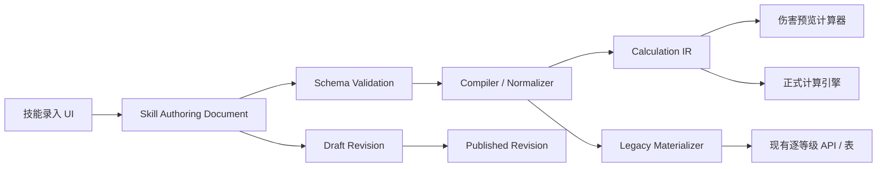

# 以伤害计算为核心的技能管理录入页面与数据模型设计

## 执行摘要

这套“技能管理”不应被设计成一个更复杂的普通表单，也不应直接照着数据库字段逐项录入。技能数值的本质不是一组孤立字段，而是一个**可执行的数值规则图**：

> **技能 = 激活方式 + 等级参数 + 时序 + 目标选择 + 效果段 + 数值公式 + 条件/触发器 + 状态交互 + 全局伤害规则引用**

这是本报告最重要的结论。

主流数据设计已经能看到这种分层趋势。Riot 的 LoL Data Dragon 将技能等级值、系数引用、冷却、消耗等拆为结构化数据；其技能值可以按技能等级形成数组，系数又通过独立变量引用外部属性。当前 Aatrox 数据还直接体现了多次重施、不同技能等级、被动、重复伤害、基于伤害量的治疗等组合场景。citeturn23view0turn25view0turn25view3 Unreal Gameplay Ability System 则更明确地区分 Ability、Attribute 与 Gameplay Effect：Effect 可以是瞬时、持续或周期执行，可以有 Modifier、复杂 Execution、条件、叠层、概率、附加效果与免疫机制。citeturn23view1turn24view0turn24view1turn24view2turn24view3 TrinityCore 的 `SpellInfo` / `SpellEffectInfo` 进一步说明，一个成熟 MMORPG 技能模型往往还要同时处理施法时间、冷却、持续时间、资源、触发概率、Proc 冷却、层数、周期、目标、半径、链式目标和属性系数。citeturn24view6turn24view7

因此，**不要建立一个拥有上百个 nullable 字段的 `skill` 表**。建议采用以下结构：

```text
Skill
 ├─ 基础信息 / i18n
 ├─ Activation      激活方式
 ├─ Timing          施法、冷却、充能、重施
 ├─ Costs           资源消耗
 ├─ Targeting       选取哪些目标
 ├─ Segments[]      技能的阶段/伤害段
 │    ├─ Schedule   什么时候发生、发生几次
 │    ├─ Targeting  本段可覆盖目标规则
 │    └─ Effects[]
 │         ├─ Damage
 │         ├─ Heal
 │         ├─ Shield
 │         ├─ Modifier
 │         ├─ Status
 │         └─ Trigger
 ├─ Triggers[]      被动/事件触发
 ├─ Variables[]     本地计算变量
 └─ RulesetRef      全局伤害计算规则
```

页面也应该沿用你现在正在采用的 UX 思路：**用户先看到技能整体，再进入某个“效果段”编辑，而不是先看到一堵技术字段墙**。

推荐的编辑路径是：

```text
角色
 ↓
技能列表 / 等级关键值矩阵
 ↓
选择一个技能
 ↓
技能结构总览
 ↓
伤害段 / DOT / 被动 / 状态效果
 ↓
配置公式、时序、目标、条件
 ↓
实时伤害计算预览
 ↓
保存草稿
 ↓
发布版本
```

MVP 最重要的不是把所有特殊游戏机制一次做完，而是先建立一个**不会因为未来机制增加而推翻的数据骨架**。首版至少应能完整表达：

| MVP 核心能力 | 是否首版必须 |
|---|---:|
| 主动 / 被动 / 事件触发技能 | 必须 |
| 可配置最大技能等级 | 必须 |
| 固定值 / 线性成长 / 百分比成长 / 逐级表 | 必须 |
| 单级 Override | 必须 |
| 基础伤害 + AD/AP/任意属性系数 | 必须 |
| 物理 / 魔法 / 真实 / 自定义伤害类型 | 必须 |
| 单段、多段、多次命中 | 必须 |
| DOT / HOT / 周期效果 | 必须 |
| 冷却、资源、施法时间 | 必须 |
| 单体、圆形、线形、锥形、目标上限 | 必须 |
| 简单条件与被动触发器 | 必须 |
| 暴击资格、概率触发 | 必须 |
| 状态 Tag / Buff / Debuff 条件 | 必须 |
| 实时计算器与事件明细 | 必须 |
| JSON 导入 / 导出 | 必须 |
| 草稿 / 发布 / 版本号 | 必须 |
| 复杂叠层 / PPM / 转伤 / 分摊 / 反伤 | 数据结构预留，第二阶段 |
| 任意脚本 / JS 表达式 | **不要做** |

尤其需要强调三个设计原则。

第一，**`0` 永远不能等价于“未配置”**。这和你前面等级属性管理的问题完全一致。技能冷却可能真的为 `0`，蓝耗可能真的为 `0`，暴击系数可能有明确的 `0`，所以未配置必须是 `null` / 字段缺失，而不是默认补零。

第二，**公式不要存成可执行 JavaScript 字符串**。应保存为可序列化的表达式 AST。这样后端、前端预览、计算引擎和未来数据迁移可以共享同一个语义，也可以做字段验证。JSON Schema 本身支持结构定义、类型约束、引用与复用，非常适合为这种持久化文档建立版本化校验层。citeturn23view7turn23view8

第三，**护甲公式、魔抗公式、穿透顺序、暴击阶段、取整方式等不要写在每个技能里**。这些属于游戏级 `DamageRuleSet`。技能只声明“这是物理伤害”“这段允许暴击”“使用源角色的 `armor_pen_flat`”，至于如何应用防御，应由计算引擎按当前游戏规则集统一处理。

最终建议的数据流为：



这里的 **Authoring Document 是事实源**；逐等级数据只是兼容旧 API 的派生结果，不再反过来限制你的 UX。

## 目标、范围与参考结论

本功能的目标可以一句话定义为：

> **让产品人员能够不写代码地描述“一个技能在什么条件下，对哪些目标，在什么时间，以什么公式产生多少数值效果”，并将其保存为后端可验证、计算引擎可确定性执行的数据。**

本设计只覆盖影响数值计算的部分。包括伤害、治疗、护盾、资源、冷却、时序、目标集合、状态、触发、增减伤、免疫、暴击、穿透、叠层等。**不在范围内**的是动画资源、粒子、模型、音效、镜头、按钮布局、技能图标拖拽流程、施法动作表现和客户端视觉表现。Epic 的 GAS 本身也将数值 Gameplay Effect 与 Gameplay Cue 这类声音/粒子表现机制区分开，这种边界非常适合作为这里的参考。citeturn24view1

另一个需要明确的边界是：**AOE 形状属于本系统，但只保存“如何得到目标集合”所需的几何信息**。比如圆半径、锥角、线宽、最大目标数、链式跳数都属于计算；粒子到底画多宽、特效怎么飞不属于这里。OpenRA 的数据驱动武器配置同样把射程、合法目标、范围伤害、不同目标类别的倍率等作为数值规则保存，而把具体表现作为不同组件处理；其 YAML 还直接展示了配置继承与覆盖的做法。citeturn24view8

**参考系统给出的共同启示**

| 参考 | 可观察到的数值建模能力 | 对本系统的启示 |
|---|---|---|
| Riot LoL Data Dragon | 技能等级数组、系数变量引用、冷却、资源消耗、多语言数据 | Rank 值和属性 Scaling 应独立结构化，而不是藏在描述文本里。citeturn23view0 |
| 当前 LoL Aatrox 数据 | Q 可重施且后续段伤害变化，W 可再次造成伤害，E 含基于造成伤害的治疗，被动独立存在 | 不能假设“一个技能 = 一次 Damage”；必须支持 segment、recast、trigger、vamp。citeturn25view0turn25view3 |
| Unreal GAS | Instant / Duration / Periodic、Modifier、Execution、Tag 条件、Stack、Chance、Immunity | Effect 应是可组合节点，而非一张超宽技能表。citeturn24view0turn24view1turn24view2turn24view3 |
| TrinityCore | BasePoints、每等级成长、资源系数、周期、链式目标、目标半径、AP 系数、CastTime、Cooldown、Proc、Stack、Range | MMORPG 类型技能需要特别重视时序、Proc、Aura、Stack、Target。citeturn24view6turn24view7 |
| OpenRA | Damage、Spread、目标类型、不同护甲类别倍率、Burst、继承 | “目标分类”和“对不同目标的修正”最好走规则/Modifier，而不是复制技能。citeturn24view8 |

Riot 的文档还有一个很值得借鉴的细节：同一个技能可拥有按 Rank 排列的 effect 数据，而系数变量拥有 `link` 与 `coeff`；这正好对应本报告建议的 `RankedNumber + AttributeRef` 两层模型。citeturn23view0

**不同游戏类型的字段优先级**

下表的“高/中/低”是基于上述公开数据结构做出的产品设计归纳，而不是说某一种游戏绝不会使用另一类机制。

| 维度 | MOBA | MMORPG | ARPG | 建议 |
|---|---|---|---|---|
| 技能 Rank 表 | 高 | 中 | 中 | 基础能力 |
| AD/AP/属性 Scaling | 高 | 高 | 高 | 基础能力 |
| 单技能多段 / 重施 | 高 | 高 | 高 | 基础能力 |
| 冷却 / 蓝耗 | 高 | 高 | 高 | 基础能力 |
| AOE / 目标上限 | 高 | 高 | 高 | 基础能力 |
| 被动 / on-hit / 条件触发 | 高 | 高 | 高 | 基础能力 |
| DOT / HOT | 中高 | 极高 | 高 | 首版支持 |
| Aura / Buff / Debuff | 高 | 极高 | 高 | 首版做基本版 |
| Stack / Refresh / 独立计时层 | 中高 | 极高 | 极高 | 数据结构首版预留 |
| Proc Chance / ICD | 高 | 极高 | 高 | 首版基础概率 + ICD |
| PPM / RPPM | 低 | 高 | 中 | 后续扩展 |
| Charge / Recharge | 中高 | 高 | 高 | 第二阶段 |
| 大量 Projectile / 高频 Hit | 中 | 中 | 极高 | 模型必须能承受 |
| Damage Conversion | 中 | 高 | 极高 | 第二阶段 |
| 元素/School 相互作用 | 中 | 极高 | 极高 | 放入 DamageRuleSet |
| Target 类型倍率 | 中 | 高 | 高 | Modifier / ruleset |
| Snapshot / Dynamic DOT | 中 | 极高 | 高 | 数据结构必须首版预留 |
| Dispel / Aura Priority | 中 | 极高 | 中 | 第二阶段 |
| 随机词条 / Local-Global Modifier | 低 | 中 | 极高 | ARPG 扩展层 |
| 连锁 / 弹射 / Falloff | 高 | 高 | 极高 | 首版可做简化版 |

Unreal 的 Attribute 还明确区分 base value 与 current value，并允许 Gameplay Effects 改变当前值，这进一步说明你的表达式引用不能只写 `source.ap`，长期看最好允许区分 `base`、`current`、`bonus`、`total` 等语义。citeturn24view4

因此推荐统一属性命名空间，例如：

```text
source.level
source.attribute.attack_damage.base
source.attribute.attack_damage.bonus
source.attribute.attack_damage.total
source.attribute.ability_power.total
source.attribute.attack_speed.current
source.attribute.crit_chance.current
source.attribute.armor_pen_flat.current

target.attribute.hp.current
target.attribute.hp.max
target.attribute.armor.current
target.attribute.magic_resist.current
target.state.stack.poison
```

这些 Key 应来自你的 **Attribute Registry**，而不是由技能编辑人员自由输入字符串。

## 技能要素完整字典

下面是建议纳入技能管理的数据维度。字段名称只是建议，实际可根据你的现有命名约定调整。整套字段字典是结合 Riot、Unreal GAS、TrinityCore 与数据驱动游戏配置模式形成的工程设计；成熟实现中确实会同时出现等级值、属性系数、周期、目标、触发、叠层和免疫等维度。citeturn23view0turn24view0turn24view2turn24view6turn24view7

**技能基础、成长、资源与时序**

| 要素 | 定义 | 类型 / 可选值 | 默认建议 | 依赖与校验 | 示例 |
|---|---|---|---|---|---|
| `maxRank` | 技能最大等级 | `integer >= 1` | 无，必填 | 所有 Rank 表不能超过它 | `5` |
| `activationType` | 如何激活 | `active / passive / triggered / toggle` | 无，必填 | passive 可无主动 cost/cast | `active` |
| `baseValue` | 某效果基础数值 | `RankedNumber` | `null` | Damage effect 必须能最终解析出 amount | `80/120/160/200/240` |
| `rankGrowth` | Rank 成长方式 | `constant / linear / percent / table` | `table` 或推断 | linear 需 base+step | `80 + 40/rank` |
| `rankOverride` | 某 Rank 特例 | `Map<rank, value>` | `{}` | rank ∈ `[1,maxRank]` | Lv4=`210` |
| `ownerLevelScaling` | 随角色等级成长 | `Expr` | `null` | 引用 `source.level` | `2 * level` |
| `cooldown` | 可再次使用前的间隔 | `RankedNumber`, 秒 | `null` | 主动技能一般配置；>=0 | `10/9/8/7/6` |
| `cooldownStart` | CD 从何时开始 | `cast_start / commit / hit / effect_end` | `commit` | duration 技能尤其重要 | `effect_end` |
| `castTime` | 施法/读条时间 | `number >=0` 秒 | `0` | instant 可为 0 | `0.75` |
| `channelDuration` | 引导持续时间 | `RankedNumber` | `null` | channel 时有效 | `3s` |
| `globalCooldown` | 公共施法间隔 | `number/null` | `null` | 游戏不使用 GCD 则空 | `1.5` |
| `recastWindow` | 第二次/多次释放窗口 | 秒 / `null` | `null` | recast 技能使用 | `4` |
| `maxCharges` | 最大充能层 | 正整数 / `null` | `null` | 配置后需 recharge | `2` |
| `rechargeTime` | 单层充能时间 | RankedNumber | `null` | `maxCharges` 存在时必填 | `12` |
| `resourceType` | 消耗资源种类 | Registry key | `null` | 不能 hardcode mana | `mana` |
| `resourceCost` | 消耗量 | RankedNumber / Expr | `null` | 无消耗应明确 `0`，未配置是 null | `40/45/50` |
| `costTiming` | 什么时候扣资源 | `start / commit / hit / per_tick` | `commit` | channel 可 per_tick | `per_tick` |
| `refundRule` | 失败/命中后的返还 | Expr / policy | `null` | 只有需要时配置 | 未命中返还 50% |

Riot 的公开技能数据直接包含 `maxrank`、逐等级 `cooldown` 和 `cost`；不同技能还可以拥有不同最大 Rank，这也是为什么最大技能等级不能全局写死。citeturn25view1turn25view2 TrinityCore 同样将施法时间、普通冷却、持续时间、资源消耗、范围和技能等级作为独立字段。citeturn24view7

**伤害公式与防御交互**

| 要素 | 定义 | 类型 / 可选值 | 默认建议 | 依赖与校验 | 示例 |
|---|---|---|---|---|---|
| `damageType` | 伤害所属规则类型 | Registry key；常见 `physical/magic/true/custom` | 无，Damage 必填 | 具体减伤逻辑由 Ruleset 决定 | `magic` |
| `amount` | 原始伤害表达式 | `ScalarExpr` | 无 | 必须可确定性求值 | `base + AP*0.6` |
| `scalingTerms` | 外部属性系数 | Expr / AttributeRef | `[]` | 引用属性必须存在于 Registry | `0.8 totalAD` |
| `flatBonus` | 固定额外伤害 | Expr | `null` | 与 amount 可合并 | `+30` |
| `percentBonus` | 对本段的百分比增伤 | Expr | `null` | 明确应用阶段 | `+15%` |
| `currentHpScale` | 根据当前 HP 缩放 | Expr | `null` | 引用 target HP | `8% currentHP` |
| `maxHpScale` | 根据最大 HP 缩放 | Expr | `null` | 引用 target maxHP | `6% maxHP` |
| `missingHpScale` | 根据已损生命缩放 | Expr | `null` | 通常需 cap | `0.2 × missingHP` |
| `executeThreshold` | 斩杀阈值 | Expr / Condition | `null` | 一般与特殊 Damage/kill effect 配合 | HP≤10% |
| `minDamage` | 单次结果下限 | Expr / null | `null` | <= maxDamage | `1` |
| `maxDamage` | 单次结果上限 | Expr / null | `null` | >= minDamage | 对怪最多 500 |
| `critMode` | 本段是否可暴击 | `none / source_chance / fixed_chance / guaranteed / condition` | `none` | 非 none 才计算 crit multiplier | `source_chance` |
| `critChance` | 本段暴击概率 | Expr `[0,1]` | source 或 null | fixed 模式要求配置 | `0.25` |
| `critMultiplier` | 暴击倍率 | Expr `>0` | Ruleset | 不要默认硬编码 2 | `1.75` |
| `armorPen` | 本段额外物理穿透 | Expr / null | `null` | 与 source 通用穿透可叠加 | `+15 flat` |
| `magicPen` | 本段额外魔抗穿透 | Expr / null | `null` | 同上 | `20%` |
| `resistanceReduction` | 对目标防御的降低 | Effect/Modifier | `null` | **不要和 penetration 混一个字段** | `armor -20%` |
| `damageAmp` | 造成伤害增幅 | Modifier | `null` | 需定义 pipeline stage | `source +10%` |
| `damageReduction` | 承受伤害降低 | Modifier | `null` | 需定义叠加规则 | `target -30%` |
| `conversion` | 伤害类型转换 | array | `[]` | 百分比总和合理 | 40% physical→fire |
| `splitComponents` | 一次命中的复合伤害 | Effect[] | `[]` | 推荐拆成多个 DamageEffect | 100物理+50魔法 |
| `roundingPolicy` | 中间/最终取整策略 | Ruleset ref | 全局 | 技能一般不单独配置 | floor final |
| `mitigationRule` | 防御公式 | Ruleset ref | 全局 | **不应每技能复制** | `standard_v2` |

这里建议把“护甲公式”“魔抗公式”“百分比穿透先还是固定穿透先”“负抗性怎么处理”等统一放入 `DamageRuleSet`。Epic 的 Gameplay Effect 也将普通 Modifier 和复杂 Execution 分开，说明复杂公式最好集中在计算层，而不是不断往一个配置对象里堆特殊字段。citeturn24view1

**命中、段数、周期、AOE 与目标集合**

| 要素 | 定义 | 类型 / 可选值 | 默认建议 | 依赖与校验 | 示例 |
|---|---|---|---|---|---|
| `segment` | 技能中的逻辑阶段 | object | 至少 1 个 | ID 在技能内唯一 | `initial_hit` |
| `delay` | 相对技能开始的触发延迟 | 秒 >=0 | `0` | 多段时排序 | `0.35` |
| `hitCount` | 本段命中次数 | RankedNumber/Expr | `1` | >=1 | `3` |
| `hitInterval` | 多 Hit 间隔 | 秒 >=0 | `0` | hitCount>1 时有效 | `0.15` |
| `duration` | 持续效果总时长 | RankedNumber/Expr | `null` | periodic 时通常必填 | `6` |
| `tickInterval` | DOT/HOT 周期 | >0 秒 | `null` | periodic 必填 | `1` |
| `tickCount` | 总 Tick 数 | Expr/派生值 | 派生 | 与 duration/interval 一致 | `6` |
| `initialTick` | 施加时是否立即 Tick | boolean | `false` | 影响总次数 | `true` |
| `finalTickPolicy` | 末尾不足周期如何处理 | `none / partial / force` | `none` | 需统一定义 | `none` |
| `snapshotPolicy` | 周期效果用施放时还是实时属性 | `cast / apply / each_tick` | `each_tick` 或 Ruleset | DOT 关键字段 | `cast` |
| `hitRule` | 如何判定命中 | `guaranteed / collision / accuracy / contested / custom` | `guaranteed` | 目标模式决定可用项 | `collision` |
| `missable` | 是否可能 miss | boolean | 根据 hitRule | 与 guaranteed 不应矛盾 | `true` |
| `targetRelation` | 敌我关系 | `enemy / ally / self / neutral / any` | 无 | Effect 类型约束 | `enemy` |
| `targetTypes` | 可命中实体分类 | Registry key[] | `[]` | 空数组语义要明确定义 | hero, monster |
| `shape` | AOE 形状 | `single/circle/cone/line/rect/ring/chain/global` | `single` | 对应尺寸字段 | `circle` |
| `radius` | 圆/环半径 | number >=0 | `null` | circle/ring | `350` |
| `angle` | 锥形角度 | `(0,360]` | `null` | cone | `60°` |
| `width` | 线/矩形宽度 | >0 | `null` | line/rect | `120` |
| `range` | 可选取距离 | RankedNumber/Expr | `null` | 技能有距离则配置 | `900` |
| `maxTargets` | 最大受影响目标数 | integer/null | `null` = 无特定上限 | >=1 | `5` |
| `pierceTargets` | 投射物可穿过数量 | integer / infinite | `0` | projectile/collision | `2` |
| `chainCount` | 链式跳转次数 | integer >=1 | `null` | shape=chain | `4` |
| `chainRange` | 相邻跳转距离 | >0 | `null` | chainCount 使用 | `450` |
| `repeatTargetPolicy` | 链式是否可重复命中 | `never / after_n / allowed` | `never` | chain 使用 | `never` |
| `falloff` | 后续段/跳伤害衰减 | Expr / per-index | `null` | chain/multi-hit | 每跳 ×0.8 |
| `damageSplit` | 多目标是否分摊 | `none / equal / weighted` | `none` | weighted 需权重 | 总伤 600 平分 |
| `aoeDiminish` | 超过目标数后衰减 | Expr / policy | `null` | 可由 Ruleset 实现 | 5目标后 50% |

TrinityCore 的 effect 结构包含目标规则、目标半径、链式目标数、周期与系数；OpenRA 的武器配置也将 `ValidTargets`、`Range`、`Spread` 与 Damage 分开。由此可见，“伤害是多少”和“哪些实体会吃到这次伤害”应该是两个相邻但不同的配置域。citeturn24view6turn24view8

**状态、被动、触发、叠层与联动**

| 要素 | 定义 | 类型 / 可选值 | 默认建议 | 依赖与校验 | 示例 |
|---|---|---|---|---|---|
| `triggerEvent` | 触发被动的事件 | Registry event | 无 | triggered/passive 必填 | `on_basic_attack_hit` |
| `triggerCondition` | 额外触发条件 | `ConditionExpr` | `true` | 必须可序列化 | 目标HP<30% |
| `triggerChance` | 每次事件触发概率 | Expr `[0,1]` | `1` | 确定触发明确填 1 | `0.3` |
| `internalCooldown` | 被动自身冷却 | 秒/RankedNumber | `null` | >=0 | `4` |
| `procCharges` | 可触发次数/储备 | integer/null | `null` | 使用后扣减 | `3` |
| `procRate` | PPM 等归一化触发率 | policy/object | `null` | 与 flat chance 不同时生效 | `2 PPM` |
| `requiredTags` | 必须拥有的状态 | Tag[] | `[]` | Registry 校验 | `target.burning` |
| `blockedTags` | 存在则阻止 | Tag[] | `[]` | 同上 | `target.immune.fire` |
| `appliedStatus` | 施加状态 | StatusEffect | `null` | duration/stack policy | `poison` |
| `statusDuration` | 状态持续时间 | Expr | `null` | status 存在时 | `5s` |
| `maxStacks` | 最大层数 | integer >=1 | `1` | stackable 时 | `5` |
| `stackBy` | 层数归属粒度 | `global/source/source_skill` | `source` | 多人 DOT 很重要 | 每施法者独立 |
| `stackPolicy` | 重复施加如何处理 | `refresh/add_duration/independent/replace/ignore` | `refresh` | 需定义 timer 语义 | `independent` |
| `overflowRule` | 满层后再次施加 | effect/policy | `null` | maxStacks 达到后 | 满5层爆炸 |
| `priority` | 冲突处理顺序 | integer | `0` | 同类 effect 冲突 | `100` |
| `exclusiveGroup` | 互斥效果组 | string/null | `null` | 同组执行覆盖规则 | `burn_tier` |
| `overridePolicy` | 同组谁覆盖谁 | `newer/stronger/higher_priority/longer` | `higher_priority` | exclusiveGroup | `stronger` |
| `triggerEffects` | 触发后执行的其他 effect | ref[] | `[]` | 防止循环 | 满层触发 explosion |
| `procMask` | 哪类事件可/不可继续触发 | flags/tags | 默认阻止自递归 | 引擎必须有 recursion guard | DOT 不触发 on-hit |
| `maxTriggerDepth` | 联动递归层级上限 | integer | 全局 | 防无限链 | `8` |

Unreal Gameplay Effects 明确支持概率应用、目标 Tag 条件、附加 Effect、免疫，以及包括最大层数、刷新持续时间和独立定时器在内的多种 stacking 行为。citeturn24view2turn24view3 TrinityCore 也将 Proc Chance、Proc Charges、Proc Cooldown、PPM 与 Stack Amount 分开存储，说明这些概念不宜压缩成一个简单的“触发率”字段。citeturn24view7

**护盾、治疗、吸血与伤害结果归属**

| 要素 | 定义 | 类型 / 可选值 | 默认建议 | 依赖与校验 | 示例 |
|---|---|---|---|---|---|
| `healAmount` | 直接治疗量 | Expr | `null` | Effect type=heal | `100+0.4AP` |
| `hot` | 周期治疗 | Schedule + HealEffect | `null` | 与 DOT 同调度模型 | 5×20 |
| `lifestealEligible` | 是否可触发普攻吸血 | bool/rule | Ruleset | 由伤害 tag 决定更好 | `false` |
| `omnivampEligible` | 是否参与全能吸血 | bool/rule | Ruleset | 可有 AOE penalty | `true` |
| `healingFromDamage` | 根据实际伤害治疗 | Expr | `null` | 应引用 post-damage result | `damageDealt*0.2` |
| `shieldAmount` | 生成护盾数值 | Expr | `null` | Effect=shield | `80+0.5AP` |
| `shieldTypes` | 可吸收哪些伤害 | DamageType[] / any | `any` | 空不得误作 any | `magic` |
| `shieldPriority` | 多盾消耗顺序 | integer/policy | Ruleset | 引擎统一处理 | oldest first |
| `damageAbsorb` | 固定/百分比吸收 | Modifier | `null` | 需要明确 pre/post mitigation | `100` |
| `immunity` | 完全阻止指定效果 | Condition + tags | `null` | 类型/来源/状态条件 | immune.magic |
| `resistChance` | 完全抵抗概率 | Expr `[0,1]` | `null` | 与 hit result 分离 | `0.25` |
| `block` | 固定/比例格挡 | Expr | `null` | pipeline stage | `-30 damage` |
| `redirect` | 伤害转移给其他实体 | TargetRef + ratio | `null` | ratio 0..1 | 30% to pet |
| `reflect` | 反射伤害 | Expr + sourcePolicy | `null` | 必须防反射递归 | 20% |
| `sourceOwner` | 最终伤害归属 | `caster/owner/summoner/item/custom` | `caster` | 召唤物尤其重要 | pet→hero |
| `sourceSkill` | 哪个技能导致 | skill/effect ref | 当前 effect | 用于统计/联动 | `poison_q` |
| `damageTags` | 伤害语义标签 | Registry tags | `[]` | 供 proc/ruleset 使用 | spell,dot,fire |
| `creditPolicy` | 击杀/统计归属 | Ruleset/ref | 全局 | 不建议每技能重写 | owner |

当前 Aatrox 的公开数据即包含“根据造成伤害进行治疗”的被动语义，这说明“治疗”虽然不是伤害本身，却可能依赖最终 Damage Result，所以计算引擎最好把实际造成伤害量作为可引用的临时变量。citeturn25view3

**容易遗漏、但一旦缺少就会导致后期推翻模型的字段**

最值得现在就预留的是 `snapshotPolicy`、`procMask`、`sourceOwner`、`pipelineStage`、`stackBy` 和 `rulesetRef`。它们不一定都要在 MVP 页面直接露出来，但底层模型最好能够容纳。

特别是 `snapshotPolicy`。例如一个 6 秒 DOT，究竟使用：

```text
施法时的 AP
```

还是：

```text
每一次 Tick 时当前 AP
```

两者可以产生完全不同结果。只保存：

```json
{
  "damage": "30 + 0.1 * AP",
  "duration": 6,
  "interval": 1
}
```

是不完整的。

另一个常被漏掉的是**计算顺序**。建议不要由技能配置任意排列护甲、暴击、增伤，而由 `DamageRuleSet` 定义统一 pipeline，例如：

```text
触发资格
  ↓
目标集合
  ↓
基础表达式
  ↓
技能内增减伤
  ↓
暴击
  ↓
伤害类型转换
  ↓
防御降低 / 穿透 / 抗性计算
  ↓
承伤增减
  ↓
护盾 / 吸收 / 分摊 / Redirect
  ↓
实际 HP 损失
  ↓
吸血 / 治疗
  ↓
on_damage_dealt / on_damage_taken 等后续触发
```

具体顺序必须由每个游戏自己的规则集定义；上面是推荐的计算架构，不应被理解为某个现有游戏的真实顺序。

## 可交付数据模型

推荐先用 TypeScript 做领域模型，同时由同一结构生成或维护 JSON Schema 进行接口验证。JSON Schema 2020-12 提供结构定义、类型约束、引用与 schema 复用机制，适合给技能文档增加 `schemaVersion` 并做长期迁移。citeturn23view7turn23view8

下面这版不是概念伪代码，而是可以直接交给 Codex / 工程师继续落地的领域接口骨架。

```ts
export type ID = string;
export type LocaleCode = string;
export type Seconds = number;
export type Probability = number; // 0..1

export interface LocalizedText {
  defaultLocale: LocaleCode;
  values: Record<LocaleCode, string>;
}

export type SkillStatus = 'draft' | 'published' | 'deprecated';

export type ActivationType =
  | 'active'
  | 'passive'
  | 'triggered'
  | 'toggle';

export type GrowthMode =
  | 'constant'
  | 'linear'
  | 'percent'
  | 'table';

export interface RankedNumber {
  mode: GrowthMode;

  // constant
  value?: number;

  // linear: rank1 = base, subsequent = base + step * (rank - 1)
  base?: number;
  step?: number;

  // percent: rankN = base * (1 + rate)^(N - 1)
  rate?: number;

  // table
  values?: Array<number | null>;

  // explicit exceptions, 1-based rank key
  overrides?: Record<string, number>;
}

export type SubjectRef =
  | 'source'
  | 'target'
  | 'owner'
  | 'skill'
  | 'event';

export interface AttributeRef {
  kind: 'attribute';
  subject: 'source' | 'target' | 'owner';
  key: string;
  valueMode?: 'base' | 'current' | 'bonus' | 'total';
  snapshot?: 'cast' | 'apply' | 'hit' | 'each_tick';
}

export interface VariableRef {
  kind: 'variable';
  name: string;
}

export interface ResultRef {
  kind: 'result';
  effectId: ID;
  field:
    | 'rawAmount'
    | 'mitigatedAmount'
    | 'absorbedAmount'
    | 'healthDamage'
    | 'healing';
}

export type ScalarExpr =
  | { op: 'const'; value: number }
  | { op: 'ranked'; value: RankedNumber }
  | AttributeRef
  | VariableRef
  | ResultRef
  | { op: 'add'; args: ScalarExpr[] }
  | { op: 'mul'; args: ScalarExpr[] }
  | { op: 'sub'; left: ScalarExpr; right: ScalarExpr }
  | { op: 'div'; left: ScalarExpr; right: ScalarExpr }
  | { op: 'min'; args: ScalarExpr[] }
  | { op: 'max'; args: ScalarExpr[] }
  | {
      op: 'clamp';
      value: ScalarExpr;
      min?: ScalarExpr;
      max?: ScalarExpr;
    }
  | {
      op: 'if';
      condition: ConditionExpr;
      then: ScalarExpr;
      else: ScalarExpr;
    };

export type CompareOperator =
  | 'eq'
  | 'neq'
  | 'gt'
  | 'gte'
  | 'lt'
  | 'lte';

export type ConditionExpr =
  | { op: 'true' }
  | { op: 'false' }
  | { op: 'all'; args: ConditionExpr[] }
  | { op: 'any'; args: ConditionExpr[] }
  | { op: 'not'; arg: ConditionExpr }
  | {
      op: 'compare';
      left: ScalarExpr;
      cmp: CompareOperator;
      right: ScalarExpr;
    }
  | {
      op: 'has_tag';
      subject: 'source' | 'target' | 'owner';
      tag: string;
    }
  | {
      op: 'missing_tag';
      subject: 'source' | 'target' | 'owner';
      tag: string;
    }
  | {
      op: 'event_is';
      event: string;
    };

export interface SkillVariable {
  name: string;
  value: ScalarExpr;
  description?: string;
}

export interface SkillCost {
  id: ID;
  resourceType: string;
  amount: ScalarExpr;
  timing: 'cast_start' | 'commit' | 'hit' | 'per_tick';
  refund?: {
    condition: ConditionExpr;
    ratio: ScalarExpr;
  };
}

export interface CooldownConfig {
  duration: RankedNumber;
  startAt: 'cast_start' | 'commit' | 'hit' | 'effect_end';

  charges?: {
    maxCharges: RankedNumber;
    recharge: RankedNumber;
  };

  recast?: {
    maxRecasts: number;
    window: Seconds;
    sharesCooldown: boolean;
  };
}

export interface CastTiming {
  castTime?: ScalarExpr;
  channelDuration?: ScalarExpr;
  globalCooldown?: ScalarExpr;
  minimumInterval?: ScalarExpr;
}

export type TargetShape =
  | 'single'
  | 'circle'
  | 'cone'
  | 'line'
  | 'rectangle'
  | 'ring'
  | 'chain'
  | 'global';

export interface TargetingConfig {
  relation: 'enemy' | 'ally' | 'self' | 'neutral' | 'any';

  entityTypes?: string[];

  range?: ScalarExpr;

  shape: TargetShape;

  radius?: ScalarExpr;
  innerRadius?: ScalarExpr;
  angleDeg?: ScalarExpr;
  width?: ScalarExpr;
  length?: ScalarExpr;

  maxTargets?: ScalarExpr;

  pierce?: {
    maxTargets: ScalarExpr;
  };

  chain?: {
    maxBounces: ScalarExpr;
    bounceRange: ScalarExpr;
    repeatTarget:
      | 'never'
      | 'allowed'
      | 'after_n';
    repeatAfter?: number;
    falloff?: ScalarExpr;
  };

  filters?: ConditionExpr[];
}

export interface EffectSchedule {
  delay?: ScalarExpr;

  mode:
    | 'instant'
    | 'multi_hit'
    | 'periodic';

  hitCount?: ScalarExpr;
  hitInterval?: ScalarExpr;

  duration?: ScalarExpr;
  tickInterval?: ScalarExpr;
  initialTick?: boolean;

  snapshot:
    | 'cast'
    | 'apply'
    | 'each_hit'
    | 'each_tick';
}

export interface EffectBase {
  id: ID;
  enabled: boolean;
  name?: LocalizedText;

  condition?: ConditionExpr;

  tags?: string[];

  priority?: number;
}

export interface DamageEffect extends EffectBase {
  type: 'damage';

  damageType: string;

  amount: ScalarExpr;

  critical?: {
    mode:
      | 'none'
      | 'source_chance'
      | 'fixed_chance'
      | 'guaranteed'
      | 'condition';

    chance?: ScalarExpr;
    multiplier?: ScalarExpr;
    condition?: ConditionExpr;
  };

  modifiers?: {
    min?: ScalarExpr;
    max?: ScalarExpr;

    damageAmp?: ScalarExpr;
    damageReduction?: ScalarExpr;

    flatArmorPen?: ScalarExpr;
    percentArmorPen?: ScalarExpr;

    flatMagicPen?: ScalarExpr;
    percentMagicPen?: ScalarExpr;
  };

  interaction?: {
    lifestealEligible?: boolean;
    omnivampEligible?: boolean;

    canTriggerProcs?: boolean;
    procTags?: string[];
    blockedProcTags?: string[];
  };
}

export interface HealEffect extends EffectBase {
  type: 'heal';
  amount: ScalarExpr;
  source?: 'direct' | 'damage_result';
}

export interface ShieldEffect extends EffectBase {
  type: 'shield';
  amount: ScalarExpr;
  absorbs?: string[];
  duration?: ScalarExpr;
  priority?: number;
}

export interface ModifierEffect extends EffectBase {
  type: 'modifier';

  targetAttribute: string;

  operation:
    | 'add_flat'
    | 'add_percent'
    | 'multiply'
    | 'override';

  amount: ScalarExpr;

  duration?: ScalarExpr;
}

export interface StatusEffect extends EffectBase {
  type: 'status';

  statusId: string;

  duration?: ScalarExpr;

  stack?: {
    max: number;

    ownerScope:
      | 'global'
      | 'source'
      | 'source_skill';

    refreshPolicy:
      | 'refresh'
      | 'add_duration'
      | 'independent'
      | 'replace'
      | 'ignore';

    overflowEffectId?: ID;
  };
}

export interface ResourceEffect extends EffectBase {
  type: 'resource';
  resourceType: string;
  amount: ScalarExpr;
}

export interface TriggerEffect extends EffectBase {
  type: 'trigger';
  triggerId: ID;
}

export type SkillEffect =
  | DamageEffect
  | HealEffect
  | ShieldEffect
  | ModifierEffect
  | StatusEffect
  | ResourceEffect
  | TriggerEffect;

export interface SkillSegment {
  id: ID;

  name: LocalizedText;

  order: number;

  schedule: EffectSchedule;

  targeting?: TargetingConfig;

  condition?: ConditionExpr;

  effects: SkillEffect[];

  rankOverrides?: Record<
    string,
    Partial<SkillSegment>
  >;
}

export interface SkillTrigger {
  id: ID;

  event: string;

  condition?: ConditionExpr;

  chance?: ScalarExpr;

  internalCooldown?: ScalarExpr;

  charges?: ScalarExpr;

  procPolicy?: {
    canTriggerFromTriggeredEffect: boolean;
    maxDepth?: number;
  };

  executeSegmentIds: ID[];
}

export interface SkillDefinition {
  schemaVersion: string;

  id: ID;
  code: string;

  entityId: ID;

  revision: number;
  status: SkillStatus;

  basedOnRevision?: number;

  i18n: {
    name: LocalizedText;
    description?: LocalizedText;
  };

  slot?: string;

  maxRank: number;

  activation: {
    type: ActivationType;

    triggerIds?: ID[];
  };

  timing?: CastTiming;

  cooldown?: CooldownConfig;

  costs?: SkillCost[];

  defaultTargeting?: TargetingConfig;

  variables?: SkillVariable[];

  segments: SkillSegment[];

  triggers?: SkillTrigger[];

  damageRuleSetId: ID;

  metadata?: {
    tags?: string[];
    source?: string;
    notes?: string;
  };
}
```

这份接口里有几个刻意的选择。

**`RankedNumber` 统一处理所有“随技能等级变化的数字”**。不要分别发明：

```text
damageLevels
cooldownLevels
manaLevels
radiusLevels
durationLevels
```

任何数值字段都可以引用同一种 Rank 规则。

例如：

```json
{
  "mode": "linear",
  "base": 80,
  "step": 40,
  "overrides": {
    "4": 210
  }
}
```

表示：

```text
Lv1 80
Lv2 120
Lv3 160
Lv4 210  ← override
Lv5 240
```

**表达式存 AST，不存字符串。**

不要：

```json
{
  "formula": "80 + source.ap * 0.6"
}
```

推荐：

```json
{
  "op": "add",
  "args": [
    {
      "op": "ranked",
      "value": {
        "mode": "linear",
        "base": 80,
        "step": 40
      }
    },
    {
      "op": "mul",
      "args": [
        {
          "kind": "attribute",
          "subject": "source",
          "key": "ability_power",
          "valueMode": "total"
        },
        {
          "op": "const",
          "value": 0.6
        }
      ]
    }
  ]
}
```

Riot Data Dragon 的公开模型本身就体现了类似分离：逐技能等级的 effect 值与属性系数变量是分开存储的。citeturn23view0

**本地变量是必要的，但只允许引用，不允许执行代码。**

例如：

```json
{
  "name": "missing_hp_ratio",
  "value": {
    "op": "div",
    "left": {
      "op": "sub",
      "left": {
        "kind": "attribute",
        "subject": "target",
        "key": "hp_max",
        "valueMode": "current"
      },
      "right": {
        "kind": "attribute",
        "subject": "target",
        "key": "hp",
        "valueMode": "current"
      }
    },
    "right": {
      "kind": "attribute",
      "subject": "target",
      "key": "hp_max",
      "valueMode": "current"
    }
  }
}
```

编辑器可以把它展示成人类能理解的：

```text
变量：目标已损生命比例
= (最大生命 - 当前生命) / 最大生命
```

而不是让产品经理编辑 AST。

**条件同样使用模板化 AST。**

例如：

```json
{
  "op": "all",
  "args": [
    {
      "op": "has_tag",
      "subject": "target",
      "tag": "status.burning"
    },
    {
      "op": "compare",
      "left": {
        "kind": "attribute",
        "subject": "target",
        "key": "hp_percent",
        "valueMode": "current"
      },
      "cmp": "lte",
      "right": {
        "op": "const",
        "value": 0.3
      }
    }
  ]
}
```

UI 对应：

```text
满足以下全部条件：

[目标] [拥有状态] [燃烧]

并且

[目标当前生命%] [≤] [30%]
```

无需出现任何代码。

**规则继承建议只在“定义层”使用，不要在运行时无限层级查找。**

可以增加：

```ts
interface TemplateInheritance {
  extends?: ID;
  overrides?: Record<string, unknown>;
}
```

但在发布时应 Compile 为完整 Skill IR。OpenRA 的配置确实使用 `Inherits` 建立数据复用；对你的系统来说，这适合编辑阶段减少重复，但运行引擎最好使用已解析结果。citeturn24view8

## 录入页面与交互规划

核心 UX 原则延续你现在已经采用的方向：

> **用户不是在维护 schema；用户是在描述技能行为。**

因此技能管理不要一上来呈现：

```text
Damage Type
Base Damage
Coeff
Tick
Period
Proc
Priority
Tag
Stack
...
```

这会成为极难使用的“配置引擎控制台”。

建议分成 **总览层 → 技能层 → 效果段层 → 高级规则层**。

**技能管理总览页**

```text
技能管理 - 伊泽瑞尔

[搜索技能...] [只看已配置 ☑]   [导入 JSON] [导出 JSON]

技能        类型      等级    Lv1     Lv2     Lv3    Lv4    Lv5   结构        CD        状态
Q 秘术射击   主动       5      20      45      70     95    120   1段伤害    5.5       已发布
W 精华跃动   主动       5      80     135     190    245    300   1段伤害    12        草稿
E 奥术跃迁   主动       5      80     130     180    230    280   1段伤害    26→14     已发布
R 精准弹幕   主动       3     350     550     750                  AOE/穿透   120→80    已发布
被动         被动       —       —       —       —      —      —    状态叠层    —         已配置

                                                      [新建技能]

草稿 1 项                                      [保存草稿] [发布]
```

这里的等级矩阵展示的是**关键数值摘要**，不是所有 effect 的每个字段。

“关键数值”可以默认取：

```text
Primary Damage Effect 的基础值
```

若技能无法用一个数概括：

```text
2段
DOT
多段
公式
被动
```

直接显示结构摘要，不强行计算一个误导性的总数。

顶部提供：

```text
搜索
只看已配置
导入 JSON
导出 JSON
草稿 / 已发布筛选
```

大量技能时支持按：

```text
技能名称
code
slot
tag
effect type
```

搜索。

**进入单个技能后的主编辑页**

建议不要再套一个窄弹窗。技能编辑复杂度已经明显高于普通字段配置，优先使用：

```text
全屏 Drawer
```

或：

```text
独立详情页
```

推荐结构：

```text
技能：腐蚀爆破
状态：草稿

概览
──────────────────────────────────
类型          主动
最大等级      5
伤害结构      爆发 + DOT
默认目标      敌方
伤害类型      魔法
规则集        standard_moba_v1

关键数值
──────────────────────────────────
              Lv1   Lv2   Lv3   Lv4   Lv5
爆发伤害       60    80   100   120   140
DOT/每跳       20    25    30    35    40
冷却           10     9     8     7     6
蓝耗           40    45    50    55    60

效果结构
──────────────────────────────────

① 初次命中
   0.0s
   单次魔法伤害
   100 + 40% AP
                              [编辑]

② 中毒
   持续 4 秒 · 每 1 秒
   4 Tick
   每跳 30 + 10% AP
   状态：poison
                              [编辑]

③ 中毒结束
   条件：持续时间自然结束
   无额外伤害
                              [编辑]

[ + 添加效果段 ]

──────────────────────────────────

资源与冷却
目标与范围
触发器与条件
伤害预览
JSON
```

不建议把这五块都默认展开。

**分段编辑 Drawer**

用户点击：

```text
① 初次命中 [编辑]
```

打开：

```text
效果段 - 初次命中

基本
名称          [初次命中]
触发时间      [立即]
目标规则      [继承技能默认]

执行方式
● 单次
○ 多次命中
○ 周期执行

效果

[伤害]
伤害类型      [魔法 ▼]

基础伤害
Lv1   Lv2   Lv3   Lv4   Lv5
 60    80   100   120   140

成长方式
[固定增量：基础 60，每级 +20]

属性系数
+ [AP] × [40] %
+ 添加系数

暴击
[不允许 ▼]

高级
▸ 穿透 / 增伤 / 上下限
▸ 条件
▸ Proc 行为
▸ Snapshot

                           [取消] [应用]
```

这就是你前面等级属性 UX 的延续：

> 先让用户操作“一个可理解的业务单元”，然后系统负责生成结构化数据。

**Rank 数值编辑器应全系统共用**

任何按技能等级变化的字段——基础伤害、CD、蓝耗、范围、持续时间、系数——都使用同一个组件：

```text
数值成长

○ 固定
● 固定增量
○ 百分比成长
○ 手动表格

Lv1 数值       80
每级增加       40

预览
Lv1  80
Lv2 120
Lv3 160
Lv4 200
Lv5 240
```

并支持：

```text
Lv4  210*
```

作为 Override。

规则推断只做**确定性高**的情况：

```text
80,80,80,80
→ constant

80,120,160,200
→ linear

100,110,121,133.1
→ percent（在数值容差范围内）

80,121,167,215
→ table
```

不要自动猜：

```text
linear + 两个 override
```

因为不能从最终表值可靠推断原设计意图。

**目标与 AOE 编辑**

```text
目标

关系
● 敌方
○ 友方
○ 自身
○ 任意

目标类别
☑ 角色
☑ 怪物
☐ 建筑
☐ 召唤物

选取方式
[圆形区域 ▼]

施法距离
[900]

半径
[350]

最大目标
[不限]

目标过滤
[ + 条件 ]
```

若选择线形：

```text
长度
宽度
最大穿透目标数
```

若选择链式：

```text
首次目标：单体
最大弹射：4
弹射距离：450
重复目标：禁止
每跳伤害：上一跳 × 80%
```

目标对象类型、选取类别、半径和 Chain Target 之类的维度在 TrinityCore 的 Spell 数据结构中本来就是一等字段，这说明不应把它们藏在描述文本里。citeturn24view6

**DOT / HOT 录入**

选：

```text
执行方式
● 周期执行
```

出现：

```text
持续时间       [4] 秒
执行间隔       [1] 秒
施加时立即执行  [否]
属性读取方式    [每次 Tick 重新计算 ▼]

预期 Tick：
t=1
t=2
t=3
t=4
共 4 次
```

实时展示 Timeline 非常重要：

```text
0s          命中，施加 poison
1s          30 + 10% AP
2s          30 + 10% AP
3s          30 + 10% AP
4s          30 + 10% AP
```

Unreal Gameplay Effect 原生就把 Instant、Duration 和 Periodic 区分，并明确周期 Effect 会按 period 重复执行，这种“调度 + Effect”分层正适合这里复用。citeturn24view0

**条件 / 触发器编辑器**

不要做通用低代码流程图作为 MVP。

采用模板句式：

```text
触发事件
[普通攻击命中 ▼]

触发概率
[30] %

内部冷却
[4] 秒

仅当满足：
[目标] [生命值%] [≤] [50%]

并且：
[目标] [没有状态] [trigger_immunity]

执行：
☑ 伤害段：extra_hit_1
☑ 伤害段：extra_hit_2
☑ 伤害段：extra_hit_3
```

高级条件再允许：

```text
全部满足 ALL
任意满足 ANY
非 NOT
```

底层保存 Condition AST。

Unreal GAS 的 Gameplay Effect Components 已经采用“概率 + Tag requirements + additional effects + immunity”这种可组合思路，而不是要求每个机制写一个特殊技能类型。citeturn24view3

**状态 / Buff / Debuff 编辑**

```text
状态
[poison ▼]

持续时间
[5] 秒

最大层数
[5]

层归属
[每个来源单独计算 ▼]

重复施加
[刷新持续时间 ▼]

满层行为
[触发：poison_explosion ▼]
```

高级模式：

```text
○ 刷新持续时间
○ 增加持续时间
○ 每层独立计时
○ 用更强效果覆盖
○ 忽略新效果
```

Unreal 的公开文档明确将最大 stack、刷新/延长、独立计时实例等作为不同 stacking 行为，因此这里不要把“层数”简单定义成一个 `stack = 5` 数字。citeturn24view2

**资源与冷却**

```text
资源

资源类型        [法力值 ▼]
消耗方式        [施法确认时 ▼]

               Lv1 Lv2 Lv3 Lv4 Lv5
消耗             40  45  50  55  60
                +5 / rank


冷却

               Lv1 Lv2 Lv3 Lv4 Lv5
基础冷却         10   9   8   7   6
                -1 / rank

开始计算
[技能确认时 ▼]

▸ 充能
▸ 重施
▸ 失败返还
```

这里尤其不要假定“技能只有一个资源”。数据层支持 `costs[]`，因为未来可能出现：

```text
50 Mana + 10% current HP
```

或者：

```text
每秒消耗 20 Energy
```

Riot 的 Data Dragon 将资源字段与逐 Rank cost 单独保存；TrinityCore 也把 Power Costs 作为 Spell 的独立结构。citeturn23view0turn24view7

**实时伤害预览计算器**

这是整个技能管理里非常值得优先投入的功能，因为它同时是：

```text
录入工具
+
校验工具
+
调试工具
+
产品验收工具
```

右侧或底部固定预览：

```text
伤害预览

技能等级        [3]
角色等级        [10]

攻击方
AP              [300]
总 AD           [150]
额外 AD         [60]
暴击率          [25%]
护甲穿透        [15]

目标
当前 HP         [1200]
最大 HP         [2000]
护甲            [80]
魔抗            [50]

状态
[ + burning ]
[ + vulnerable ]

随机模式
● 期望值
○ 不暴击
○ 强制暴击
○ 固定随机种子

结果
─────────────────────────
初始命中 raw           340
抗性后                 272

DOT Tick ×4
单 Tick raw             60
单 Tick 抗性后          48
DOT 总计               192

技能总实际伤害          464

护盾吸收                 0
实际生命损失            464
吸血治疗                 0
```

再提供“详细追踪”：

```text
[查看计算过程]
```

展开：

```text
segment.initial
  base            160
  AP scaling      180
  raw             340
  crit            ×1
  resistance      ×0.8
  health damage   272
```

这样以后出现“为什么网站算出来跟游戏不一样”，不需要工程师从后端打日志才能排查。

## 示例技能与预期计算

以下示例采用**本报告自定义的演示 Ruleset**，只为了验证数据结构与计算流程，不代表任何现有商业游戏的真实公式。

为了使计算直观，三个示例统一假设：

```text
演示魔抗修正：最终伤害 = Raw × 0.8
演示护甲修正：最终伤害 = Raw × 0.8

除非特别声明：
无暴击
无额外增伤
无护盾
不取整
```

**示例：单段瞬发伤害**

技能设定：

```text
名称：奥术冲击
最大等级：5
基础伤害：80 / 120 / 160 / 200 / 240
AP 系数：60%
伤害类型：魔法
CD：10 / 9 / 8 / 7 / 6
消耗：40 Mana
目标：敌方单体
```

对应 JSON：

```json
{
  "schemaVersion": "1.0.0",
  "id": "skill_arcane_burst",
  "code": "arcane_burst",
  "entityId": "hero_demo",
  "revision": 1,
  "status": "draft",
  "i18n": {
    "name": {
      "defaultLocale": "zh-CN",
      "values": {
        "zh-CN": "奥术冲击",
        "en-US": "Arcane Burst"
      }
    }
  },
  "maxRank": 5,
  "activation": {
    "type": "active"
  },
  "cooldown": {
    "duration": {
      "mode": "linear",
      "base": 10,
      "step": -1
    },
    "startAt": "commit"
  },
  "costs": [
    {
      "id": "mana_cost",
      "resourceType": "mana",
      "timing": "commit",
      "amount": {
        "op": "const",
        "value": 40
      }
    }
  ],
  "defaultTargeting": {
    "relation": "enemy",
    "shape": "single"
  },
  "segments": [
    {
      "id": "hit",
      "name": {
        "defaultLocale": "zh-CN",
        "values": {
          "zh-CN": "命中"
        }
      },
      "order": 1,
      "schedule": {
        "mode": "instant",
        "snapshot": "each_hit"
      },
      "effects": [
        {
          "id": "damage",
          "enabled": true,
          "type": "damage",
          "damageType": "magic",
          "amount": {
            "op": "add",
            "args": [
              {
                "op": "ranked",
                "value": {
                  "mode": "linear",
                  "base": 80,
                  "step": 40
                }
              },
              {
                "op": "mul",
                "args": [
                  {
                    "kind": "attribute",
                    "subject": "source",
                    "key": "ability_power",
                    "valueMode": "total"
                  },
                  {
                    "op": "const",
                    "value": 0.6
                  }
                ]
              }
            ]
          },
          "critical": {
            "mode": "none"
          }
        }
      ]
    }
  ],
  "damageRuleSetId": "demo_rules_v1"
}
```

页面填写时用户看到的是：

| 字段 | 输入 |
|---|---|
| 类型 | 主动 |
| 最大等级 | 5 |
| 基础伤害 | Lv1 80，每级 +40 |
| Scaling | AP × 60% |
| 伤害类型 | 魔法 |
| 目标 | 敌方单体 |
| 冷却 | Lv1 10 秒，每级 -1 秒 |
| 消耗 | 固定 40 Mana |

假设：

```text
技能等级 = 3
AP = 300
```

则：

```text
Lv3 Base = 160

AP Scaling
= 300 × 0.6
= 180

Raw
= 160 + 180
= 340

演示魔抗修正
= 340 × 0.8
= 272
```

**预期结果：272 实际伤害。**

**示例：瞬发爆发 + DOT**

技能：

```text
腐蚀爆破

Lv1~5
爆发伤害：60 / 80 / 100 / 120 / 140
爆发 AP：40%

DOT 每跳：
20 / 25 / 30 / 35 / 40
AP：10%

DOT：
持续 4 秒
1 秒一次
不立即 Tick
共 4 Tick
```

JSON：

```json
{
  "schemaVersion": "1.0.0",
  "id": "skill_corrosive_burst",
  "code": "corrosive_burst",
  "entityId": "hero_demo",
  "revision": 1,
  "status": "draft",
  "i18n": {
    "name": {
      "defaultLocale": "zh-CN",
      "values": {
        "zh-CN": "腐蚀爆破"
      }
    }
  },
  "maxRank": 5,
  "activation": {
    "type": "active"
  },
  "defaultTargeting": {
    "relation": "enemy",
    "shape": "single"
  },
  "segments": [
    {
      "id": "burst",
      "name": {
        "defaultLocale": "zh-CN",
        "values": {
          "zh-CN": "初始爆发"
        }
      },
      "order": 1,
      "schedule": {
        "mode": "instant",
        "snapshot": "each_hit"
      },
      "effects": [
        {
          "id": "burst_damage",
          "enabled": true,
          "type": "damage",
          "damageType": "magic",
          "amount": {
            "op": "add",
            "args": [
              {
                "op": "ranked",
                "value": {
                  "mode": "linear",
                  "base": 60,
                  "step": 20
                }
              },
              {
                "op": "mul",
                "args": [
                  {
                    "kind": "attribute",
                    "subject": "source",
                    "key": "ability_power",
                    "valueMode": "total"
                  },
                  {
                    "op": "const",
                    "value": 0.4
                  }
                ]
              }
            ]
          }
        },
        {
          "id": "apply_poison",
          "enabled": true,
          "type": "status",
          "statusId": "poison",
          "duration": {
            "op": "const",
            "value": 4
          }
        }
      ]
    },
    {
      "id": "poison_dot",
      "name": {
        "defaultLocale": "zh-CN",
        "values": {
          "zh-CN": "中毒"
        }
      },
      "order": 2,
      "schedule": {
        "mode": "periodic",
        "duration": {
          "op": "const",
          "value": 4
        },
        "tickInterval": {
          "op": "const",
          "value": 1
        },
        "initialTick": false,
        "snapshot": "each_tick"
      },
      "condition": {
        "op": "has_tag",
        "subject": "target",
        "tag": "status.poison"
      },
      "effects": [
        {
          "id": "dot_damage",
          "enabled": true,
          "type": "damage",
          "damageType": "magic",
          "amount": {
            "op": "add",
            "args": [
              {
                "op": "ranked",
                "value": {
                  "mode": "linear",
                  "base": 20,
                  "step": 5
                }
              },
              {
                "op": "mul",
                "args": [
                  {
                    "kind": "attribute",
                    "subject": "source",
                    "key": "ability_power",
                    "valueMode": "total"
                  },
                  {
                    "op": "const",
                    "value": 0.1
                  }
                ]
              }
            ]
          }
        }
      ]
    }
  ],
  "damageRuleSetId": "demo_rules_v1"
}
```

假设：

```text
技能等级 = 3
AP = 200
```

初始爆发：

```text
Base = 100
AP = 200 × 0.4 = 80

Raw Burst
= 180

实际
= 180 × 0.8
= 144
```

每次 DOT：

```text
Base = 30
AP = 200 × 0.1 = 20

Raw Tick
= 50

实际 Tick
= 40
```

4 Tick：

```text
40 × 4 = 160
```

总伤害：

```text
144 + 160
= 304
```

**预期时间线：**

```text
t=0   爆发：144，施加 poison
t=1   DOT：40
t=2   DOT：40
t=3   DOT：40
t=4   DOT：40

总实际伤害 = 304
```

这个示例也证明为什么 `initialTick` 和 `snapshot` 不能省略。

**示例：被动概率触发三段伤害**

技能：

```text
碎裂连击

类型：被动
事件：普通攻击命中
触发概率：30%
内部冷却：4 秒

成功触发后：
额外命中 3 次
间隔 0.15 秒

每次：
20 + 15% bonus AD
物理伤害
不能暴击
不能再次触发自己
```

JSON：

```json
{
  "schemaVersion": "1.0.0",
  "id": "skill_shatter_combo",
  "code": "shatter_combo",
  "entityId": "hero_demo",
  "revision": 1,
  "status": "draft",
  "i18n": {
    "name": {
      "defaultLocale": "zh-CN",
      "values": {
        "zh-CN": "碎裂连击"
      }
    }
  },
  "maxRank": 1,
  "activation": {
    "type": "passive",
    "triggerIds": [
      "basic_attack_proc"
    ]
  },
  "segments": [
    {
      "id": "extra_hits",
      "name": {
        "defaultLocale": "zh-CN",
        "values": {
          "zh-CN": "追加连击"
        }
      },
      "order": 1,
      "schedule": {
        "mode": "multi_hit",
        "hitCount": {
          "op": "const",
          "value": 3
        },
        "hitInterval": {
          "op": "const",
          "value": 0.15
        },
        "snapshot": "each_hit"
      },
      "effects": [
        {
          "id": "extra_hit_damage",
          "enabled": true,
          "type": "damage",
          "damageType": "physical",
          "amount": {
            "op": "add",
            "args": [
              {
                "op": "const",
                "value": 20
              },
              {
                "op": "mul",
                "args": [
                  {
                    "kind": "attribute",
                    "subject": "source",
                    "key": "attack_damage",
                    "valueMode": "bonus"
                  },
                  {
                    "op": "const",
                    "value": 0.15
                  }
                ]
              }
            ]
          },
          "critical": {
            "mode": "none"
          },
          "interaction": {
            "canTriggerProcs": false
          }
        }
      ]
    }
  ],
  "triggers": [
    {
      "id": "basic_attack_proc",
      "event": "on_basic_attack_hit",
      "chance": {
        "op": "const",
        "value": 0.3
      },
      "internalCooldown": {
        "op": "const",
        "value": 4
      },
      "procPolicy": {
        "canTriggerFromTriggeredEffect": false,
        "maxDepth": 1
      },
      "executeSegmentIds": [
        "extra_hits"
      ]
    }
  ],
  "damageRuleSetId": "demo_rules_v1"
}
```

假设：

```text
bonus AD = 100
```

单段 Raw：

```text
20 + 100 × 0.15
= 35
```

三次：

```text
35 × 3
= 105 Raw
```

演示护甲修正：

```text
105 × 0.8
= 84
```

因此：

```text
触发成功时额外伤害 = 84
```

如果计算器选择“概率期望值”模式：

```text
每次满足触发资格的普通攻击
期望额外伤害
= 84 × 30%
= 25.2
```

但这个 `25.2` **不能理解成每一击实际造成 25.2**；运行时事件仍然是“70% 不触发 / 30% 触发 84”。因此预览工具必须区分：

```text
实际事件模拟
```

与：

```text
概率期望
```

两种模式。

## 后端兼容、MVP 与验收

最关键的保存策略是：

> **不要把最终逐等级伤害结果作为唯一事实源。**

原因是最终伤害往往依赖运行时环境：

```text
施法者 AP
施法者 AD
当前 Buff
目标护甲
目标魔抗
目标 HP
目标状态
附近目标数量
是否暴击
随机 Proc
护盾
免疫
命中顺序
```

所以严格来说，“一个技能 Rank 3 对某目标造成多少最终伤害”并不是静态技能定义的一部分。

正确的持久化分成三层。

**Authoring Layer**

保存产品人员真正编辑的语义文档：

```text
skill_definition
skill_revision
JSON document
```

例如：

```text
base = 100
AP coeff = 0.4
DOT = 4 tick
```

这是 canonical source of truth。

**Compiled Layer**

发布时：

```text
Authoring JSON
   ↓
validate
   ↓
resolve inheritance
   ↓
normalize RankedNumber
   ↓
validate AttributeRef / Tag / Resource / DamageType
   ↓
compile Condition AST
   ↓
compile Effect Graph
   ↓
Calculation IR
```

计算引擎只吃稳定、完整、无继承歧义的 IR。

**Legacy Materialized Layer**

如果你现有后端仍然是：

```text
skill_id
rank
attribute
value
```

完全可以继续兼容。

例如原始规则：

```json
{
  "cooldown": {
    "mode": "linear",
    "base": 10,
    "step": -1
  }
}
```

发布时 Materialize：

```text
skill_arcane_burst / rank 1 / cooldown / 10
skill_arcane_burst / rank 2 / cooldown / 9
skill_arcane_burst / rank 3 / cooldown / 8
skill_arcane_burst / rank 4 / cooldown / 7
skill_arcane_burst / rank 5 / cooldown / 6
```

伤害基础值也可以展开：

```text
rank 1 / segment.hit / base_damage / 80
rank 2 / segment.hit / base_damage / 120
...
```

系数：

```text
rank 1 / segment.hit / ability_power_coeff / 0.6
...
```

但不要 materialize：

```text
rank 3 damage = 272
```

除非 `272` 是针对一个明确的**测试场景 / 目标模板**生成的缓存结果。

真正运行时结果应该保留公式。

建议现有旧 API 的兼容过程：

```text
新 UI
 ↓
SkillDefinition Draft
 ↓
materializeLevelParameters()
 ↓
现有逐等级 DTO
 ↓
现有 API
```

这样你可以先完成 UX 和数据模型升级，而不需要立刻推翻所有后端表。

**版本化方案**

建议：

```ts
interface SkillRevision {
  skillId: string;

  revision: number;

  schemaVersion: string;

  status:
    | 'draft'
    | 'published'
    | 'deprecated';

  basedOnRevision?: number;

  document: SkillDefinition;

  createdAt: string;
  createdBy: string;

  publishedAt?: string;

  checksum?: string;
}
```

原则：

```text
Draft
  可以修改

Published
  不可原地修改

修改已发布技能
  ↓
新建 revision N+1

旧 revision
  永久可重放
```

如果伤害计算结果以后用于历史版本对比，这一点非常重要，因为同一个：

```text
skill_id = ezreal_q
```

在不同补丁版本可能并不是同一套参数。

**Schema 迁移**

例如：

```text
1.0.0
只有 snapshot: cast | dynamic

1.1.0
改为 cast | apply | each_hit | each_tick
```

通过：

```text
migrateSkill_1_0_to_1_1()
```

迁移，而不是在业务逻辑到处判断旧字段。

JSON Schema 的 schema 版本化和引用机制适合承担结构验证，而具体语义迁移由应用代码完成。citeturn23view7turn23view8

**最小必要字段**

首版一个可执行技能至少应该拥有：

| 层 | 必填 |
|---|---|
| Skill | `id`, `code`, `schemaVersion`, `revision`, `status`, `maxRank` |
| i18n | 至少一个默认名称 |
| Activation | `type` |
| Segment | `id`, `order`, `schedule` |
| Damage Effect | `id`, `damageType`, `amount` |
| Target | 技能级或 segment 级至少能解析一个目标规则 |
| Rules | `damageRuleSetId` |

以下全部应是可选扩展：

```text
cooldown
cost
crit
DOT
stack
condition
trigger
shield
penetration override
chain
recast
charge
lifesteal
conversion
redirect
reflect
```

不要让一个简单的：

```text
造成 100 点真实伤害
```

技能被迫填写几十个无关字段。

**MVP 开发任务拆分**

| 模块 | 开发任务 | 优先级 |
|---|---|---:|
| Domain | `RankedNumber` | P0 |
| Domain | `ScalarExpr` / AttributeRef | P0 |
| Domain | `ConditionExpr` | P0 |
| Domain | Skill / Segment / Effect 类型 | P0 |
| Domain | TargetingConfig | P0 |
| Domain | DamageRuleSet 引用 | P0 |
| FE | Skill 管理总览矩阵 | P0 |
| FE | Skill Editor | P0 |
| FE | RankedNumberEditor | P0 |
| FE | SegmentEditorDrawer | P0 |
| FE | DamageFormulaBuilder | P0 |
| FE | AttributeRefPicker | P0 |
| FE | CostCooldownEditor | P0 |
| FE | TargetingEditor | P0 |
| FE | PeriodicEffectEditor | P0 |
| FE | SimpleConditionBuilder | P0 |
| FE | TriggerEditor | P0 |
| FE | DamagePreviewCalculator | P0 |
| FE | JSON Import/Export | P0 |
| BE | Skill Draft CRUD | P0 |
| BE | Publish Revision | P0 |
| BE | JSON Schema Validation | P0 |
| BE | Attribute/Tag/Resource Registry validation | P0 |
| Engine | RankedNumber resolver | P0 |
| Engine | Expression evaluator | P0 |
| Engine | Condition evaluator | P0 |
| Engine | Effect scheduler | P0 |
| Engine | Basic damage pipeline | P0 |
| Engine | DOT / multi-hit execution | P0 |
| Adapter | Legacy materializer | P0 |
| Test | 三套示例技能 fixture | P0 |
| Domain | Stack advanced policies | P1 |
| Domain | Charge / Recast | P1 |
| Domain | Shield / Redirect / Reflect | P1 |
| Domain | Damage conversion | P1 |
| Domain | PPM / advanced Proc | P2 |
| Domain | Complex inheritance/templates | P2 |

**建议的前端组件结构**

```text
SkillManagementPage
 ├─ SkillOverviewMatrix
 │   ├─ SkillSearch
 │   ├─ ConfiguredOnlyFilter
 │   └─ SkillOverviewRow
 │
 └─ SkillEditor
     ├─ SkillBasicSection
     ├─ RankSummaryMatrix
     ├─ CostCooldownSection
     ├─ TargetingSection
     ├─ SegmentList
     │   └─ SegmentEditorDrawer
     │       ├─ ScheduleEditor
     │       ├─ TargetOverrideEditor
     │       └─ EffectList
     │           ├─ DamageEffectEditor
     │           ├─ HealEffectEditor
     │           ├─ ShieldEffectEditor
     │           ├─ StatusEffectEditor
     │           └─ ModifierEffectEditor
     ├─ TriggerEditor
     ├─ DamagePreviewPanel
     └─ JsonInspector

共享
 ├─ RankedNumberEditor
 ├─ ScalarExpressionEditor
 ├─ AttributeRefPicker
 ├─ ConditionBuilder
 └─ RegistrySelect
```

**关键转换函数**

建议计算相关函数保持纯函数：

```ts
resolveRankedNumber(
  input: RankedNumber,
  rank: number
): number | null

inferRankRule(
  values: Array<number | null>
): RankedNumber

evaluateExpression(
  expr: ScalarExpr,
  context: CalculationContext
): number

evaluateCondition(
  expr: ConditionExpr,
  context: CalculationContext
): boolean

resolveTargets(
  targeting: TargetingConfig,
  context: TargetContext
): EntityRef[]

buildEffectTimeline(
  segment: SkillSegment,
  context: CalculationContext
): ScheduledEffect[]

calculateDamage(
  effect: DamageEffect,
  context: CalculationContext,
  rules: DamageRuleSet
): DamageResult

compileSkill(
  source: SkillDefinition
): CompiledSkill

materializeLegacyRankValues(
  skill: SkillDefinition
): LegacySkillValue[]

migrateSkillDocument(
  document: unknown
): SkillDefinition
```

**验收测试**

| 测试 | 输入 | 预期 |
|---|---|---|
| Null / Zero | Cost=`0` | 保存后仍是明确 `0` |
| 未配置 | Cost=`null` | 不生成 Cost Effect |
| Fixed Rank | `[325,325,325]` | 推断 constant |
| Linear Rank | `[80,120,160,200]` | 推断 base=80 step=40 |
| Percent Rank | `[100,110,121]` | 在容差内推断 10% |
| Irregular Rank | `[80,121,165]` | table |
| Override | Linear Lv4 改 210 | Lv4 使用 210，其余仍按规则 |
| Remove Override | 删除 Lv4 override | 恢复计算值 200 |
| AP Scaling | `100 + AP×0.4`, AP=200 | Raw=180 |
| Multi Hit | 35 ×3 | 3 个独立 hit event |
| DOT | duration 4, interval 1, initial=false | 4 Tick |
| Immediate DOT | duration 4, interval 1, initial=true | 按项目定义得到明确 timeline |
| Snapshot | cast AP=200，tick AP=300 | cast 和 each_tick 产生不同结果 |
| Condition False | target 无 burning | Effect 不执行 |
| Condition True | target 有 burning | Effect 执行 |
| Proc 0 | chance=0 | 永不触发 |
| Proc 1 | chance=1 | 必然触发 |
| Proc recursion | Triggered hit 禁止 proc | 不产生无限递归 |
| Crit disabled | critChance=100% 但 effect none | 不暴击 |
| Immunity | target immune.magic | 魔法 Effect 被规则集阻止 |
| Shield | shield=100, damage=150 | 按 Ruleset 输出 absorbed 与 HP loss |
| Target cap | 圆内 8 目标，maxTargets=5 | 只解析 5 个 |
| Chain | maxBounces=3 | 总目标不超过规则值 |
| JSON Roundtrip | Export→Import | 语义等价 |
| Draft | 修改已保存草稿 | revision 不发布也可继续编辑 |
| Publish | 发布 revision 3 | revision 3 不允许原地改写 |
| Migration | schema 1.0 fixture | 自动升级当前 schema |
| Legacy materialize | 同一文档执行两次 | 输出幂等 |
| Preview / Backend | 同 context | 前后端结果一致 |

**数据量与性能**

以数百个技能、多角色为规模时，不需要在技能列表页加载每一个完整表达式树。建议列表 API 返回 summary：

```ts
interface SkillSummary {
  id: string;
  code: string;
  name: string;
  activationType: ActivationType;
  maxRank: number;
  primaryValues?: Array<number | null>;
  structureSummary: string;
  revision: number;
  status: SkillStatus;
}
```

打开详情时再请求完整 `SkillDefinition`。

发布时可以缓存：

```text
compiled IR
rank-resolved constants
condition indexes
tag dependencies
attribute dependencies
```

从而让计算引擎无需每次重新解析 Authoring JSON。

**最终应该交给开发的产品原则**

整个技能管理最应该避免的，是把技能做成：

```text
技能基础表
+
伤害表
+
DOT表
+
被动表
+
暴击表
+
联动表
+
一百个特殊字段
```

这种模型短期看容易录入，半年后一定出现：

```text
is_special_damage
special_damage_type_2
trigger_skill_id
trigger_skill_id_2
dot_extra_rule
custom_formula
custom_formula_v2
```

更稳定的模型应是：

```text
Skill
  ↓
Segment
  ↓
Effect
  ↓
Expression / Condition / Target / Schedule
```

并把游戏通用的伤害交互：

```text
暴击默认规则
护甲与魔抗公式
穿透顺序
伤害类型交互
吸血规则
护盾优先级
取整方式
免疫规则
Proc 递归策略
```

集中到：

```text
DamageRuleSet
```

里。

这个设计既能覆盖目前最常见的 MOBA 技能 Rank + AD/AP Scaling，也为 MMORPG 的周期 Aura、Proc、Stack，以及 ARPG 的高频多段、状态联动和伤害类型转换留下了扩展空间。Riot 的等级数组与系数引用、Unreal GAS 的 Ability/Effect/Attribute 分层、TrinityCore 的 Spell/Effect/Proc/Target 字段分离，都指向同一个工程结论：**技能应被建模成可组合的数值行为，而不是一张不断扩列的记录表。** citeturn23view0turn24view0turn24view6turn24view7

优先参考入口包括 Riot 官方 League Developer / Data Dragon 文档与当前 Champion JSON、Epic 官方 Gameplay Ability System / Gameplay Effects / Gameplay Attributes 文档、TrinityCore 的 `SpellInfo.h` 原始源码、OpenRA 的数据驱动武器配置，以及 JSON Schema 2020-12 官方规范；上述引用均可直接打开对应原始页面。citeturn23view0turn25view0turn23view1turn23view2turn23view3turn23view4turn23view6turn23view7turn23view8