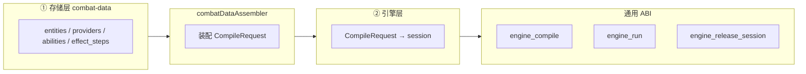
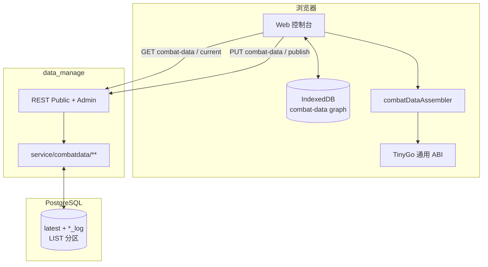
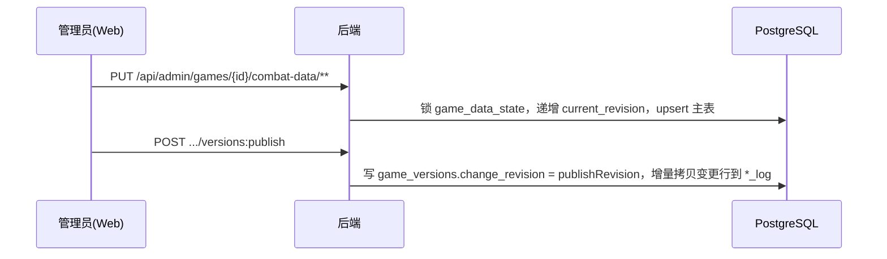
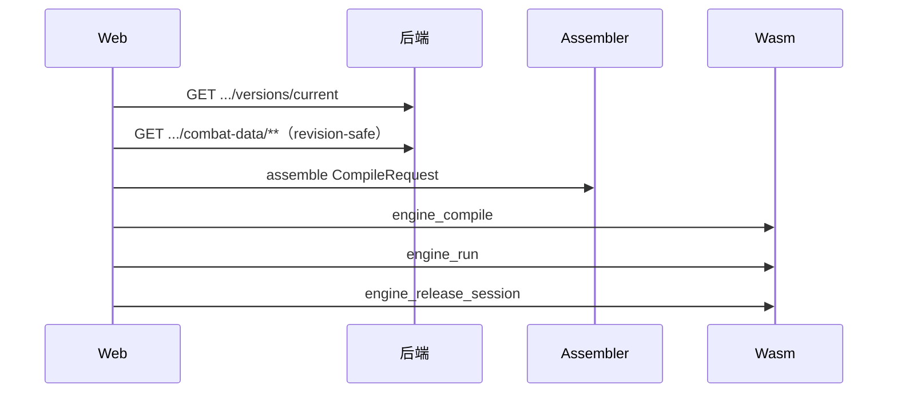

# 01 · 系统总览

> 上级索引：[README](./README.md)　|　相关：[前端](./02-前端设计.md)、[后端](./03-后端设计.md)、[数据库](./04-数据库设计.md)、[Wasm](./05-Wasm计算引擎设计.md)、[开发协同](./06-开发模式与协同流程.md)

本章回答「项目是什么、要做哪些功能、各部分如何协作」。模块细节见各自章节。

---

## 1. 产品定位与要解决的问题

游戏版本更新后，玩家/攻略者要确认「某套配置对某目标的输出」往往只能进训练营手测——成本高、难复现。

**Damage Viewer**：把战斗机制数据结构化管理并按 revision 版本化，把计算放到浏览器本地的确定性 Wasm 引擎里完成。

- **目标用户**：玩家、攻略作者。
- **核心价值**：免手测、可复现、可对比、可沉淀。
- **非目标**：不做完整社区产品；首期聚焦通用 1v1 combat-data 闭环。

---

## 2. 功能全景

状态：✅ 已落地 / 🟡 部分 / ⬜ 规划。

### 2.1 数据管理（后端 + 前端后台 + DB）

| 功能 | 说明 | 状态 | 详见 |
|------|------|------|------|
| 多游戏管理 | `game_id` 隔离，LIST 分区 | ✅ | [DB §2](./04-数据库设计.md) |
| combat-data 管理 | 实体/属性/资源/Provider/能力/效果等 GET + Admin PUT | ✅ | [前端](./02-前端设计.md) / [后端](./03-后端设计.md) |
| revision 与发布 | PUT 递增 `change_revision`；publish 冻结 `publishRevision` 到 `game_versions`，并增量拷贝 `change_revision ∈ (previousPublishedRevision, publishRevision]` 的行到 `*_log` | ✅ | [后端 §5](./03-后端设计.md) |
| 编辑/只读权限分离 | 只读无鉴权；Admin JWT（`canEdit`） | ✅ | [后端](./03-后端设计.md) |
| 图片资源 | 小图标按 URI 管理，不纳入 combat-data revision | ✅ | [前端](./02-前端设计.md) |

### 2.2 计算与展示（前端 + Wasm）

| 功能 | 说明 | 状态 | 详见 |
|------|------|------|------|
| combat-data 装配 | `combatDataAssembler` → `CompileRequest` | ✅ | [08](./08-适配层编译规范.md) |
| 通用 ABI | `engine_compile` → `engine_run` → `engine_release_session` | ✅ | [前端 §Wasm](./02-前端设计.md) |
| graph 缓存 | IndexedDB，按 `gameId + revision` | ✅ | [前端](./02-前端设计.md) |
| 产品级场景工作台 | 面向玩家的对比/斩杀线等 | ⬜ | 规划 |

### 2.3 协同开发

| 功能 | 详见 |
|------|------|
| Cursor 协同 + 文档分层 + 任务治理 | [06](./06-开发模式与协同流程.md) |

---

## 3. 贯穿全局的设计理念

### 3.1 重客户端 + revision 发布

计算下沉到浏览器 Wasm；服务端只做数据管理与发布元数据：

- 最新战斗数据在**主表**；publish 将 `change_revision ∈ (previousPublishedRevision, publishRevision]` 的行增量拷贝进对应 `*_log`，并在 `game_versions` 上冻结 `publishRevision`。
- 读端按 Public `combat-data/**` 拉最新图（可缓存）；**不**依赖全量 Bundle/Catalog 快照。

### 3.2 配置驱动 + 引擎即解释器

机制以 combat-data 配置表达；前端装配层编译为引擎 `CompileRequest`，引擎编译后运行：



详细字段映射见 [08](./08-适配层编译规范.md)。

---

## 4. 系统架构

### 4.1 组件视图



### 4.2 模块边界

| 边界 | 谁负责 | 谁不负责 |
|------|--------|---------|
| combat-data 读写、revision、publish | **后端** | 不做伤害计算 |
| 录入、装配 CompileRequest、缓存、展示 | **前端** | 不实现引擎求值语义 |
| 编译与运行 | **Wasm** | 不访问网络/DB |
| 持久化与分区 | **数据库** | 软引用完整性主要由后端校验 |

### 4.3 技术选型

| 维度 | 选型 |
|------|------|
| 前端 | React 18 + TS strict + Vite 5 + Arco；Hash 路由 |
| 后端 | Java 21 + Spring Boot 3.5 + MyBatis；JWT ES256 |
| 数据库 | PostgreSQL LIST 分区；`change_revision` + `_log` |
| 引擎 ABI | frame + JSON；通用导出 `engine_compile` / `engine_run` / `engine_release_session` |

---

## 5. 端到端数据流

### 5.1 编辑 → 发布



### 5.2 读取 → 装配 → 计算



### 5.3 跨端契约链（简）

```
DB 最新主表 + change_revision
  → Public combat-data API
  → combatDataLoader / IndexedDB
  → combatDataAssembler → CompileRequest
  → engine_compile / engine_run / engine_release_session
```

---

## 6. 现状与规划

已打通：Admin combat-data 编辑 → publish（revision/`_log`）→ 读端装配 → 通用 Wasm 验证页。

规划中：产品级场景工作台、Worker 宿主、更完整的 1v1 机制回归门禁。历史 Bundle/Catalog 聚合路径已删除，不作为现行架构延续。
