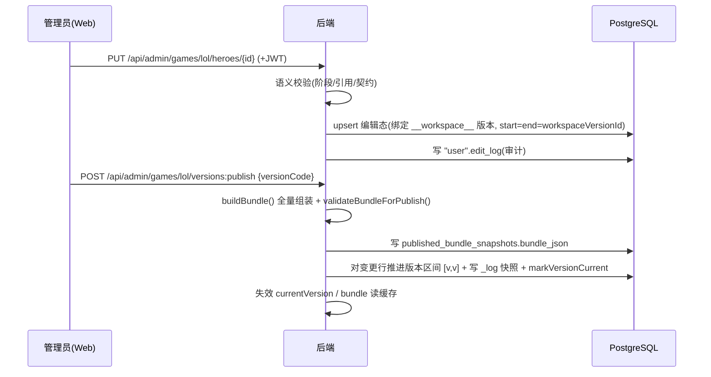
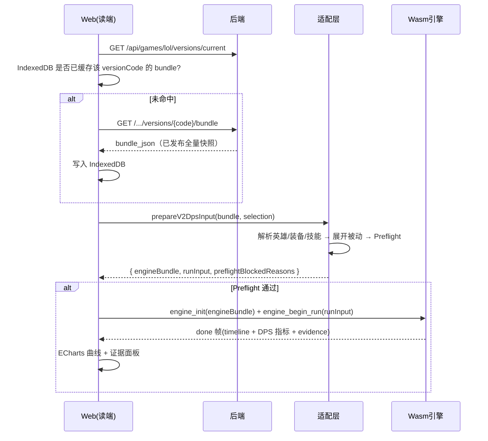

# 01 · 系统总览

> 上级索引：[README](./README.md)　|　相关：[前端](./02-前端设计.md)、[后端](./03-后端设计.md)、[数据库](./04-数据库设计.md)、[Wasm](./05-Wasm计算引擎设计.md)、[开发协同](./06-开发模式与协同流程.md)

本章回答「项目是什么、要做哪些功能、各部分如何协作、贯穿全局的设计理念是什么」。模块内部的可实现细节见各自章节。

---

## 1. 产品定位与要解决的问题

游戏（首期 LoL）每次版本更新后，玩家/攻略者要确认「某套装备打某个目标的 DPS / 斩杀线 / N 秒输出」往往只能反复进训练营手测——成本高、难复现、难沉淀。

**Damage Viewer 要做的事**：把机制数据结构化管理并版本化，把伤害计算放到浏览器本地的确定性引擎里完成，让玩家随时复算、对比版本、对比装备方案。

- **目标用户**：玩家、攻略作者（按角色认领、共建数据）。
- **核心价值**：免手测、可复现、可对比、可沉淀。
- **非目标**（历史决策）：不做配置分享平台、不做完整社区产品；首期仅中文、仅覆盖首期闭环机制。
- **商业形态**（历史决策）：一次性买断、读多写少、目标 ~10 万日活。

> 业务叙事真源：`文档记录/需求澄清/项目/背景说明.md`。

---

## 2. 功能全景（各端"要做什么"）

下表是整个系统的功能清单，作为各章详述的索引。状态：✅ 已落地 / 🟡 部分 / ⬜ 规划。

### 2.1 数据管理（后端 + 前端后台 + DB）

| 功能 | 说明 | 状态 | 详见 |
|------|------|------|------|
| 多游戏管理 | 以 `game_id` 隔离多款游戏，数据物理分区 | ✅ | [DB §2.2](./04-数据库设计.md#22-多游戏-list-分区) |
| 机制数据管理 | 英雄/技能/装备/属性/类型/状态/公式/乘区桶等列表查询 + PUT 覆盖写 | ✅ | [前端 §5](./02-前端设计.md#五页面功能规格已落地) / [后端 §4](./03-后端设计.md#四对外接口契约) |
| 语义校验 | 阶段范围、引用存在性、机制结构校验 | ✅ | [后端 §6](./03-后端设计.md#六校验规则) |
| 版本化发布 | 把编辑态冻结为全量只读 Bundle 快照 | ✅ | [后端 §5.2](./03-后端设计.md#52-版本与发布算法) |
| 编辑/只读权限分离 | 只读无需鉴权；编辑走外部 JWT（`canEdit`） | ✅ | [后端 §5.3](./03-后端设计.md#53-鉴权supportauth) |
| 编辑审计 | 写操作记 `edit_log`，7 天自动清理 | ✅ | [DB §4](./04-数据库设计.md#四usermanage-数据模型user-schema) |
| 图片资源管理 | 上传 64×64 图标，按 URI 管理，不纳入版本 | ✅ | [前端 §5.3](./02-前端设计.md#53-图片缓存页-imagespageimages) |

### 2.2 计算与展示（前端 + Wasm）

| 功能 | 说明 | 状态 | 详见 |
|------|------|------|------|
| 单攻击方 DPS 计算 | 站桩普攻 + 技能/装备被动，输出 DPS 时间线与指标 | ✅ | [Wasm §5](./05-Wasm计算引擎设计.md#五计算管线dps可实现级) |
| 配置驱动机制 | 机制以配置（数据）表达，引擎解释执行 | ✅ | [§3 设计理念](#3-贯穿全局的设计理念) |
| 公式 AST 求值 | 公式是表达式树，编译为字节码，栈式确定性求值 | ✅ | [Wasm §4](./05-Wasm计算引擎设计.md#四公式-ast配置即程序) |
| DPS 曲线对比 | 单英雄/多英雄/装备方案多曲线对比 | ✅ | [前端 §5.4](./02-前端设计.md#54-wasm-验证-dps-页) |
| 证据（evidence）输出 | 暴击上下文、乘区、ICD、数值边界等可追溯证据 | ✅ | [Wasm §6](./05-Wasm计算引擎设计.md#六证据evidence与回归) |
| 1v1 事件模拟 | 双方交互、状态/护盾/控制（事件堆驱动） | 🟡 | [Wasm §7](./05-Wasm计算引擎设计.md#七1v1-事件引擎与骨架子系统) |
| 本地缓存 | 图片 + Bundle 的 IndexedDB 缓存 | ✅ | [前端 §9](./02-前端设计.md#九本地缓存-schema) |
| 产品级场景工作台 | 装备对比、斩杀线、成长曲线等面向玩家场景 | ⬜ | [前端 §10](./02-前端设计.md#十规划路线roadmap) |

### 2.3 协同开发（治理）

| 功能 | 说明 | 详见 |
|------|------|------|
| GPT+Cursor 协同流程 | 需求收敛→受限编码→验收 | [开发协同 §3](./06-开发模式与协同流程.md#三新功能如何交给-ai-开发端到端流程) |
| 文档分层 + 任务治理 | 需求/概要/详细/测试分层；task_rules + SQLite | [开发协同 §5](./06-开发模式与协同流程.md#五任务-文档治理taskrulesjson-sqlite) |

---

## 3. 贯穿全局的设计理念

理解这两点，就能理解整个系统为什么这样设计。

### 3.1 重客户端 + 静态化发布

计算下沉到浏览器 Wasm，服务端只做数据管理与分发：

- 发布产物是**版本冻结的全量 Bundle 快照**，可被 Redis 读缓存与浏览器 IndexedDB 层层加速。
- 读路径（玩家侧）**只读已发布快照**，永不实时拼装编辑态 → 读路径稳定、可强缓存、与编辑互不干扰。
- 适配读多写少；服务端无计算压力。

### 3.2 配置驱动 + 引擎即解释器（核心）

**机制不是写死的代码，而是配置数据；引擎是这些配置的编译器 + 解释器。** 加一个新机制 = 加一段配置（多数情况），而不是改引擎代码。这套"配置驱动"分**两层**，前端适配层负责把第一层编译成第二层：

```mermaid
flowchart LR
  subgraph L1["① 录入/存储层配置（DB + Admin API）"]
    A1["heroes / skills / items"]
    A2["mechanics_config.dpsPassiveEffects[]"]
    A3["formula_profiles / coefficient_buckets / status_*"]
  end
  subgraph ADAPT["前端适配层 tinygoV2*Adapter"]
    AD["解析英雄/装备/技能 → 展开被动 → 解析快照"]
  end
  subgraph L2["② 引擎层配置（EngineBundle + 运行输入）"]
    B1["attributes / resources / actors / actions"]
    B2["statuses / formulas / coefficientBuckets / triggers ..."]
    B3["DPSInput.resolvedSnapshot + passiveEffects[]"]
  end
  subgraph ENG["引擎 = 解释器"]
    E1["compile：配置→字节码/索引"]
    E2["runtime：栈式公式求值 + DPS 管线"]
  end
  L1 --> ADAPT --> L2 --> ENG
```



- **① 录入/存储层**：人类友好、面向编辑。用 JSONB（`mechanics_config`、`base_stats` 等）承载可演进的机制配置，后端只做校验+持久化+发布，不解释机制语义。
- **② 引擎层**：机器友好、面向求值。`EngineBundle`（源码 `EngineBundleV2`）**不含** `heroes/skills/items/skillMounts`——英雄/装备/技能/被动已被**前端适配层解析展开**为 `DPSInput.resolvedSnapshot`（含 `passiveEffects[]` 操作列表）。`EngineBundle` 顶层类别如下：

| 顶层字段 | 内容 |
|----------|------|
| `schemaVersion` | 契约版本（当前 1） |
| `attributes` | 属性定义（默认值/clamp/派生公式） |
| `resources` | 资源定义（current/max 默认） |
| `actors` | 战斗单位模板（属性/资源初值、可用 action） |
| `actions` | 动作模板（classifier/冷却/effects/资源消耗） |
| `statuses` | 状态模板（DoT/HoT/控制/护盾/属性修饰） |
| `statusActionControlRules` | 状态×动作控制规则 |
| `formulas` | 公式 AST 森林 |
| `triggers` | 1v1 事件触发器（DPS 被动不走此项） |
| `damageProfiles` | 伤害类型配置 |
| `coefficientBuckets` | 乘区/属性阶段定义 |
| `settings` | 队列/事件上限等运行参数 |

各元素逐字段契约见 [08 · 适配层规范 §3](./08-适配层编译规范.md#三引擎层-dtoenginebundlev2-元素)。
- **公式 = 程序**：公式在配置里是一棵表达式树（`FormulaDefinition`，节点 op 含 `const/attr/resource/counter/input/sign/add/sub/mul/div/max/min`），`CompileRegistry` 把它编译成后缀字节码，运行时用栈式虚拟机配合注入的属性/资源/计数器求值（详见 [Wasm §4](./05-Wasm计算引擎设计.md#四公式-ast配置即程序)）。

> 这一理念是"可指引开发"的关键：重建系统时，**先实现"配置 schema + 编译器 + 求值器"这套通用机制**，再把具体英雄/装备表达为配置，而不是为每个机制写专用代码。

---

## 4. 系统架构

### 4.1 组件视图

```mermaid
flowchart TB
  subgraph Browser["浏览器（重客户端）"]
    WEB["Web 控制台<br/>React + Arco"]
    IDB[("IndexedDB<br/>图片 / Bundle 缓存")]
    ADP["适配层<br/>tinygoV2*Adapter"]
    WASM["TinyGo V2 引擎<br/>(wasm32, 256MiB)"]
    WEB <--> IDB
    WEB --> ADP --> WASM
  end
  subgraph Server["后端 data_manage（单体）"]
    API["REST API<br/>Public + Admin"]
    SVC["GameDataService<br/>Read/Write Store"]
    REDIS[("Redis 读缓存")]
    API --> SVC
    SVC <--> REDIS
  end
  subgraph DB["PostgreSQL"]
    PUB[("public schema<br/>按 game_id 分区")]
    USR[("\"user\" schema<br/>账号 / 审计 / PV")]
  end
  EXT["外部身份系统<br/>(签发 JWT)"]
  WEB -->|"GET /api/** 只读"| API
  WEB -->|"PUT/POST /api/admin/** + JWT"| API
  SVC <--> PUB
  SVC --> USR
  EXT -.JWT.-> WEB
```

### 4.2 模块边界与职责

| 边界 | 谁负责 | 谁不负责 |
|------|--------|---------|
| 机制数据查询/覆盖写、语义校验、版本发布 | **后端** | 不做伤害计算、不做用户登录注册 |
| 录入交互、可视化、把存储配置编译为引擎配置、缓存编排 | **前端** | 不实现计算语义（仅编译+展示） |
| 伤害 / DPS 计算、公式求值 | **Wasm 引擎** | 不访问网络、不读写 DB |
| 业务数据持久化、分区、发布快照 | **数据库** | 仅保留少量稳定 FK；软引用主要靠后端校验保证完整性 |
| 身份签发 | **外部系统** | 本项目只消费 JWT 的 `email/canEdit/paid` |

### 4.3 技术选型总表

| 维度 | 选型 |
|------|------|
| 前端 | React 18.3 + TypeScript 5.6（strict）+ Vite 5.4 + Arco Design 2.66 + ECharts 6；无 Redux/路由库（Hash 路由 + useState） |
| 后端 | Java 21 + Spring Boot 3.5.0 + MyBatis 3.0.4（无 JPA）；JWT 验签 ES256 |
| 数据库 | PostgreSQL（`public` + `"user"`）；LIST 分区；`pg_cron` 清理审计 |
| 读缓存 | Redis（Lettuce） |
| 计算引擎 | TinyGo 0.40.1 → wasm32-wasi，256MiB，`-scheduler=none -opt=z` |
| 引擎 ABI | 自定义 frame（magic `DVG2`=`0x32475644`）+ JSON payload |

---

## 5. 端到端数据流

### 5.1 编辑 → 发布



### 5.2 读取 → 编译 → 计算



### 5.3 跨端契约链（一条机制的生命周期）

```
DB: skills.mechanics_config.dpsPassiveEffects[]            存储层配置
  → 后端 buildBundle() 透出 bundle.skills[].mechanicsConfig 发布
  → API: GET /.../bundle
  → 前端 tinygoV2DpsAdapter 解析展开为 passiveEffects[] 操作   编译为引擎配置
  → Wasm DPSPassiveEffectV2 / DPSPassiveOperationV2 消费       解释执行
  → 输出 effectBreakdown evidence
  → 前端展示
```

> 注意：契约文档 `文档记录/详细设计/server/game_manage/接口定义.md` 的 `GameDataBundleV1` / `MechanicsConfigV1` 正文**滞后于已落地实现**。本说明书已按 `buildBundle` + `EngineBundleV2` 的当前实现口径写入总契约；这些文档债只限 [后端 §7](./03-后端设计.md#七契约文档与实现差异文档债) 与 [数据库 §5.4](./04-数据库设计.md#54-契约文档-vs-实现差异文档债) 点名条目，后续应把接口定义文档回填到本说明书口径。

---

## 6. 现状与规划总览

### 6.1 已打通的闭环

数据管理后台 → 版本发布 → 只读 Bundle → 本地缓存 → 适配层编译 → Wasm DPS 计算 → 可视化，**整条主链已打通**（以单攻击方 DPS 为代表场景）。

### 6.2 跨端规划路线

| 方向 | 内容 | 涉及模块 |
|------|------|---------|
| 产品化场景工作台 | 「场景模拟」一级页、装备对比、斩杀线、Scenario 编排抽象 | 前端 |
| 真实装备全链路 + 发布 Preflight | Batch P/S/U 全链路验收、发布前契约硬化 | Wasm + 后端 + 前端 |
| 引擎主链统一 | Trigger → Command → Pipeline 替代内联；TriggerIndex、ValueTraceV2 | Wasm |
| 运行宿主升级 | 浏览器 Worker 宿主（当前在主线程） | 前端 + Wasm |
| 1v1 全机制与多单位 | M5 小型 1v1 回归、多目标、seeded_random 暴击 | Wasm |
| 契约文档同步 | bundle / mechanics_config 契约正文回填实现 | 后端文档 |
| 录入体验 | JSONB 字段结构化编辑器、属性选择器（数据录入 T01–T17） | 前端 |
| 数据/护盾通道补全 | heal/shield 四通道、combat_rule_profile | 数据库 + Wasm |

各模块更细的 Roadmap 见对应章节末尾。
