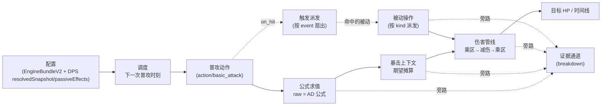

# 05 · Wasm 计算引擎设计（TinyGo V2）

> 上级索引：[README](./README.md)　|　上游：[系统总览](./01-系统总览.md)　|　相关：[前端](./02-前端设计.md)、[后端](./03-后端设计.md)、[数据库](./04-数据库设计.md)
>
> 代码位置：`wasm/tinygo_engine_v2/`。协作约定：`wasm/tinygo_engine_v2/AGENTS.md`、`ARCHITECTURE.md`、`README.md`。

---

## 一、功能说明：引擎要做什么

引擎用 **TinyGo 把 Go 引擎编译为 wasm32**，在浏览器本地确定性地计算伤害/DPS。它要做的事可以归纳为一句话：

> **吃一份"配置"（机制 = 数据），把"公式"当程序解释执行，确定性地算出伤害与 DPS，并产出可追溯的证据。**

具体功能：

1. **接收配置**：`engine_init` 收下 `EngineBundleV2`（`schemaVersion/attributes/resources/actors/actions/statuses/statusActionControlRules/formulas/triggers/damageProfiles/coefficientBuckets/settings`），编译为只读运行时结构。
2. **计算单攻击方 DPS**：`engine_begin_run` 收下已解析的 DPS 输入，按时间推进站桩普攻 + 技能/装备被动，输出 DPS 时间线、指标与证据（**产品化主线**）。
3. **计算 1v1 事件模拟**：`engine_step` 驱动事件堆，支持双方交互、状态/护盾/控制（M1–M4 验证线，全机制仍在推进）。
4. **公式求值**：把配置里的表达式树编译成字节码，用栈式虚拟机求值，可输出逐步 breakdown。
5. **确定性与无副作用**：单线程、无网络、无 DB；同样输入永远同样输出（暴击用期望值摊算，可选 seed）。

**运行边界（`AGENTS.md` §8）**：热路径禁止 goroutine/channel/lock/panic/反射；机制不得直接改 HP，数值变化必须经统一入口；首期只优化 1v1 单线程确定性。正式宿主目标是浏览器 Worker（当前前端在主线程调用）。

---

## 二、技术栈与构建

### 2.1 工具链

| 项 | 值 |
|----|----|
| Go module | `tinygo_engine_v2`，`go 1.25.0` |
| TinyGo | **0.40.1** |
| 编译目标 | `targets/wasm-256m.json`：`wasm32-unknown-wasi`，`goos=js`，`goarch=wasm` |
| 内存 | initial = max = **268435456（256 MiB）** |
| 构建参数 | `-scheduler=none -no-debug -opt=z` |

### 2.2 构建命令与产物

```powershell
tinygo build -scheduler=none -no-debug -opt=z `
  -target .\targets\wasm-256m.json `
  -o .\dist\tinygo_engine_v2.wasm .\cmd\engine_wasm
# 验证
go test ./...
node .\scripts\smoke-node.mjs        # 实例化 + 导出函数检查
node .\scripts\bench-node.mjs --iterations 10 --warmup 2
```

产物 `dist/tinygo_engine_v2.wasm` 需**手动同步**到 `web/src/engine/wasm/tinygo_engine_v2.wasm`（前端 build 不编译 wasm）。

> 旧 Rust/Katarina crate 已移除，`demo/go_engine_v2`、`demo/java_engine_v2` 禁止作为新基线。

---

## 三、设计思想：解耦与组装

引擎的核心设计目标**不是"实现很多机制"，而是"让机制互不耦合地拼装"**。一次伤害计算由一串**单一职责、实现层互不知晓**的部件组装而成——它们由一个中心编排器按数据契约（公式 ID、bucketKey、event、operation kind）依次调度，但谁都不直接 import 别人的实现。也就是说**"编排"这一层有意集中，"逻辑实现"层是解耦的**。

理解这一节，就理解了为什么"加一个新机制"通常只是加一段配置或加一个独立 handler，而不会牵动整张计算图。下面用软件工程的模式语言（沿用项目 `ARCHITECTURE.md` 与 `design-pattern-refactor` 的词表）说明这些"缝（变化点）"，以及它们如何拼成一次完整计算。

### 3.1 一次普攻命中的"组装视图"

下图是"打出一次会暴击、带破败被动、对目标有减伤"的普攻——每段只读自己的输入、写自己的输出，**部件之间通过数据契约交接，而不是互相 import 对方的实现逻辑**（编排由下方说明的中心状态机负责）：



- **编排集中、逻辑解耦**：DPS 路径有一个中心编排状态机 `dpsCurveState`（持有 bundle、runCtx、属性、被动、stacks、dots、timeline），负责"按时间推进、依次调用各段"。但**各段之间不互相 import**：调度不知道伤害怎么算，公式不知道谁在用它，被动不知道伤害管线有几段，证据通道不参与计算——它们只通过数据契约（公式 ID、bucketKey、event、operation kind）交接。换言之，**耦合在"编排"这一层是有意集中的，逻辑实现层是解耦的**。
- **加机制 = 往某一条缝里加一项**：加被动 → 加一条 `operations`；加减伤 → 加一个乘区桶贡献；加触发时机 → 订阅一个新 event；加数值 → 加一个公式节点。下游与编排器无需改动。

### 3.2 解耦缝总览（变化点 ↔ 模式角色）

每一行是一条"缝"：**要加同类东西时只改"变化点"那一列，其余部件不动**。模式名只是给真实变化点起的名字（非装饰）。

> **状态列读法**：✅ = 该解耦缝**已是真实运行路径**（可能以内联形式落地，不代表已抽象成统一框架）；🟡 = 部分落地/双轨/暂用轻量表示。`internal/command`、`internal/pipeline`、`internal/trigger.Index` 这三个"统一主链"骨架包**当前未接入主链**——它们是合流**目标态**，不要据本表误读为"统一主链已落地"（见 [§3.6](#36-诚实理想解耦-vs-当前实现)）。真正落地的变化点是 DPS dispatcher、伤害 stage、operation handler、公式 VM、证据通道等具体实现。

| 缝 / 变化点 | 加东西时改这里 | 如何做到解耦 | 模式角色 | 落点 | 状态 |
|------------|----------------|--------------|----------|------|------|
| **机制即配置** | 加英雄/装备/被动 | 行为存在数据里，引擎只解释，不为每个机制写分支 | Interpreter（解释器） | `EngineBundleV2` + 适配层 | ✅ |
| **编译/运行分离** | 改录入/契约格式 | DTO 先编译成 IR（短 ID/索引/校验），热路径不碰原始 JSON | Builder + Compiler/IR | `compile.Bundle → CompiledBundle` | ✅ |
| **公式求值靠抽象** | 加公式/换取数来源 | VM 依赖 `AttributeReader/ResourceReader/CounterReader` 接口，而非具体运行时状态（求值算法唯一，非多策略切换） | 依赖倒置(DIP) | `formula.EvalContext` | ✅ |
| **属性分层解析** | 加 buff/装备/被动改属性 | 消费者读聚合值不知谁贡献；生产者只加 modifier | Mediator / 分层聚合 | `attribute.Store`(base/current/max/resolved) | ✅（1v1）/ 🟡（DPS 用 `dps_state.go` 的 flat `attrs`+`attributeViews`，仅偶发同步 Store） |
| **伤害分阶段** | 加减伤/增伤/乘区 | 伤害是一个 packet，依次过若干独立 stage，各 stage 只做一次变换 | Pipeline / 责任链 | `hp_change/*` stage + `coefficientBucket` | ✅（DPS 内联于 `dps_hp_change_modifier_adapter.go`，`internal/pipeline` 仍为骨架） |
| **机制操作** | 加一种 operation | 按 `kind` 分派到独立 handler，dispatcher 不知 handler 内部 | Command（按 kind 的 switch 分派，非 Strategy 多态） | `dps_operation_handlers` | ✅（`internal/command` 未接入） |
| **触发即订阅** | 加一个触发时机 | 被动声明关心的 `event` + ownerRole + matcher，由 dispatcher 扇出，被动间互不感知 | Observer / Mediator | `dps_passive_dispatcher`、`trigger.event` | ✅（DPS）/ 🟡（1v1 遍历 `Bundle.Triggers`，`trigger.Index` 仍为骨架） |
| **匹配靠规格** | 加筛选条件 | "是否命中此动作/目标"由 matcher 判定，与机制逻辑分离 | Specification | 1v1: `typeset.Matcher`；DPS: `linkedPassiveMatchesMatcher` + 字符串 `procScope` | ✅（1v1）/ 🟡（DPS 字符串集合实现，未走 `typeset.Registry`） |
| **施法门控** | 加一个施法限制 | 门链逐关短路 + 返回原因码，加一关不影响其它关 | 责任链(CoR) | `CanCast` gates | ✅（`forbid`）/ 🟡（控制规则 `interrupt` 仅编译，通用消费未接入） |
| **生命周期** | 加一个阶段 | 显式、受守卫的状态迁移 | State | `Session.phase`、`RunContext.Done`、curve status | ✅ |
| **宿主隔离** | 换宿主 | 只暴露 frame/outbox，内部全隐藏 | Facade / Adapter | `cmd/engine_wasm` + `internal/abi` | ✅ ABI/Facade 已落地；当前宿主为**主线程 + Node smoke**，**浏览器 Worker 宿主仍规划中** |
| **证据旁路** | 加一种证据 | 与主计算并行的统一通道，不污染计算逻辑 | Observer / 旁路通道 | `effectBreakdown`、`EvalTrace` | ✅ |
| **只读快照** | 加一种检视 | 捕获状态但不推进仿真 | Memento | `snapshot`/`done` payload | ✅ |
| **事件排序** | — | 稳定优先级堆把"事件生产"与"执行顺序"解耦 | Priority Queue | `internal/scheduler` | ✅（1v1） |

### 3.3 关键缝详解（为什么这样就解耦了）

- **机制即配置（Interpreter）——根解耦**：英雄/装备/被动不是代码，而是存储层 `mechanicsConfig.dpsPassiveEffects[]` 经适配层展开后进入 `EngineBundleV2` 与 `DPSInput.resolvedSnapshot.passiveEffects[]` 的数据。引擎是这份数据的解释器。于是"破败连刃怎么打"与"引擎怎么跑"被分开：换一个英雄通常不改引擎，改引擎也不直接改英雄数据。这是其它所有缝的前提。
- **公式靠接口求值（DIP）**：公式 VM 通过 `EvalContext` 里的 `AttributeReader` 等**接口**取数，不知道数据来自 1v1 actor 还是 DPS 快照。同一套公式字节码可被两条计算路径复用——这是教科书式的依赖倒置，也是代码里真实存在的接口缝（`internal/formula/formula.go`）。
- **属性分层解析（生产者/消费者解耦）**：buff、装备、被动只管加 modifier；公式与伤害管线只读聚合值。新增一个加成来源不影响任何读取方。**注意现状**：1v1 经 `attribute.Store`（base/current/max/resolved）做这套分层聚合；DPS 主路径用 `dpsCurveState` 的扁平 `attrs`/`attributeViews`，仅在与 RunContext 同步时回写 Store——属于"同一缝、DPS 暂用轻量表示"，是后续要统一的点（[§3.6](#36-诚实理想解耦-vs-当前实现)）。
- **伤害分阶段（Pipeline / 责任链）**：一次伤害是一个值，顺序流过 `outgoing→incoming→减伤→final→flat` 各 stage，每个 stage 只做一次变换并可留证据。加"暴击额外减伤""百分比增伤"= 往对应 stage 加一个乘区桶贡献，**不改管线骨架**。
- **机制操作即命令（Command / handler 分派）**：每种 `operation.kind`（damage/apply_dot/stat_modifier/…）是一个自包含操作分支，dispatcher 按 kind 进入对应 handler。当前实现仍是中央 `switch` 分派，尚不是独立 Strategy 注册表；后续若把 handler 注册表抽出，才升级为完整 Strategy 形态。新增 operation 的目标落点是新增 handler + 校验，尽量不碰已有 operation。
- **触发即订阅（Observer）**：被动用 `trigger.event` + matcher 声明"我关心普攻命中/暴击/受伤……"，由 dispatcher 在事件发生时扇出给关心它的被动。被动之间、被动与伤害流程之间都不直接调用，新增触发时机不需要改其它被动。
- **证据是横切关注点（旁路通道）**：暴击上下文、乘区候选、ICD、数值 clamp 都通过 `effectBreakdown`/`EvalTrace` 旁路输出，与"算出多少伤害"的主逻辑解耦——可解释性可以随时加强而不动计算。

### 3.4 SOLID 落点

| 原则 | 在本引擎的体现 |
|------|----------------|
| **S** 单一职责 | `internal/` 按职责分包：`formula`(求值)/`attribute`(属性)/`resource`(资源)/`scheduler`(排序)/`typeset`(匹配)/`abi`(协议)；`cmd/engine_wasm` 只做 ABI 装配 |
| **O** 开闭 | 加机制=加配置；加 operation=加 handler；加公式=加节点/算子；调用方不改 |
| **L/I** 里氏/接口隔离 | 公式只依赖 `AttributeReader`/`ResourceReader`/`CounterReader` 三个小接口，互不绑定 |
| **D** 依赖倒置 | 运行时依赖 `CompiledBundle`（IR）而非原始 DTO；公式依赖 reader 抽象而非具体 store |

### 3.5 "加一个新东西落在哪条缝"

| 想加什么 | 落在哪条缝 | 要动引擎代码吗 |
|----------|------------|----------------|
| 新英雄/装备/数值 | 配置（数据） | 否 |
| 新公式（任意计算） | 公式节点组合 | 否（除非缺算子） |
| 已支持类型的新被动 | `operations` + `trigger` | 否 |
| 新乘区/属性修饰 | 乘区桶 + operation `bucketKey` | 否 |
| 全新触发时机 / operation 类型 | 触发缝 / 操作缝 | 是（加 event/handler + 校验，一次） |
| 新公式算子（pow/clamp 等） | 公式缝 | 是（加 compile/eval 分支，一次） |

> 与 [07-端到端示例 · 通用扩展心法](./07-端到端开发示例.md#通用扩展心法) 一致：能用现有缝组合表达就是纯配置；不能则先扩一次引擎能力，之后同类回到纯配置。

### 3.6 诚实：理想解耦 vs 当前实现

本节描述的是**目标架构**，其中多数缝已是真实运行路径（公式接口、属性 Store、乘区桶、matcher、CanCast 门链、ABI Facade、证据旁路、快照、scheduler 都已落地）。但有两处"设计完整、实现分叉"，重建/重构时需知晓（`ARCHITECTURE.md` 同口径）：

1. **统一命令/管线主链未合流**：`internal/command`、`internal/pipeline`、`internal/trigger.Index` 已有包结构，但当前热点逻辑在 `runtime`（1v1）与 `dps_*`（DPS）里**内联实现**。"Pipeline/Command/Observer"在 DPS 路径以具体函数体现，尚未抽象成统一主链。把内联收敛到这三个包是既定重构方向。
2. **DPS 与 1v1 双轨，且共享比表面更深**：两条路径复用公式/资源与求值接口，但 matcher 分轨实现；各自拥有调度、被动派发、伤害应用。更具体地：
   - **DPS 复用 1v1 的 `PerformCastAt`**：DPS 的普攻/技能（`dps_basic_attack.go`）调用 1v1 `RunContext.PerformCastAt` 取公式与 effect 结果，再套自己的 DPS 伤害管线——共享点比"公式/属性/资源/matcher"更深一层。
   - **属性双表示**：DPS 用扁平 `attrs`/`attributeViews`，1v1 用 `attribute.Store`，两者间靠同步桥接，而非单一表示。
   - **matcher 双实现**：1v1 用 `typeset.Matcher`，DPS 用字符串集合的 `matchDPSTypeMatcher`。
   这些是有意的显式边界（不是隐性耦合），但确实意味着"同一条缝在两轨各有一份实现"，统一它们与合流三包是同一个重构方向。

> 一句话：**这些缝是"机制如何不耦合"的真源；当 command/pipeline/trigger 三包成为实际主链、且 DPS/1v1 收敛到单一属性表示与单一施法入口后，本节的模式图与代码结构将一一对应。**

---

## 四、公式 AST（配置即程序）

这是引擎设计的灵魂——把公式当成一棵可配置的表达式树编译执行。重建系统时**优先实现这套机制**。

### 4.1 配置：公式定义是表达式树

`FormulaDefinitionV2`（`internal/model/types.go`）每个节点的字段：

| 字段 | JSON tag | 语义 |
|------|----------|------|
| ID | `id` | 公式唯一 ID，被其他节点 `left`/`right` 或 action 引用 |
| Op | `op` | 节点类型（见下表） |
| Value | `value` | `const` 字面量 |
| Attr | `attr` | 属性 ID（`op=attr`） |
| AttrRead | `attrRead` | 属性读取面，默认 `resolved` |
| Resource | `resource` | 资源 ID（`op=resource`，读 current） |
| Counter | `counter` | 计数器键（`op=counter`） |
| Left / Right | `left`/`right` | 子公式 ID |

**支持的 `op`**：

| op | 子节点 | 字节码 | 语义 |
|----|--------|--------|------|
| `""` / `const` | — | OpConst | 压入 Value |
| `attr` | — | OpAttr | 读 source 属性（按 AttrRead 面） |
| `resource` | — | OpResource | 读 source 资源 current |
| `counter` | — | OpCounter | 读 counter（无则 0） |
| `input` | — | OpInput | 压入 EvalContext.Input（如技能等级） |
| `sign` | Left | OpSign | sign(x) ∈ {-1,0,1} |
| `add/sub/mul/div/max/min` | Left, Right | OpAdd… | 二元运算 |

**`AttributeReadKind`**：`resolved`（默认，经 modifier 聚合）/ `base` / `current` / `max`。

### 4.2 编译：表达式树 → 后缀字节码（`internal/formula/formula.go`）

`CompileRegistry(defs, attrIndex, resourceIndex)` 把每个公式定义递归编译成一段后缀（RPN）指令 `Program`：

- 先建 `attrIndex` / `resourceIndex`（string → uint16），编译期把属性名固化为下标，**热路径无 map 查找**。
- 递归 `compile(id)`：前序遍历子树 → 追加后缀指令；检测重复 ID 与环（`visiting` map）。
- 产出 `Registry{ Programs []Program, Index map[string]ProgramID }`。

示例 `add(mul(attr ap, const 1.2), attr bonus)`：

```
AST:  add ─┬─ mul ─┬─ attr(ap)
           │       └─ const(1.2)
           └─ attr(bonus)

字节码: [OpAttr ap] [OpConst 1.2] [OpMul] [OpAttr bonus] [OpAdd]
```

### 4.3 求值：栈式虚拟机（`Registry.Eval` / `EvalTrace`）

```go
type EvalContext struct {
    SourceAttrs AttributeReader // attr/resource 默认读 source
    TargetAttrs AttributeReader // 预留（当前 OpAttr 读 SourceAttrs）
    Resources   ResourceReader
    Counters    CounterReader
    Input       float64         // 技能等级等
}
```

求值是一个简单的栈机：遍历指令，常量/属性/资源/计数器压栈，二元运算弹两个压一个；结束时栈必须恰好剩 1 个值。关键不变量（直接照抄即可保证确定性）：

- 除零 / NaN / Inf → 报错 `E_NUMERIC`，不产出脏值。
- `OpAttr` 越界、source 不可用 → 报错。
- `counter` 缺失视为 0（不报错）。
- 栈最终 ≠ 1 个值 → 报错（公式结构非法）。
- `EvalTrace` 额外产出 `[]ActionValueBreakdownStepV2`（每步 `{formulaId, op, ref, value}`）作为证据。

> 重建要点：公式系统 = 「表达式树 schema」+「递归编译为 RPN」+「栈机求值」+「编译期属性索引」。这套通用机制实现后，任何数值（伤害、冷却、资源消耗、DoT tick、派生属性）都用公式配置表达，无需为每条公式写代码。`EvalContext` 用接口取数（[§三 公式靠接口求值](#33-关键缝详解为什么这样就解耦了)），是引擎里最干净的解耦缝。

### 4.4 乘区桶（CoefficientBucket）：可配置的多乘区聚合

伤害/属性的"乘区"也是配置。`CoefficientBucketV2`：

| 字段 | 语义 |
|------|------|
| `bucketKey` | 唯一键，operation 通过 `bucketKey` 引用 |
| `resolutionDomain` | `attribute` / `hp_change` |
| `stageKey` | 解析阶段（见下） |
| `targetAttrKey` | attribute 域必填 |
| `aggregationMode` | `add` / `multiply` / `pick_max` / `set_final` |
| `bucketConfig` | `priority`、`valueUnit`、`clampMin/Max`、`evidenceLabel` |

- 属性域 stageKey：`attribute/base_bonus` → `attribute/flat_bonus` → `attribute/final_multiplier`（按此顺序应用）。
- hp_change 域 stageKey：`hp_change/outgoing/pre_mitigation`、`.../incoming/pre_mitigation`、`.../final/post_mitigation`、`hp_change/flat/post_percent`。
- `valueUnit`：`percent_delta` / `factor` / `flat_delta` / `final_value`。

聚合伪代码：

```
候选值按 priority 排序 → 按 aggregationMode + valueUnit 聚合
add + percent_delta:      amount * (1 + Σ delta)
add + flat_delta:         amount + Σ delta
multiply + factor:        amount * Π factor
set_final + final_value:  amount = final
pick_max:                 取 max 后按 valueUnit 应用
```

> 乘区桶是"伤害分阶段"缝的配置载体：加一个乘区 = 加一个 bucket + operation 引用它，伤害管线骨架不变。

---

## 五、计算管线（DPS，可实现级）

### 5.1 输入/输出契约（顶层）

**输入 `SingleAttackerDPSInputV2`**：

| 字段 | 语义 |
|------|------|
| `caseId` / `versionCode` / `wasmSha256` | 回归/发布追溯 |
| `simulationRules` | 仿真规则（见下） |
| `targetSnapshot` | 顶层目标快照（可选） |
| `curves[]` | 多曲线批量，每条 `{ curveId, label, selection, resolvedSnapshot }` |

**`simulationRules`（含 normalize 默认值）**：

| 字段 | 默认 | 语义 |
|------|------|------|
| `durationMs` | — | 仿真时长 |
| `attackSpeedCap` | `3.0` | 攻速上限 |
| `critPolicy` | `expected` | 暴击策略（首期仅 expected，seeded_random 被 block） |
| `dotTickIntervalMs` | `1000` | DoT tick 间隔（全局） |
| `firstAttackAtMs` | 与 plan 同步 | 首次攻击时刻 |
| `autoAttackPlan` | targetRole=`target` | 自动攻击计划 |
| `maxEvents` | `10000` | 事件上限 |
| `seed` | — | RNG 种子 |

**`resolvedSnapshot`（前端适配层已解析）**：`attackerSnapshot` / `targetSnapshot`（含 `attributes` flat map 与 `attributeViews` 的 base/current/max/resolved、`currentHp`/`maxHp`）、`basicAttackActions`、`activeActions`、`equipmentSet/Stats`、`enabledPassiveEffects`、`passiveEffects[]`（**已展开的操作列表**）、`scenarioStates`、`runeStatAdjustments`。

**输出 `SingleAttackerDPSOutputV2`** → `curveResults[]`，每条 `DPSCurveResultV2`：`status`(ok/blocked)、各 timeline（attack/interval/damage/attackerDamage/targetHp/effect）、`totalDamage`、`timeWindowDps`、`killDps`/`killTimeMs`、`damageByType`/`damageBySource`、`skill/itemPassiveTriggers`、`effectBreakdown[]`、`blockedReasons`。

### 5.2 主循环算法

入口 `runSingleAttackerDPS` → 每条 curve `runSingleAttackerDPSCurve`。

**初始化顺序**：
1. `validateDPSCurve`（duration>0、critPolicy=expected、attackSpeedCap=3、dotTick=1000…，collect-all 进 `blockedReasons`）。
2. `applyEquipmentStatsToResolvedSnapshot`（装备 flat 加到攻击者属性/视图）。
3. `newDPSCurveState`（建 RunContext、被动、抗性快照）。
4. `applyInitialStatModifiers`（always-on / pre-enabled stat_modifier + 属性乘区桶）。
5. `initEnergizedCharge` / `initActiveActionSchedules`。

**时间推进（核心）**：

```text
loop:
  nextDot    = min(各 DoT.NextTickAtMs)
  nextAction = min(各 schedule.nextAtMs)
  if 两者皆无: break
  if nextDot <= nextAction: processDotTick(nextDot)
  else:                     processActiveActionsAt(nextAction)   // 同刻多 action 按 priority, listOrder
  if targetHP<=0 or blocked or 超 maxEvents: break
```

**攻击间隔**：每次施法后取 action 冷却——有 `cooldownFormulaId` 则公式求值并 round 为 ms，否则用固定 `cooldownMs`（普攻通常配 `1000/AS` 公式）；记录 timeline 时 `effectiveAS = min(rawAS, attackSpeedCap)`。

**暴击期望摊算**（`critPolicy=expected`）：

```text
normalPart = raw * (1 - chanceEffective)
critPart   = raw * chanceEffective * multiplier
expected   = normalPart + critPart
```

`damage_modifier` 在 expected 模式分别缩放 normalPart / critPart；`on_crit` 被动对 `damage` 用 `amount * chanceEffective` 加权。

### 5.3 伤害数学（护甲减伤 + 穿透）

```text
# 有效抗性（仅 resistance>0 时应用穿透）
effectiveRes = max(0, resistance * (1 - clamp(percentPen,0,1)) - flatPen)

# 减伤
if damageType == "true":  return amount
if resistance >= 0:       amount * 100 / (100 + effectiveRes)
if resistance <  0:       amount * (2 - 100/(100 - resistance))   # 负护甲增伤
```

穿透属性键（攻击者）：physical 用 `armor_pen_percent`/`physical_pen_percent` + `armor_pen_flat`/`lethality`；magic 用 `magic_pen_percent` + `magic_pen_flat`。

**完整伤害管线**（有 combat context）：

```text
amount
 → 乘区 hp_change/outgoing/pre_mitigation
 → 乘区 hp_change/incoming/pre_mitigation
 → 记录 preMitigation 证据
 → mitigateDamageByResistance（上式）
 → 乘区 hp_change/final/post_mitigation
 → 乘区 hp_change/flat/post_percent
 → applyDamageToHP
```

> 这条流水即 [§3.2 "伤害分阶段"](#32-解耦缝总览变化点-模式角色)缝的实体：每段是独立 stage，加减伤/增伤只往对应 stage 添乘区桶贡献。

### 5.4 Operation 语义（机制 = 配置的操作）

每个被动效果 `DPSPassiveEffectV2` 含 `operations[]`，每个 operation 是一条可配置指令。`kind` 与精确语义：

| kind | 触发时机 | 语义 |
|------|----------|------|
| `damage` | 被动派发 | `resolveOperationAmount` 合成伤害 → 走伤害管线 |
| `apply_dot` | 被动派发 | 注册 DoT，tick 用全局 `dotTickIntervalMs`；`refresh` 刷新同 key |
| `add_stack` | 被动派发 | `stacks[key]++`，受 `maxStacks`；可选过期 |
| `trigger_damage_at_stacks` | 被动派发 | `stacks≥triggerStacks` 时造成伤害，可 `resetStacks` |
| `stat_modifier` | 初始/刷新/派发 | flat/percent/override 改属性；有 `bucketKey` 走属性乘区桶 |
| `coefficient_modifier` | 同上 | 必带 `bucketKey`，按 domain 走 attribute / hp_change 桶 |
| `damage_modifier` | **伤害前** | 仅 `valuePhase=incoming`，默认 percent；支持 `critOnly`；有 `bucketKey` 走 hp_change 桶 |
| `crit_context_modifier` | **伤害前**（早于 incoming） | 改暴击上下文（forceCrit / 倍率 scale/override） |
| `execute_threshold` | on_damage_dealt/taken | `checkTiming=after_damage`，按 HP 比例/绝对值斩杀 |
| `phantom_hit_on_hit_repeat` | 普攻 on_hit 后 | `stacks≥triggerStacks` 时复制 `phantomHitCopyable` 的 damage（不重新派发联动） |

**`resolveOperationAmount` 合成公式**（重建照抄）：

```text
amount  = op.Amount
        + targetCurrentHP  * ratio(basis)
        + targetMaxHP      * ratio
        + missingHP        * ratio(basis)
amount *= (1 + missingRatio * missingAmp)        # 若配置
amount += attackerAttr(readKind) * attrRatio
amount += stacks * amountPerStack
amount  = max(amount, minAmount)                 # 若 hasMinAmount
```

**触发字段**：`triggerKind` 与 `trigger.event` 可并存——引擎优先用 `trigger.event`，否则按 `triggerKind` 映射默认事件。引擎 `trigger.event` 全集：`on_basic_attack_hit`/`on_spell_hit`/`on_hit`/`on_damage_dealt`/`on_damage_taken`/`on_crit`/`dot_tick`/`stat_modifier_always_on`/`pre_enabled_state_modifier`。完整触发模型、各字段与"按 kind 的 operation 完整契约"见 [适配层规范 §8](./08-适配层编译规范.md#八被动配置完整契约dpspassiveeffects)。充能字段 `chargeKey`/`chargeThreshold`/`chargeCap`/`chargeReadyPolicy`；`internalCooldownMs`（ICD）；`procScope`（real_basic_attack_only / active_skill）。

### 5.5 被动派发顺序

普攻命中后 `processAttackPassives`：`on_basic_attack_hit`（含联动）→ `on_damage_dealt` → `on_damage_taken` → `processPhantomHits` → `processOnCritPassives`。技能命中后 `processSkillPassives`：`on_spell_hit` → dealt → taken → on_crit（无 phantom）。

`dispatchDPSLinkedEffects` 排序：priority 升序 → 配置顺序；`every_n` 用命中计数门控；ICD 用 `passiveCooldownReadyAt` 在同事件内去重。这是 [§3.2 "触发即订阅"](#32-解耦缝总览变化点-模式角色)缝在 DPS 路径的实现。

---

## 六、证据（evidence）与回归

### 6.1 结构化证据字段

`effectBreakdown[]` 每项 `DPSEffectBreakdownV2` 可携带：

- **`critContext`**（`DPSCritContextV2`）：`policy`、`chanceRaw/effective`、`multiplier`、`expectedNormalPart/expectedCritPart`、`boundEvidence`。
- **`coefficientBucket`**（`DPSCoefficientBucketEvidenceV2`）：`domain`、`stageKey`、`bucketKey`、`aggregationMode`、`raw`、`result`、`candidates[]`、`skipped[]`。
- **`passiveCooldown`**（`DPSPassiveCooldownEvidenceV2`）：`internalCooldownMs`、`readyAtMs`、`triggered`、`skipped`。
- **`numericBound`**（`NumericBoundEvidenceV2`）：`source`、`mode`、`rawValue`、`boundedValue`、`min/max`、`wasClamped`。

证据是"为什么这个数是这个数"的可追溯说明，前端验证页据此展示，回归测试据此断言。它走 [§3.2 "证据旁路"](#32-解耦缝总览变化点-模式角色)缝，与主计算解耦。

### 6.2 Canonical 回归（Batch F）

Runtime golden 用例（`dps_driver_test.go`）：攻速 buff 过期边界、攻速 cap 2.99/3.0/3.01、DoT tick 边界、同次普攻来源顺序、blocked 曲线不污染同批、expected crit vs seeded_random blocked。证据以 Go test + 页面导出 JSON 保存（`文档记录/测试记录/wasm/artifacts/`），**非**独立 golden 仓库。

---

## 七、1v1 事件引擎与骨架子系统

DPS 竖切之外，引擎还有一条 1v1 事件路径（`engine_step`），目标是竞技场全机制，目前支撑 M1–M4 字段验证与 Batch J。

### 7.1 1v1 施法链与 CanCast 门控

施法**唯一入口** `CanCast` 门控链（[§3.2 "施法门控"](#32-解耦缝总览变化点-模式角色)缝）：① action 存在 → ② actor 拥有 → ③ 未被状态 `StatusActionControlRules(ruleKind=forbid)` 禁止 → ④ Mark 满足 → ⑤ 资源足够 → ⑥ 冷却就绪。

`StatusActionControlRules(ruleKind=interrupt)` 已有 DTO/编译契约，但当前 1v1 通用运行时尚未按控制规则自动扫描并中断执行阶段；已落地的打断能力来自显式 `EffectDefV2(type=interrupt)` 调用 `interruptExecutions`。因此需要“状态导致通用 interrupt”时，应按 Roadmap 补运行时消费点，不能仅录入 `interrupt` 规则就假定生效。

```text
PerformCastAt
 → CanCast
 → commitCastStart（扣资源、进冷却、可选 channel）
 → fireTriggers(on_action_cast)
 → for each effect: applyEffect（deal_damage: 公式→暴击→模式→结算）
 → dealDamage: 护盾 → HP → fireTriggers(dealt/taken)
```

`EffectDefV2` 的 `type` 枚举：`deal_damage`/`heal`/`apply_status`/`grant_shield`/`apply_mark`/`consume_mark`/`damage_from_recent`/`interrupt`/`increment_counter`/`spend_resource`/`modify_attribute`。

### 7.2 已实现 vs 骨架

| 组件 | 状态 |
|------|------|
| `RunContext.applyEffect` / `dealDamage` / `fireTriggers`（内联触发） | ✅ 已实现 |
| `StatusActionControlRules(ruleKind=forbid)` → `CanCast` | ✅ 已实现 |
| `StatusActionControlRules(ruleKind=interrupt)` 通用消费 | 🟡 DTO/编译已存在，运行时未接入；当前打断靠显式 `EffectDefV2(type=interrupt)` |
| DPS `DPSPassiveEffectV2` dispatcher | ✅ 独立实现（不走 `Bundle.Triggers`） |
| `internal/command`、`internal/pipeline`、`internal/trigger.Index` | 🟡 骨架（未接入主链） |
| `counter`/`mark`/`crit`/`augment` 独立包 | 🟡 部分被 runtime 消费，未升为一等状态 |
| `ValueTraceV2` | 🟡 DTO 有，runtime 未稳定产出 |

> 架构特征「设计完整、实现分叉」详见 [§3.6](#36-诚实理想解耦-vs-当前实现)：`command/pipeline/trigger` 在文档与包结构中已定义，热点逻辑暂在 `runtime` 与 `dps_*` 内联；统一为主链是后续重构方向。

---

## 八、ABI 与宿主接口

### 8.1 导出函数

```text
alloc, dealloc
engine_init, engine_snapshot_initial, engine_snapshot_actions_initial
engine_begin_run, engine_step, engine_abort_run
engine_outbox_ptr, engine_outbox_len, engine_outbox_clear
```

### 8.2 Frame 协议

- Magic `0x32475644`（`DVG2`），16 字节 header（`magic/schemaVersion/kind/flags/payloadLen`）+ UTF-8 JSON payload。
- `FrameKind`：Init(1)、Run(2)、Tick(10)、Log(11)、Sample(12)、Done(13)、Error(14)、Ready(15)、Snapshot(16)、ActionSnapshot(17)、BinaryRun(100)。
- outbox 固定容量；`done/error/snapshot` 优先保留，`tick/log/sample` 可降采样。
- DPS：`begin_run` 内同步完成并写 `Done`（不需 `step`）；M3/M4 1v1 才用 `step` 循环。

ABI 是 [§3.2 "宿主隔离"](#32-解耦缝总览变化点-模式角色)缝：换宿主（Worker/Node）只换 adapter，引擎内部不变。调用时序与前端桥接见 [前端 §7](./02-前端设计.md#七wasm-调用与适配层)。

### 8.3 错误码

`ErrCode`：`OK`、`E_BAD_MAGIC`、`E_SCHEMA_MISMATCH`、`E_UNKNOWN_ATTR/FORMULA/ACTOR/ACTION/STATUS/RESOURCE`、`E_RULE_CONFLICT`、`E_QUEUE_OVERFLOW`、`E_ARENA_FULL`、`E_NUMERIC`、`E_UNSUPPORTED`、`E_INVALID_INPUT`、`E_NOT_READY`、`E_INSUFFICIENT_RESOURCE`。

---

## 九、已覆盖机制与里程碑

### 9.1 已落地机制（DPS 竖切）

站桩普攻骨架、target_dummy 契约、装备属性合并、期望暴击、护甲减伤+穿透、英雄普攻被动（on-hit/every-N/stack/DoT）、装备被动（破败/海妖/鬼索）、叠层 stat_modifier、phantom_hit、energized 充能、next_basic_attack_after_state、事件化联动、damage_modifier、乘区平台、属性读取语义、ProcCooldown/ICD、crit_context_modifier、execute_threshold、procScope。

### 9.2 Batch / 里程碑完成度

| Batch | 状态 | Batch | 状态 |
|-------|------|-------|------|
| A 骨架 | ✅ | M 属性/三相 | ✅ |
| B 英雄被动 | ✅ | N 充能阈值 | ✅ |
| C ADC 属性 | ✅ | O 事件联动 | ✅ |
| D ADC 装备被动 | ✅ | P 真实装备闭环 | ⬜ |
| E/E-B 对比页 | ✅ | Q 配置校验 | ✅ |
| F Canonical 回归 | ✅ | R 乘区平台 | ✅ |
| G ADC 覆盖录入 | 🟡 | S-0 引用 Preflight | ⬜ |
| H 叠层被动 | 🟡 | T 数值边界+暴击 | ✅ |
| I 普攻 Skill 化 | 🟡 | T-1 ProcCooldown | 🟡（并入 T） |
| J 1v1 开发闭环 | ✅ | U 兰顿/execute/发布 | 🟡 |
| K 鬼索幻影 | ✅ | V 装备被动模板 | ⬜ |
| L 咒刃 next-attack | 🟡 | | |

**1v1 M 线**：M0 口径 ✅；M1 HUD/M2 Action/M3 单技能假人/M4 单机制扩展 = 🟡（开发侧可运行，正式 gate 未全通过）；M5 1v1 回归 ⬜。

> V2 DPS 线不取代 M 线，而是 M1–M4 稳定后的产品化主线（`文档记录/概要设计/验证里程碑V2.md`）。

---

## 十、重开发检查清单

按此顺序重建即可：

1. **ABI 层**：frame 编解码 + outbox + alloc/dealloc + 导出函数骨架。
2. **配置 DTO**：`EngineBundleV2` + `FormulaDefinitionV2` + DPS 输入/输出结构（`internal/model`）。
3. **公式引擎**：表达式树 → 后缀字节码编译 → 栈机求值 + 编译期属性索引（[§四](#四公式-ast配置即程序)）。
4. **属性/资源**：`attribute.Store`（base/current/max/resolved + modifier 聚合）、`resource.Store`。
5. **乘区桶**：bucketKey + stageKey + aggregationMode + valueUnit 四元组编译与聚合（[§4.4](#44-乘区桶coefficientbucket可配置的多乘区聚合)）。
6. **DPS 管线**：时间循环 + 伤害数学 + operation 派发 + 证据（[§五](#五计算管线dps可实现级)、[§六](#六证据evidence与回归)）。
7. **确定性保证**：seed、critPolicy=expected、priority 稳定排序、ICD 同事件去重、数值非有限即报错。
8. **扩展约定**：新 operation = `dps_contract` 常量 + handler 分支 + 校验；新公式 op = `formula.compile` switch + `Eval` switch（即 [§三](#三设计思想解耦与组装) 的"操作缝/公式缝"）。

---

## 十一、规划路线（Roadmap）

- Batch **P / S / U / V** 全链路验收；skill_mounts 自然键重构（Batch I 后续）。
- **Trigger → Command → Pipeline** 主链替代内联（让 [§3.6](#36-诚实理想解耦-vs-当前实现) 的内联收敛到三包）；**TriggerIndex**；**ValueTraceV2** 稳定产出；状态动作控制 `interrupt` 的通用运行时消费。
- **seeded_random crit**（当前仅 expected）；**多单位战斗**；完整 **cadence/augment**。
- **浏览器 Worker 宿主**（当前主线程）。
- Batch G 的 37 项 needs_runtime_extension（distance_based、更多 spellblade 真实数据等）。

---

## 十二、关键文件索引

| 类别 | 路径 |
|------|------|
| Wasm 入口 / ABI | `cmd/engine_wasm/main.go`、`internal/abi/` |
| 契约 DTO | `internal/model/types.go` |
| 公式引擎 | `internal/formula/formula.go` |
| 编译 | `internal/compile/compile.go`、`coefficient_bucket.go` |
| Session / 1v1 | `internal/runtime/session.go`、`runtime.go`、`runtime_cast.go`、`runtime_effects.go` |
| DPS | `internal/runtime/dps_driver.go`、`dps_damage.go`、`damage_math.go`、`dps_operation_handlers.go`、`dps_passive_dispatcher.go` |
| TypeList / 匹配 | `internal/typeset/typeset.go` |
| 骨架包（目标主链） | `internal/command/`、`internal/pipeline/`、`internal/trigger/` |
| 构建 | `scripts/build-wasm.ps1`、`targets/wasm-256m.json` |
| 协作 / 架构 | `wasm/tinygo_engine_v2/AGENTS.md`、`ARCHITECTURE.md`、`README.md` |
| 设计文档 | `文档记录/{需求澄清,概要设计,详细设计}/wasm/`、`文档记录/详细设计/最小验证/V2-*.md` |
