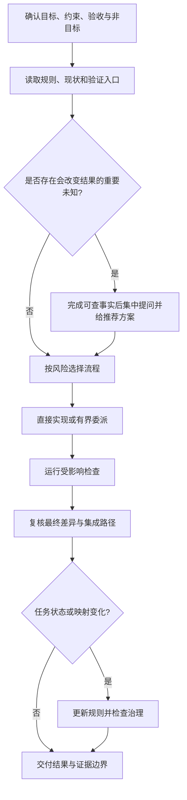

# 06 · 开发模式与协同流程

> 上级索引：[README](./README.md)　|　上游：[系统总览](./01-系统总览.md)

> 本章只说明稳定的协作关系。活动规则以根目录和目标路径最近的 `AGENTS.md` 为准；模块入口、命令和运行事实以对应 `README.md` 与源码为准。

---

## 一、协作模型

主负责人理解目标、作出跨模块决定、实现或集成关键部分，并对最终验收负责。执行代理只承担独立且写入范围明确的任务；分析与评审代理默认只读。Cursor 是可选执行工具，不是普通开发的必经步骤。

模型、代理名称和提示词不会改变用户授权或实际工具权限。用户当前的明确任务要求优先于技能指南；技能用于补充领域方法，不能扩大范围、写入权限或外部副作用。

## 二、规则分层

1. 平台权限和安全规则始终优先。
2. 仓库从根目录到当前目录逐层加载 `AGENTS.md`，较近文件只补充或覆盖本目录所需规则。
3. 根文件保存跨工作树的授权、风险流程、委派、验证、真源和记忆边界。
4. 模块 `AGENTS.md` 只保存该目录独有的责任、禁区和完成门槛；入口清单与命令放在 README，避免重复和漂移。
5. 技能只在描述命中当前任务时读取；大量参考和确定性接线按需进入 `references/` 与 `scripts/`。

## 三、工作树与共享真源

| 工作范围 | 工作树根目录 | 模块入口 |
| --- | --- | --- |
| 规划和共享治理 | `C:\project\damage_viewer_project_planning` | 根规则与目标文档 |
| 后端 | `C:\project\damage_backend_dev` | `server/data_manage/AGENTS.md`、`README.md` |
| 前端 | `C:\project\damage_web_dev` | `web/AGENTS.md`、`README.md` |
| Wasm | `C:\project\damage_wasm_dev` | `wasm/tinygo_engine_v2/AGENTS.md`、`README.md` |

planning/`master` 是根规则、共享技能和治理工具的真源。共享变更只在该分支修改、验证，并按任务授权提交和推送。其他分支自行执行 `fetch`（获取远端更新），再按该分支的 Git 策略合入；不得跨工作树直接复制文件或应用同一补丁来模拟同步。

`node tools/agent-governance/cli.mjs check` 只比较清单并报告漂移，不复制或修复文件。每个工作树独立核对分支和脏改，不假设它们处于同一提交。

## 四、从请求到交付

行动请求授权主负责人在既定范围内推进到可验证结果。提问前先完成已授权的只读调查和可逆准备；只要求说明、方案或评审时不开始实现。

### 按风险选择流程

- 局部、可逆且沿用成熟模式的改动：直接实现，运行针对性检查。
- 普通跨端功能：先写清共享字段、约束、错误和验收，再按依赖顺序实施。
- 数据破坏性迁移、权限、运行时协议、复杂循环引用或未解决的重要业务语义：实施前写短方案并做一次独立评审，完成后独立检查关键改动。

评审只处理有证据且影响正确性、数据安全或验收的问题。新事实改变重要决定时才复审相关部分，不因措辞、私有命名或非阻塞偏好反复往返。

### 有界委派

窄小或必须顺序完成的任务由主负责人直接处理。存在两个以上互不依赖的调查、实现或测试分支，且并行确有收益时，通常使用 1～2 个代理；大规模只读调查或测试才使用更多并发。并行写入范围不得重叠，共享热点文件只设一个集成负责人。

交接只包含目标、当前契约、允许写入范围、参考入口、验收和升级条件。执行者可调整内部实现；共享语义、权限、数据处置或任务范围变化必须返回主负责人。

## 五、文档和任务治理

普通功能优先用一份短说明写清目标、行为、责任和验收。只有共享语义复杂或模块需要独立维护时，才拆为一份共享契约和必要模块设计。当前方案与历史评审、运行日志和测试证据分开；同一字段、接口、错误和顺序只有一个定义来源。

`db/task_doc_governance/task_rules.json` 是任务状态和文档映射唯一真源，Markdown 文档头只标识文档，SQLite 只提供派生查询。仅在任务状态、映射或文档头变化，或用户要求治理审计时运行 `check`；需要刷新查询索引时才运行 `rebuild`，明确批量修正文档头时才使用 `rebuild --fix-headers`。

详细方法按需读取 `document-layering` 和 `task-doc-governance` 技能。

## 六、Cursor 可选路线

只有用户或当前任务明确选择 Cursor，或需要排查其接线时，才读取 `cursor-local-agent`。普通实现和评审不受其固定模型、事件日志和运行产物约束。

Cursor 方案评审必须保持工作树零变化；实现运行必须声明目标、有效契约、允许路径、非目标、验证和停止条件。失败、取消或超时后先检查已经落地的差异与证据，不盲目重放。完整模型参数、审计和脚本入口见 [Cursor 可选协作说明](../文档记录/详细设计/Cursor协同开发流程说明.md)。

## 七、验证与完成

验证按改动风险和模块规则选择。已有结果只有在对应最终文件未受后续改动影响时复用；失败、新改动或尚未覆盖的风险才要求扩大或重复检查。

交付时说明实际改动、命令和退出结果，并区分静态、单测、实库、最终 Wasm、运行时和浏览器证据。工具执行失败先查看文件与产物，再决定接手或重试；不能把可自动化验收转交用户，也不能把未执行检查写成通过。

## 八、记忆边界

仓库文件保存当前规则、实现文档和任务真源。Obsidian 只按需保存稳定决定和会话摘要；Codex Memory 只在用户明确要求时更新高层偏好与长期约束。发生冲突时以当前仓库真源和本次证据为准。
