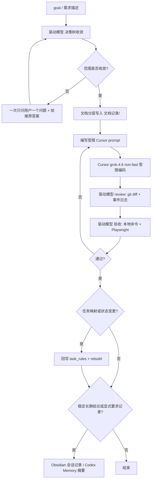

# 06 · 开发模式与协同流程

> 上级索引：[README](./README.md)　|　上游：[系统总览](./01-系统总览.md)
>
> 本章回答「这个项目是怎么用 AI 协同开发的」：AGENTS.md 如何分层、新功能如何交给 AI、文档如何分层、任务如何治理、记忆边界如何划分。

---

## 一、概览

本项目采用 **驱动模型（主控/收敛/验收）+ 顶层 Cursor local agent（受限编码执行）** 的协同开发模式，并用三套机制保证可控、可追溯。「驱动模型」是角色，可由 GPT / opus / glm 等任一当前可用的会话主模型担任；**显式创建的顶层** Cursor agent 固定 `grok-4.6` + `effort=high` + `fast=false`（裸 `grok-4.6` 默认仍为 high + fast=true，必须显式传参）。Cursor 内部 task/subagent/explore 委派允许在有界 prompt 内进行，由顶层 agent 对产出负责。Codex-native subagent 默认探索/审查/分析，不得绕过 Cursor 代码流程。角色表见根 `AGENTS.md` §0。三套机制如下：

1. **AGENTS.md 分层 + worktree 路由**：规则就近生效，跨模块只读跨 worktree 底线；planning/`master` 为共享治理真源。
2. **文档分层（文档记录/）**：需求澄清 / 概要设计 / 详细设计 / 测试记录单一职责，不混写。
3. **任务-文档治理（task_rules.json + SQLite）**：任务与文档映射有唯一真源，默认可只读检查，显式 rebuild 才写。

加上 **`.agents/skills/`** 领域规程，构成「规则 → 收敛 → 执行 → 验收 → 治理」的闭环。

---

## 二、AGENTS.md 分层与 worktree 路由

### 2.1 分层原则

- **最近层 `AGENTS.md` 覆盖父级**：修改前先读目标路径**最近一层** `AGENTS.md`；该层规则覆盖其所有父级 `AGENTS.md`（含仓库根）。就近层与父层冲突时，以最近层为准。
- **README 只承载技术事实与命令，永不覆盖 `AGENTS.md`**：各层 `README.md` 仅提供入口地图、命令、运行时与验证细节；**不得**用 README 覆盖、削弱或改写任何 `AGENTS.md` 规则。
- **根 `AGENTS.md`** 只保留跨 worktree 内容：① 术语与权限（驱动模型 / Codex-native subagent / 顶层 Cursor / Cursor internal）；② 全局协作底线；③ Cursor 开发流程（强制）；④ 渐进式披露与 worktree 路由；⑤ 记忆与治理边界。planning/`master` 为共享 AGENTS/skills/治理工具真源。
- 模块级入口地图、命令、运行时、验证细节由各模块子目录 `AGENTS.md` / `README.md` 承接，不在根文件重复。

### 2.2 worktree 路由

仓库按模块拆成多个 Git worktree：

| Worktree | 典型分支前缀 | 追加读取的最近层规则 |
|----------|-------------|---------------------|
| `damage_viewer_project_planning` | planning（master） | 子目录最近层规则 |
| `damage_backend_dev` | `backend/` / `server/` | `server/data_manage/AGENTS.md` + `README.md` |
| `damage_web_dev` | `web/` | `web/AGENTS.md` + `README.md` |
| `damage_wasm_dev` | `wasm/` | `wasm/tinygo_engine_v2/AGENTS.md` + `README.md` |

> 路由冲突时**以 worktree 根目录为准**（不以分支前缀为准），并在会话开始时说明。不要假设 master/backend/web/wasm 当前处于同一提交；每次会话按 worktree 分别核对 `HEAD` 与 `git status`。

---

## 三、新功能如何交给 AI 开发（端到端流程）



### 各阶段要点

1. **需求收敛（驱动模型主会话）**
   - `goal` / 任务页只定义目标与范围，不替代流程。
   - 驱动模型先从代码库、最近层 `AGENTS.md`/`README`、现有文档自行收敛；本地查不到才**一次**向用户提问并附推荐答案。
   - 复杂任务把**独立有界**分支拆给 Codex-native subagent（默认探索/审查）；主线程保留集成与最终验证，避免琐碎/串行扇出。

2. **文档分层（真源 `文档记录/`）**
   - 需求澄清：why + 边界 + 验收标准；概要设计：系统位置 + 模块关系 + 里程碑 gate；详细设计：文件级实现方案（Batch 计划、验证计划、接口变更）；测试记录：验证结论与证据缺口。
   - 遵循 `document-layering` skill：**一篇文档单一职责**，混层就拆。

3. **编写受限 Cursor prompt（必含五项）**
   - **目标**、**允许写入范围**、**非目标**、**验证命令**、**停止条件**。
   - 范围未收敛或写入范围未限制 → **不得启动 Cursor**。
   - 通过 SDK / local agent **显式创建顶层** Cursor agent 时**固定 `grok-4.6` + `effort=high` + `fast=false`**（接线见 `.agents/skills/cursor-local-agent/SKILL.md`）。`--allowed-path` 为审计型写入 allowlist（fail-closed），非 OS sandbox。

4. **Cursor 受限编码**
   - 只负责编码执行，不自行扩写需求、不扩大范围、不替代验收。

5. **驱动模型验收**
   - 每轮先看 Cursor 产物、事件日志、`git diff`（即使 `status=error` 也先看 diff）。
   - 本地命令验证（`mvn test`、`npm run build`、`go test`、wasm smoke 等）。
   - 页面/联调由驱动模型自行启动或复用前后端 + Playwright 走完整用户流，记录 route、断言、截图/导出证据。
   - 仅游戏客户端实测、OCR/人工读数、登录验证码、权限密钥、不可自动化本机服务等交接给用户。
   - Cursor 链路异常先报阻塞；**未经用户许可不得退回「驱动模型直接改代码」**。

6. **回写治理与记忆**
   - **仅当**任务粒度/状态/文档映射变更时 → 改 `task_rules.json` → 先 `check` → 显式 `rebuild`（仅 `--fix-headers` 才改 Markdown 头）。映射未变则不要 rebuild。
   - 跨 worktree 共享治理漂移：`node tools/agent-governance/cli.mjs check`（只读；默认仅长寿开发 worktree）。
   - **仅当**出现稳定长期结论，或用户/驱动模型显式要求记录时 → Obsidian 会话/任务页或 Codex Memory；不要每轮机械回写。

> 流程真源：`文档记录/详细设计/Cursor协同开发流程说明.md`。

---

## 四、里程碑与验收（双轨）

项目验收沿两条互补的里程碑推进，**V2 DPS 线不取代 M 线**：

| 轨道 | 真源 | 目标 | 现状 |
|------|------|------|------|
| **M0–M5（机制验证线）** | `文档记录/概要设计/验证里程碑.md` | 从 HUD 初始属性 → Action 面板 → 单技能假人 → 单机制扩展 → 1v1 回归，逐字段对齐训练营可观测值 | M1–M4 开发侧推进；正式 gate（runner/golden/OCR 归档）多数未通过 |
| **V2-M0–M6（单攻击方 DPS 线）** | `文档记录/概要设计/验证里程碑V2.md` | 普攻基准 → 时间窗 DPS → 技能/装备被动 → 标靶/装备方案对比 → 前端展示页 | DPS 主线产品化最高，仍在扩机制 |

验证辅助：集成测试 runner 产报告，OCR 仅作离线 baseline 辅助（`文档记录/详细设计/集成测试报告与OCR基线方案.md`、`验证计划编写说明.md`）。详见 [Wasm · 里程碑](./05-Wasm计算引擎设计.md#九已覆盖机制与里程碑)。

---

## 五、任务-文档治理（task_rules.json + SQLite）

| 真源 | 职责 |
|------|------|
| `db/task_doc_governance/task_rules.json` | 任务定义、文档映射、任务状态（**唯一真源**） |
| `db/task_doc_governance/document_header.schema.json` | Markdown 文档头契约（标识文档，不替代映射） |
| `db/task_doc_governance/task_doc_governance.sqlite` | 重建产物，结构化查询索引，**禁止手改** |
| `文档记录/**/*.md` | 实现文档正文真源 |

`task_rules.json` 结构（要点）：

```json
{
  "docRoot": "文档记录",
  "defaults": { "execution_model": "..." },
  "exclude": ["模板、治理方案自身等"],
  "tasks": [
    {
      "task_key": "稳定主键",
      "title": "人类可读标题",
      "module": "planning|web|server|wasm",
      "feature": "机器可读功能标识",
      "status": "未开始|进行中|完成|delay",
      "priority": 1,
      "docs": ["文档记录/.../*.md"]
    }
  ]
}
```

文档头契约见 `document_header.schema.json`：`TASK_KEY`、`DOC_TYPE`、`WORKSTREAM`、`STATUS`（`draft|tracked|active|done|partial|pass`）、`EXECUTION_MODEL`（实际路由，禁止硬编码默认）、`LAST_TRACKED_AT`。

CLI（`tools/task-governance/cli.mjs`）：

| 命令 | 用途 |
|------|------|
| `node tools/task-governance/cli.mjs` / `help` | 打印用法（无写入） |
| `node tools/task-governance/cli.mjs check` / `doctor` | 只读校验：重复归属、缺失/未归属文档、非法头/规则；出错非零退出 |
| `node tools/task-governance/cli.mjs rebuild` | 仅重建 SQLite；报告同类问题，残留则非零退出 |
| `node tools/task-governance/cli.mjs rebuild --fix-headers` | 重建 SQLite 并显式更新 Markdown 头 |
| `node tools/task-governance/cli.mjs tasks` | 任务概览（只读） |
| `node tools/task-governance/cli.mjs docs <task_key>` | 查询某任务挂载的全部文档（只读） |

跨 worktree 共享文件审计（`tools/agent-governance/cli.mjs`，只读、永不拷贝）：

| 命令 | 用途 |
|------|------|
| `node tools/agent-governance/cli.mjs check` | EOL 归一化后对比 `shared-files.json` 清单；`--strict` 下漂移非零退出 |

**维护时机**：调整任务粒度/归属/状态/文档映射 → 改 JSON → `check` → `rebuild`；只改 AGENTS/README 且不改映射 → 无需 rebuild。

> 设计真源：`文档记录/详细设计/SQLite任务文档治理方案.md`。

---

## 六、记忆职责边界

| 系统 | 存什么 | 不存什么 |
|------|--------|---------|
| **Codex Memory** | 高层协作偏好、长期技术路线、常见约束 | 精确模板、大段原文、完整命令输出、可审计任务记录 |
| **Obsidian** | 项目上下文、决策日志、会话记录、人工可读索引、下一步建议 | 另一套独立任务真源；非汇总会话不直接改共享上下文页 |
| **仓库文件** | `AGENTS.md`/`README.md`、`文档记录/**`、`task_rules.json` 为实现与治理真源 | — |

**冲突解决顺序**：仓库当前文件 > Obsidian / Codex Memory。

---

## 七、Skills 机制

- **加载方式**：通常只预加载 skill 的 `name`/`description` 元数据，正文按需读取；项目级 `.agents/skills` 为真源；新增/修改用 `writing-skills` 做基线检查。
- **如何辅助开发**：description 触发按需加载领域规程（路由）；`document-layering` 防混层（收敛）；`cursor-local-agent` 规范 Grok 4.6 调用与 smoke（执行）；Browser/Playwright 验证能力与 `backend-db-access` 提供可复现验证（验收）；`task-doc-governance` 保证映射与 rebuild 一致（治理）。

项目级 skill 清单（`.agents/skills/`）：

| Skill | 用途 |
|-------|------|
| `backend-db-access` | 通过 JDBC/jshell 探查/操作后端 PostgreSQL |
| `cursor-local-agent` | 顶层 Cursor SDK/local agent（grok-4.6、effort=high、fast=false）+ 审计型 allowlist |
| `design-pattern-refactor` | 行为保持的结构重构（尤其 Wasm runtime） |
| `document-layering` | 文档分层不混写 |
| `frontend-skill` | 视觉导向页面/原型 UI 设计约束 |
| `grill-me` | 对计划/design 决策树式追问 |
| `secret-safe-local-file-processing` | 处理含密钥本地文件时脱敏 |
| `task-doc-governance` | 维护 task_rules、check/rebuild/query SQLite |
| `wasm-batch-mechanism-development` | TinyGo V2 Batch 式 DPS/装备被动/联动机制开发与验收 |
| `writing-skills` | Codex-native RED/GREEN skill 编写与验证 |

---

## 八、关键路径索引

```
AGENTS.md                                  # 跨 worktree 协作底线 + Cursor 强制流程
文档记录/
├── 详细设计/Cursor协同开发流程说明.md   # 协同流程真源
├── 详细设计/SQLite任务文档治理方案.md       # 治理设计真源
├── 详细设计/接口与页面索引.md               # 跨端入口导航
├── 详细设计/集成测试报告与OCR基线方案.md
├── 详细设计/验证计划编写说明.md
├── 概要设计/验证里程碑.md / 验证里程碑V2.md   # 双轨 gate
└── 模板/开发任务文档模板.md
db/task_doc_governance/task_rules.json     # 任务-文档映射真源
db/task_doc_governance/document_header.schema.json  # 文档头契约
db/task_doc_governance/task_doc_governance.sqlite  # 查询索引（rebuild 生成）
tools/task-governance/cli.mjs              # check / rebuild / tasks / docs
tools/agent-governance/cli.mjs             # 跨 worktree 共享文件只读审计
.agents/skills/                            # AI 领域规程真源
README.md                                  # worktree / 真源路由
```
