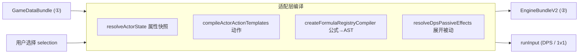

# 08 · 适配层编译规范（存储配置 → 引擎配置）

> 上级索引：[README](./README.md)　|　上游：[系统总览](./01-系统总览.md)　|　相关：[前端](./02-前端设计.md)、[Wasm](./05-Wasm计算引擎设计.md)、[端到端示例](./07-端到端开发示例.md)
>
> 本章补齐"跨端契约链的中段"——前端适配层如何把**发布 Bundle + 用户选择**编译成**引擎输入**（`EngineBundleV2` + run 输入）。这是"仅凭文档重建系统"最关键、也最容易断档的一环。本章内容自洽，可直接据此实现，无需回看源码；其出处文件为 `web/src/engine/tinygoV2BundleAdapter.ts`、`tinygoV2DpsAdapter.ts`、`wasm/tinygo_engine_v2/internal/model/types.go`、`internal/runtime/dps_contract.go`、`server/.../DefaultBasicAttackProvisioner.java`（仅供溯源，不是重建必读）。

---

## 一、为什么需要这一层

[系统总览 §3.2](./01-系统总览.md#32-配置驱动-引擎即解释器核心) 说过配置是两层：

- **① 存储/录入层**（DB + Admin API）：`heroes/skills/items/mechanics_config/formula_profiles/...`，人类友好。
- **② 引擎层**（`EngineBundle`(源码 `EngineBundleV2`) + 运行输入）：顶层含 `schemaVersion/attributes/resources/actors/actions/statuses/statusActionControlRules/formulas/triggers/damageProfiles/coefficientBuckets/settings` + 已解析的 `resolvedSnapshot`，机器友好。

引擎层 **不含** `heroes/skills/items/skillMounts/mechanicsConfig`——这些必须由适配层解析展开。本章定义这套编译规则。



---

## 二、用户选择（selection schema）

### 2.1 M1–M4 验证：`WasmValidationSelection`

由 `createDefaultWasmValidationSelection(bundle)` 产出。

| 字段 | 类型 | 含义 |
|------|------|------|
| `selfHeroId` / `enemyHeroId` | `string` | 双方英雄 ID |
| `selfLevel` / `enemyLevel` | `number` | 等级（self 默认 `detectMaxLevel(bundle)`，enemy 默认 1） |
| `selfItemIds` / `enemyItemIds` | `string[]` | 装备 ID 列表 |
| `selfSkillLevels` / `enemySkillLevels` | `Record<skillId, number>` | **key = skillId** 的技能等级 |
| `selfAttributeBonuses?` / `enemyAttributeBonuses?` | `Record<attrKey, number>` | 符文/加成（**加法**） |
| `selfAttributeOverrides?` / `enemyAttributeOverrides?` | `Record<attrKey, number>` | **覆盖**（后者赢） |
| `selfResourceOverrides?` / `enemyResourceOverrides?` | `Record<resId, {current,max}>` | 资源覆盖 |
| `hpAttrKey` | `string` | HP 属性键（`detectHpAttrKey`） |

LoL 默认加成：`{ ap: 18, hp: 65 }`。M1–M4 **不展开** DPS 被动。

### 2.2 DPS：`V2DpsSelection` + `V2DpsCurveSelection`

顶层 `V2DpsSelection`：`caseId?`、`attackerHeroId`、`targetActorId`（须 target_dummy）、`targetEquipmentItemIds?`、`durationMs`、`attackSpeedCap=3.0`、`critPolicy='expected'`、`curves[]`。

每条 `V2DpsCurveSelection`：

| 字段 | 类型 | 含义 |
|------|------|------|
| `curveId` / `label` | `string` | 曲线标识 / 显示名 |
| `attackerHeroId?` | `string` | 覆盖顶层攻击方 |
| `heroLevel` | `number` | 英雄等级（默认 11） |
| `skillLevels` | `Record<skillKey, number>` | **key = skillKey（P/Q/W/E/R）**，由 `mapDpsSkillLevelsToSkillIds` 映射到 skillId |
| `equipmentItemIds` | `string[]` | 攻击方装备（须带 `adc_completed_item` 类型标签） |
| `enabledPassiveEffectIds` | `string[]` | 启用被动 effect ID |
| `enabledScenarioStateIds` | `string[]` | 场景状态 ID |
| `runeStatAdjustments` | `Record<attrKey, number>` | 符文属性加成 |
| `syntheticPassiveEffects?` | `V2DpsPassiveEffect[]` | 合成测试被动 |
| `targetEquipmentSet?` / `targetEnabledPassiveEffects?` | `string[]` | 曲线级目标装备/被动 |

> 注意 **两种 selection 的技能等级 key 不同**：M1–M4 用 `skillId`，DPS 用 `skillKey`。

### 2.3 `skillKey → skillId` 映射（`mapDpsSkillLevelsToSkillIds`）

DPS 的 `skillLevels` 以 `P/Q/W/E/R` 为键，编译前由 `mapDpsSkillLevelsToSkillIds(bundle, heroId, skillLevels)` 映射为 `Record<skillId, level>`：

```text
skillIds = { skill | skill.ownerType=='hero' && skill.ownerId==heroId }
         ∪ { mount.skillId | skillMounts: targetCategory=='hero' && targetId==heroId && enabled!=false }
FOR skillId IN skillIds:
  key = normalizeSkillKey(skill.skillKey)   # PASSIVE→P; 仅保留 P/Q/W/E/R
  IF key 有效 AND skillLevels[key] 定义: result[skillId] = skillLevels[key]
```

行为：查找范围 = 英雄直属技能 + 该英雄已启用挂载技能（纯 `item.skillRefs` 不在此函数范围）；同 `skillKey` 多技能都取同一等级（无冲突检测）；bundle 无该 skillId 静默跳过。`normalizeSkillLevels` 默认 `{P:1,Q:1,W:1,E:1,R:1}`，P clamp `[0,1]`、QWER clamp `[1,5]`。

---

## 三、引擎层 DTO（`EngineBundleV2` 元素）

适配层产出的目标结构 `EngineBundle`（源码 `EngineBundleV2`），`schemaVersion=1`。顶层类别：

| 顶层字段 | 元素类型 | 见 |
|----------|----------|----|
| `attributes` | `AttributeDefinitionV2` | [Wasm §4.1](./05-Wasm计算引擎设计.md#41-配置公式定义是表达式树) |
| `resources` | `ResourceDefinitionV2` | §3.4 |
| `actors` | `ActorTemplateV2` | §3.1 |
| `actions` | `ActionTemplateV2` | §3.2 |
| `statuses` | `StatusTemplateV2` | §3.4 |
| `statusActionControlRules` | `StatusActionControlRuleV2` | §3.5 / [DB §3.9](./04-数据库设计.md#39-状态动作控制statuscontrolschemasql) |
| `formulas` | `FormulaDefinitionV2` | [Wasm §4](./05-Wasm计算引擎设计.md#四公式-ast配置即程序) |
| `triggers` | `TriggerDefinitionV2`（1v1，见 §3.4 与 §十一） | §3.4 |
| `damageProfiles` | `DamageProfileV2` | §3.4 |
| `coefficientBuckets` | `CoefficientBucketV2` | [Wasm §4.4](./05-Wasm计算引擎设计.md#44-乘区桶coefficientbucket可配置的多乘区聚合) |
| `settings` | `BundleSettingsV2` | §3.4 |

下面展开关键元素结构。

### 3.1 `ActorTemplateV2`

| 字段 | json tag | 语义 |
|------|----------|------|
| ID | `id` | 模板 ID |
| MaxHP / InitialHP | `maxHp` / `initialHp` | 最大/初始 HP |
| Attributes | `attributes` | `map[attrKey]AttributeValueV2` |
| Resources | `resources` | `map[resId]{current,max}` |
| Actions | `actions` | 可施放 action ID 列表 |

`AttributeValueV2`：`base/current/max/resolved` + `hasCurrent/hasMax`。**Actor 不含 status 初值**（status 在 run 输入注入）。

### 3.2 `ActionTemplateV2`

| 字段 | json tag | 语义 |
|------|----------|------|
| ID / Label | `id` / `label` | 动作 ID / 名 |
| Classifier | `classifier` | `ClassifierV2`（types/tags） |
| CooldownMs / CooldownFormulaID | `cooldownMs` / `cooldownFormulaId` | 固定冷却 / 冷却公式（二选一） |
| ChannelDurationMs / SkillLevel | `channelDurationMs` / `skillLevel` | 引导时长 / 默认等级 |
| PanelInputs | `panelInputs` | 面板输入初值 |
| Effects | `effects` | `[]EffectDefV2` |
| RequiresMark / ConsumesMark | `requiresMark` / `consumesMark` | Mark 门控 |
| ResourceCost | `resourceCost` | `[]{resourceId,amount,formulaId?}` |
| PanelCosts / PanelEffects | `panelCosts` / `panelEffects` | 面板侧消耗/预览 |

### 3.3 `EffectDefV2`

`type`（`EffectType`）全集：`deal_damage` / `heal` / `apply_status` / `grant_shield` / `apply_mark` / `consume_mark` / `damage_from_recent` / `interrupt` / `increment_counter` / `spend_resource` / `modify_attribute`。

字段：`formulaId` / `amount` / `damageType` / `statusId` / `sourceRole` / `targetRole` / `historyWindowMs` / `counterKey` / `markId` / `resourceId` / `attrId` / `modifierMode` / `critPolicy` / `critChanceSource` / `critChance` / `critMultiplierSource` / `critMultiplier` / `modeAugmentId` / `modeMultiplier`。

`AttrModifierMode`：`flat` / `percent` / `override_base` / `override_current` / `override_max`。

### 3.4 其它

| 结构 | 关键字段 |
|------|----------|
| `StatusTemplateV2` | `id`、`kind`、`classifier`、`durationMs`、`magnitude`、`shieldKind`、`tickIntervalMs`、`tickCount`、`tickEffectType`（空则按 kind 推断：dot→deal_damage、hot→heal）、`tickFormulaId`、`tickAmount`、`tickDamageType`、tick 暴击字段、`attrModifiers[]` |
| `ResourceDefinitionV2` | `id`、`defaultCurrent`、`defaultMax` |
| `DamageProfileV2` | `id`、`damageType` |
| `BundleSettingsV2` | `maxEvents`、`maxCommandsPerEvent`、`maxQueueEvents`、`maxChainDepth` |
| `ClassifierV2` | `types[]`、`tags[]`（类型键如 `action/basic_attack`） |
| `TypeMatcherV2` | `any[]`、`all[]`、`none[]`；控制规则编译时任一集合非空才算有效 |
| `TriggerDefinitionV2`（1v1 路径，非 DPS 被动） | DTO 字段：`id`、`event`、`ownerRole`、`ownerId`、`requiresDamage`、`effects[]`、`phase`、`oncePerEvent`、`internalCooldownMs`。**当前 1v1 主链消费**：`event`(主要 `on_action_cast`/`damage_dealt`/`damage_taken`)+`effects`+`ownerRole`+`requiresDamage`；**`phase`/`oncePerEvent`/`internalCooldownMs`/更多 `EventPhase`（heal_applied/status_apply/status_expire 等）为预留/Roadmap，当前主链不保证生效**——详见 §十一与 [Wasm §7.2](./05-Wasm计算引擎设计.md#72-已实现-vs-骨架) |

### 3.5 `StatusActionControlRuleV2`

发布 Bundle 的 `statusActionControlRules[]` 是存储层 DTO；适配层必须把其中的 `type_id` 数字解析为引擎可匹配的 type key，再写入 `EngineBundleV2.statusActionControlRules[]`。

**type key 解析规则**：

1. `typeKey(typeId)` 先在 `bundle.types[]` 中按 `typeId` 找到 type 记录；找不到则编译失败。
2. 机器 type key 优先取 `description` 中形如 `domain/name` 的字符串（如 `action/basic_attack`、`status/silence`、`skill_tag/dash`、`exec_phase/channel`）；若 `name` 本身已经是 `domain/name`，可作为兜底。
3. 只有 `basic_attack`、`cast_skill` 这类裸 `name` 但无机器 key 时，不得在控制规则编译中猜前缀；应报错提示补齐 type 元数据。当前默认普攻数据用 `description=action/basic_attack`，符合本规则。

**存储 DTO → 引擎 DTO 映射**：

| Bundle 字段 | `StatusActionControlRuleV2` 字段 | 规则 |
|-------------|----------------------------------|------|
| `ruleId` | `id` | 原样 |
| `statusTypeId` | `statusTypes` | `{ "any": [typeKey(statusTypeId)] }` |
| `ruleKind` | `ruleKind` | 仅 `forbid` / `interrupt`；其它值编译失败 |
| `actionTypeIds[]` | `actionTypes` | `{ "any": actionTypeIds.map(typeKey) }`；空数组编译失败 |
| `actionMatchTypeIds[]` | `actionMatchTypes` | 非空时 `{ "any": actionMatchTypeIds.map(typeKey) }`；空时省略 |
| `interruptPhaseTypeIds[]` | `interruptPhaseTypes` | `interrupt` 必须非空并映射为 `{ "any": ... }`；`forbid` 必须为空 |
| `priority` | `priority` | 缺省 `0`；引擎按优先级降序稳定排序 |
| `extend.retryOnRelease` | `retryOnRelease` | 可选布尔；缺省 `false` |
| `description` / 其它 `extend` | 不进入引擎 | 仅后台展示或未来扩展 |

**配套 classifier 要求**：

- 被规则匹配的 `StatusTemplateV2` 必须带 `classifier.types[]`，通常由 `statusDefinitions.statusTypeId -> typeKey` 产生；否则运行时状态 `TypeSet` 为空，规则不会命中。
- 被规则匹配的 `ActionTemplateV2` 必须带 `classifier.types[]` / `classifier.tags[]`，来源仍是 `typeRelations(targetCategory=skill,targetId=skillId)` 解析出的 type key。

**当前实现诚实标注**：`wasm/tinygo_engine_v2` 已有 `StatusActionControlRuleV2` DTO/编译逻辑，`ruleKind=forbid` 已接入 `CanCast`；`ruleKind=interrupt` 只完成 DTO/编译，尚无通用运行时消费点（当前打断靠显式 `EffectDefV2(type=interrupt)`）。同时当前 `web/src/engine/tinygoV2BundleAdapter.ts` 的 `TinyGoV2EngineBundle` 类型和 `compileTinyGoV2ValidationInput` 还未填充 `statusActionControlRules`，且已发布状态编译尚未写入 `classifier.types`。因此 M1-M4 当前实现不会让发布的状态动作控制规则完整生效；本节是目标契约，补实现时必须按上表落地。

---

## 四、属性快照合成（`resolveActorState` / `buildActorSnapshot`）

> ⚠️ **双轨**：引擎 bundle 内攻击方 actor 模板（`resolveActorAttributes`，M1 路径）与 DPS 展示快照（`buildActorSnapshot`，含 growth）合成路径不同；实现时两边都要做。

### 4.1 引擎 actor 模板（`resolveActorAttributes`）

```text
attrs := { attrKey: defaultBase }                  # 来自属性定义
applyNumberMap(attrs, resolveHeroStatsAtLevel(hero, level))
FOR itemId IN itemIds: FOR mod IN item.statModifiers: attrs[mod.attrKey] += mod.value   # 加法
addNumberMapInPlace(attrs, attributeBonuses)        # 加法
applyNumberMap(attrs, attributeOverrides)           # 覆盖
→ AttributeValueV2{ base=current=max=resolved=attrs[k], hasCurrent=true, hasMax=true }
maxHp = max(attrs[hpAttrKey], 1); initialHp = maxHp
```

### 4.2 `statsByLevel` 两种结构（按 level 选取）

1. **stageKey map**：`{ "11": { attrKey: number } }` → `baseStats + levelEntry`（逐 key 加法）。
2. **per-attr 数组**：`{ attrKey: number[] }` → `index = clamp(level,1,len)-1`，`result[attrKey] += values[index]`。
3. 二者都没有 → 仅 `baseStats`。

### 4.3 DPS 展示快照额外的 growth 外推（`buildActorSnapshot`）

对 `statsByLevel` 中 `*_growth` 键（目标属性 = 去 `_growth` 后缀），`extraLevels = clamp(level,1,18)-1`：

- `attack_speed_growth`：`base * (1 + normalizeGrowthRatio(growth) * extraLevels)`
- 其它：`base + growth * extraLevels`
- 已在显式 level 数据（stageKey/数组）中的属性 **跳过** growth。

后处理顺序：`buildActorSnapshot` → `applyRuneStatAdjustments`（加在 current/max/resolved，base 不变）→ `applyEquipmentStatsToActorSnapshot`（装备加法）。

### 4.4 `value_kind`（ratio/rate）

适配层合成阶段 **不解释** `value_kind`（仅传递 clamp 边界）；ratio/rate 语义在 Admin/引擎侧。**被动 `stat_modifier` 不进属性合成**，只进 `resolvedSnapshot.passiveEffects[]` 由引擎在运行时解释。

---

## 五、动作模板编译（`compileActorActionTemplates`）

### 5.1 技能收集顺序（`collectActorActionSkills`）

1. 英雄 `ownerType=hero` 且 `isCastableSkill`（非纯被动 P；或有 cooldowns/resourceCosts；或 mechanics 含 `on_spell_cast`）。
2. 装备 `item.skillRefs` 关联技能。
3. `skillMounts`（`targetCategory=hero`，`enabled≠false`）→ `actionId = "${side}::${skillId}"`。

### 5.2 `mechanicsConfig.triggers` → `effects[]`（`compileActionEffects`）

仅处理 `eventType==='on_spell_cast'`：

| trigger action | 引擎 effect |
|----------------|-------------|
| `deal_damage` | `{type:'deal_damage', formulaId, damageType, crit*, mode*, sourceRole, targetRole}` |
| `schedule_tick` | 查 `on_tick`+`eventTickKey`：DOT→`apply_status`(注册 tick status)；HOT→`__raw__` heal |
| `__raw__` | `compileRawEffect` → heal/shield/apply_status/apply_mark/consume_mark/damage_from_recent/interrupt/increment_counter |

伤害公式解析优先级：`action.bindingKey` → `raw.amount/raw.damage` 内 binding → `formulaText` → 回落 binding。

### 5.3 普攻 `basic_attack`

- **来源**：仅 `skillMounts` 挂载技能（无 mount 则无普攻，adapter 不自动合成）。
- **分类器**：由 `bundle.typeRelations`（`targetCategory=skill`）解析，归一为 `ACTION_BASIC_ATTACK_CLASSIFIER = 'action/basic_attack'`。
- **DPS 识别**：`resolveBasicAttackActions` 要求 action 模板含该 classifier。

### 5.4 冷却与攻速（`compileActionCooldown`）

```text
IF cooldown.kind == 'formula': cooldownFormulaId = resolveBinding(...)
ELSE:
  baseCooldownMs = value * 1000
  IF gameId=='lol' AND source 有 'ability_haste' AND baseCooldownMs>0:
    cooldownFormulaId = 生成公式: baseMs*100 / (100 + ability_haste)
  ELSE: cooldownMs = baseCooldownMs
```

普攻间隔不在此处理；由后端 Provisioner 注入的默认普攻公式 `1000 / min(max(attack_speed,0.01), 3.0)` 决定（见 [§九](#九默认普攻补齐契约provisioner)）。

---

## 六、公式编译（`createFormulaRegistryCompiler`）

### 6.1 binding 查找优先级（`resolveFormulaBindingRecord`）

1. `(skill, skillId)` → 2. `(ownerType, ownerId)` → 3. `(global, gameId)`。生成引擎 formulaId：`${actionId}::${bindingKey}`。

### 6.2 profile → AST

```text
mergedParams = { ...profile.params, ...binding.overrideParams }   # 浅合并, override 赢
formulaKind  = profile.formulaKind.toLowerCase()
IF formulaKind=='linear' OR (mergedParams.baseVar AND mergedParams.terms[]):
  compileLinearFormulaParams → add/mul 树
ELSE:  # vars_expr
  parseFormulaParams(mergedParams) → 编译 vars(externalSymbols) + compileFormulaText(formulaText)
```

> `formula_type`（DB 字段）适配层不读取；以 `formulaKind` + `params` 为准。

### 6.3 表达式 → `FormulaDefinitionV2`（`emitFormulaExpr`）

| 内部 expr | 前端 emit 的 `op` | 引擎是否支持 |
|-----------|-------------------|--------------|
| `constant` | `const` + `value` | ✅ |
| `input_value` | `input` | ✅ |
| `actor_attr` | `attr` + `attr`(键)（前端还会带 `actor`） | ✅（但引擎 `attr` **只读 source**，忽略 `actor`，详见 §6.5） |
| `counter` | `counter` | ✅ |
| `add/multiply/subtract/divide/max/min` | `add/mul/sub/div/max/min` | ✅ |
| `negate` | `mul(-1, x)` | ✅ |
| `actor_hp_current` / `actor_hp_max` | `hp_current` / `hp_max` | ❌ **引擎不支持**（详见 §6.5） |

属性名归一化 `FORMULA_ATTR_ALIASES`（如 `ability_power→ap`），且必须存在于 `bundle.attributeDefinitions`。公式 AST 编译/求值见 [Wasm §4](./05-Wasm计算引擎设计.md#四公式-ast配置即程序)。

### 6.4 `formula_profiles.params` 存储 schema（可拷贝）

`params` 的结构由 `formulaKind`（小写）决定。

**`linear`**：线性求和。`baseVar` 为首项（系数 1），`terms[]` 为加项。

```json
{
  "formulaKind": "linear",
  "params": {
    "baseVar": "tick_damage",
    "terms": [ { "var": "ap", "coef": 1.0 } ]
  }
}
```
语义 `tick_damage + ap*1.0`。`terms[].var` 解析顺序：先查当前技能 `skill.params.vars`（编译后的符号），否则查 `bundle.attributeDefinitions` 同名 attrKey（**固定读 source**），都没有则报错。**linear 不支持 `self.x`/`target.x` 点号写法**；系数字段名是 **`coef`**（默认 1），不是 `coefficient`。

**`vars_expr`**：表达式文本 + 变量定义。

```json
{
  "formulaKind": "vars_expr",
  "params": {
    "formulaText": "base_damage + ap_scaled",
    "vars": {
      "base_damage": { "kind": "table", "by": "skillLevel", "values": [10,35,60,85,110] },
      "ap_scaled":   { "kind": "scaled_attr", "attr": "self.ability_power", "coefficient": 0.3 }
    },
    "constants": { "bonus": 5 }
  }
}
```

`vars[name].kind` 形态：

| kind | 字段 | 语义 |
|------|------|------|
| `const` | `value` | 常量 |
| `table` | `by`(`skillLevel`/`championLevel`)、`values[]` | 按等级取表 |
| `scaled_attr` | `attr`(支持 `self.ad`/`target.armor`)、`coefficient?` | 属性×系数 |
| `mapping_scaled_attr` | `selector`、`values`(key→number)、`attr`、`coefficient?` | 映射系数后乘属性 |
| `formula` | `formulaText`、`formulaVars[]` | 嵌套子表达式 |
| `counter` | `counterKey`/`counter`/`key` | 运行时 counter |

`formulaText` 语法（`formulaCompiler.ts`）：四则 `+ - * /` + 括号、`max(...)`/`min(...)`、`x`/`input_value`→管线 input、属性引用 `self.ad`/`target.armor`、HP 后缀 `hp_current`/`hp_max`（见 §6.5 限制）、变量名引用 vars/constants。

**外部符号合并**：`env.symbols`(技能 vars) ∪ 顶层数值键 ∪ `params.constants` ∪ 编译后的 `params.vars` → 喂给 `compileFormulaText`。约束：`vars_expr` 走 binding 解析时**需要技能编译上下文 env**；纯发布态 status tick 公式当前用 `linear`（Batch J），若改 vars_expr 需定义无 env 策略。

**`formula_bindings.override_params` 合并**：`{ ...profile.params, ...overrideParams }`（**仅顶层浅合并**——override 写 `terms` 会整段替换，不按项深合并）。

### 6.5 公式 op 的引擎实现边界（重要 · 已知限制）

引擎 `internal/formula/formula.go` 实际支持的 op 全集**仅**：`const`、`attr`、`resource`、`counter`、`input`、`sign`、`add`、`sub`、`mul`、`div`、`max`、`min`（与 [Wasm §4.1](./05-Wasm计算引擎设计.md#41-配置公式定义是表达式树) 一致）。由此产生两条**当前实现限制**（属代码层文档债，重建时应择一对齐）：

1. **`hp_current` / `hp_max` op 引擎未实现**：前端 `formulaText` 写 `target.hp_current` 等会 emit 出 `hp_current`/`hp_max` op，**引擎 compile 会报 `unsupported formula op`**。当前生产数据（linear 档案、默认普攻 `self.attack_damage`）不触发，但含 `target.hp_current` 的配置会编译失败。重建时二选一：① 引擎补 `hp_current`/`hp_max` op；② 前端改用 `attr` 表达 HP。
2. **`attr` 只读 source**：引擎 `OpAttr` 恒读 `EvalContext.SourceAttrs`，会**忽略**前端 emit 的 `actor:target`。即"按目标属性算公式"在当前引擎不生效；DPS 的目标 HP 相关计算改由 operation 的 `target*HP*` 字段（[§8.2](#82-operation-按-kind-的字段dpspassiveoperationv2)）承担，而非公式。
3. 引擎支持但前端未 emit：`resource`、`sign`（如需经公式读资源/取符号，须扩前端 emit）。

---

## 七、DPS 输入组装（`prepareV2DpsInput`）

### 7.1 全流程

```text
1. normalizeAttributeDefinitions
2. targetSnapshot = applyEquipmentStatsToActorSnapshot(buildActorSnapshot(targetHero,1), targetEquipment.stats)
3. isTargetDummy = targetHero 类型含 'target_dummy'
4. targetActorTemplate = isTargetDummy ? 由 snapshot 构建 : undefined
5. FOR each curve: buildV2DpsCurveRunSpec(...)
6. preflightBlockedReasons = dedupe(各检查)   # 见 §7.3
7. engineBundle = mergeDpsEngineBundles(各 curve compile, targetActorTemplate, coefficientBuckets)
8. runInput = { caseId, versionCode, wasmSha256, simulationRules, targetSnapshot, curves }
```

### 7.2 被动展开（`buildV2DpsCurveRunSpec`）

```text
selectedPassiveIds = enabledPassiveEffectIds + scenario 所需被动
resolvedSnapshot.passiveEffects[] = [
  resolveDpsPassiveEffects(bundle, heroId, ids, skillLevels),       # 英雄技能被动
  resolveDpsItemPassiveEffects(bundle, equipmentItemIds, ids),      # 攻击方装备被动
  resolveDpsTargetItemPassiveEffects(...),                          # ownerRole=target
  syntheticPassiveEffects
]
```

- 读取源：`skill.mechanicsConfig.dpsPassiveEffects`。
- 匹配 ID：`passiveId | effectId | sourceId`（装备另匹配 `skillId`）。
- 等级投影：`resolveDpsPassiveEffectBySkillLevel` 对 `everyN` 及 operation 数值做表查找；失败 → `operations:[{kind:'missing_level_table'}]`。
- 装备 `skillRefs`：`resolveItemSkillRefs`，受 `skillRefOptions` 控制**两种模式**——**`legacy`（默认）**：缺失/空 skillRefs 时容错 fallback；**`strict`（`STRICT_DPS_SKILL_REF_OPTIONS`）**：missing/empty 不 fallback、报诊断。**约定：页面入口与新数据应显式传 `strict`**，仅历史数据兼容走 legacy。`prepareV2DpsInput` 的 Preflight 与发布契约诊断均以 strict 为准。

### 7.3 run 模式与 Preflight

- **run 模式靠 JSON 形态隐含**，**无 `mode` 字段**：DPS 输入含 `curves+simulationRules` 且无 `self/enemy` → 引擎走 DPS 分支（见 [Wasm §5.1](./05-Wasm计算引擎设计.md#51-输入输出契约顶层)）。`'single_attacker_dps'` 仅前端日志标签。
- **Preflight blocked reason 常量**：

| 常量 | 含义 |
|------|------|
| `missing_basic_attack_action` | 无 mount 普攻 |
| `target_not_target_dummy` | 目标非假人 |
| `target_item_passive_owner_role_mismatch` | 目标装备被动 ownerRole 错误 |
| `target_item_passive_missing_target_owner_role` | 目标装备有被动但无 `ownerRole=target` |
| `skillRef_*` | 装备 skillRef 解析 error |

---

## 八、被动配置完整契约（`dpsPassiveEffects[]`）

存储层（`skills.mechanics_config.dpsPassiveEffects[]`）字段与引擎 `DPSPassiveEffectV2` 对齐。

### 8.1 触发模型（统一说明，消除歧义）

一个被动用 `triggerKind` 与/或 `trigger.event` 表达：

- **二者可并存**。事件解析优先级（`resolvedDPSTriggerEvent`）：**`trigger.event` 非空则用它**；否则按 `triggerKind` 映射默认事件。
- **分工**：`triggerKind` 控制**调度语义**（每 N 次、充能、常驻 modifier、场景状态门控）；`trigger.event` 控制**事件匹配**；`trigger.matcher.*` 进一步过滤（damageType/actionTypes/procScopes）。

**`triggerKind` 全集**：`""`(=on_basic_attack_hit)、`on_basic_attack_hit`、`every_n_basic_attack_hit`(需 `everyN`)、`stack_on_hit`、`stat_modifier_always_on`、`pre_enabled_state_modifier`、`next_basic_attack_after_state`(需 `requiresScenarioStateId`)、`energized_charge_and_consume`(需充能字段组)。

**`trigger.event` 引擎全集**：`on_basic_attack_hit`、`on_spell_hit`、`on_hit`、`on_damage_dealt`、`on_damage_taken`、`on_crit`、`dot_tick`、`stat_modifier_always_on`、`pre_enabled_state_modifier`。

> ⚠️ **目标契约 = 引擎全集（含 `on_crit`）；前后端白名单缺 `on_crit` 是待对齐的实现差异，应放行**。引擎运行时已支持 `on_crit`；但当前后端发布校验与前端 `validateDpsPassiveEffects` 的白名单为 `{on_basic_attack_hit, on_spell_hit, on_hit, on_damage_dealt, on_damage_taken, dot_tick}`（**暂缺 `on_crit`**）。这是**实现待修项**，不是设计上的合理子集——重建/对齐时三端校验都应以引擎全集为准放行 `on_crit`。

**默认事件映射**：`on_basic_attack_hit`/`every_n_basic_attack_hit`/`stack_on_hit`/`next_basic_attack_after_state`/`energized_charge_and_consume` → `on_basic_attack_hit`；`stat_modifier_always_on`/`pre_enabled_state_modifier` → 同名。

其它触发字段：`triggerId`、`everyN`、`requiresScenarioStateId`、`chargeKey`、`chargeGainPerBasicAttack`、`chargeThreshold`、`chargeCap`、`chargeReadyPolicy`(默认 `next_basic_attack_after_threshold_reached`)、`consumeChargeOnTrigger`、`procScope`(默认 `real_basic_attack_only`)、`internalCooldownMs`、`ownerRole`(attacker/target)、`priority`。

### 8.2 operation 按 kind 的字段（`DPSPassiveOperationV2`）

公共字段：`kind`(必填)、`source`、`targetRole`、`priority`、`evidenceKey`、`bucketKey`、`valueSpec`、`conditions[]`。

`valueSpec`（`DPSModifierValueSpecV2`）：`kind`∈{`literal`,`attr_ratio`,`hp_ratio`,`hp_diff_ratio`,`crit_scaling`,`formula`} + `value`/`ownerRole`/`compareRole`/`attrKey`/`attrRead`/`hpMeter`/`ratio`/clamp/`formulaId`。

| kind | 关键字段 |
|------|----------|
| `damage` | `damageType`、`amount`、`amountPerStack`、`targetCurrentHPRatio`+`targetCurrentHPBasis`(current/attack_start)、`targetMaxHPRatio`、`targetMissingHPRatio`+`targetMissingHPBasis`、`targetMissingHpAmp`、`attackerAttr`+`attackerAttrRead`+`attackerAttrRatio`、`minAmount`+`hasMinAmount`、`stackKey`、`phantomHitCopyable`、`targetRole`(默认 target)。**至少一个数值项非零** |
| `apply_dot` | 同 `damage` 数值字段 + `durationMs`(必填>0)、`tickIntervalMs`(0 或 = 全局 `dotTickIntervalMs`)、`refreshMode`(仅 refresh/空)、`stackKey`、`source` |
| `add_stack` | `stackKey`(必填)、`maxStacks`(必填>0)、`durationMs`、`refreshMode` |
| `trigger_damage_at_stacks` | `damage` 数值字段 + `stackKey`(必填)、`triggerStacks`(≤0 回退 maxStacks)、`resetStacks` |
| `stat_modifier` | `attrKey`(无 bucketKey 时必填)、`modifierMode`(flat/percent/override*)、`value`、`perStack`、`stackKey`(perStack 时必填)、`bucketKey`+`valueSpec`、`targetRole`(默认 attacker) |
| `coefficient_modifier` | `bucketKey`(必填)、`value`/`valueSpec`、`targetRole`、`perStack` |
| `damage_modifier` | `valuePhase`(仅 incoming/空)、`modifierMode`(无 bucket 时仅 percent)、`value`、`critOnly`、`bucketKey`+`valueSpec`+`conditions`、`targetRole`(默认 target)。**在伤害管线应用** |
| `crit_context_modifier` | `forceCrit`、`critMultiplierOverride`+`hasCritMultiplierOverride`、`critMultiplierScale`+`hasCritMultiplierScale`(override 与 scale 不可同时)。伤害结算前应用 |
| `execute_threshold` | `thresholdType`(current_hp_ratio/current_hp_value)、`thresholdValue`、`checkTiming`(仅 after_damage/空)、`targetRole`(仅 target)。触发置目标 HP=0，`stopReason=execute_threshold` |
| `phantom_hit_on_hit_repeat` | `stackKey`(必填，配对 add_stack)、`triggerStacks`、`repeatCount`(必须 1)、`repeatTag`、`repeatScope`(必须 copyable_on_hit)。复制同被动内 `phantomHitCopyable=true` 的 damage |

operation 语义/数值合成见 [Wasm §5.4](./05-Wasm计算引擎设计.md#54-operation-语义机制-配置的操作)。

> **前端校验白名单**额外含若干显式 charge 操作：`energized_charge_check`/`energized_charge_consume`/`energized_charge_gain`/`next_attack_state_consume`；未知 kind 仅 warning。

---

## 九、默认普攻补齐契约（Provisioner）

LoL 英雄通常没有"普攻"作为一个 skill，由 `DefaultBasicAttackProvisioner`（后端）在 **发布前 `ensureForGame`** 与 **写英雄时 `ensureHeroMount`** 自动补齐：

| 补齐项 | 内容 | 写入表 |
|--------|------|--------|
| 共享普攻 skill | `skill_lol_basic_attack_default`（`skillKey=AA`，owner 为 null=共享）；`cooldowns[0].kind=formula, bindingKey=cooldown.basic_attack`；`mechanicsConfig.triggers[0]`：`event.type=on_spell_cast`，action `deal_damage`/`damageType=physical`/`amount.bindingKey=damage.basic_attack.base`；crit `policy=expected`/`chanceSource=attacker_crit_chance`/`multiplierSource=attacker_crit_damage` | `skills` |
| 冷却公式 | `formula_lol_basic_attack_cooldown`：`1000 / min(max(self.attack_speed,0.01),3.0)`，binding `cooldown.basic_attack` | `formula_profiles`+`formula_bindings` |
| 伤害公式 | `formula_lol_basic_attack_damage_base`：`self.attack_damage`，binding `damage.basic_attack.base` | 同上 |
| 类型 | `typeId=50101`，name=`basic_attack`，desc=`action/basic_attack` | `types` |
| 类型关系 | `50101` → `(skill, skill_lol_basic_attack_default)` | `type_relations` |
| 英雄挂载 | 每英雄 `(hero, {heroId}, skill_lol_basic_attack_default, enabled=true)` | `skill_mounts` |

冷却 ∝ 1/攻速：攻速下界 0.01、上界 3.0（最短间隔 ≈ 333.33ms）。

---

## 十、跨端命名对照（消除歧义）

同一实体在不同上下文用不同的 category 字符串，**这是有意的，不是 bug**：

| 上下文 | 英雄用的 category | 来源 |
|--------|-------------------|------|
| `type_relations.target_category` | `character` | DB CHECK 枚举（equipment/attribute/skill/character/type） |
| `formula_bindings.target_category` | `hero` | DB CHECK 枚举（skill/hero/item/global） |
| `skill_mounts.target_category` | `hero` | 自然键（无 CHECK，取值靠约定） |
| 前端类型标签挂载 | `character` | 与 type_relations 对齐 |

> 实现时按"目标表对应的枚举"取值；适配层 `collectActorActionSkills` 读 `skill_mounts` 用 `hero`，读类型标签用 `character`。

---

## 十一、M1–M4 验证路径编译（1v1）+ 状态资源编译

DPS 是主链；M1–M4 验证页走另一条 1v1 编译路径，入口 `compileTinyGoV2ValidationInput(bundle, selection) → { engineBundle, runInput, summaries }`。各页在此基础上改写 `runInput`：M1/M2 用快照（`maxEvents:1`、`initialActions:[]`）；M3/M4 填 `initialActions` 并开 `enableLogs/valueTrace`、加大 `maxEvents`。

### 11.1 1v1 `runInput`（`EngineRunInputV2`）

```json
{
  "seed": 7,
  "modeAugments": [],
  "self":  { "actorId": "self",  "templateId": "self_template",
             "statusIds": [],
             "actionInputs": { "self::skill_ahri_q": { "skillLevel": 5, "panelInputs": { "skillLevel": 5, "championLevel": 18 } } } },
  "enemy": { "actorId": "enemy", "templateId": "enemy_template", "actionInputs": {} },
  "initialActions": [ { "triggerAtMs": 0, "sourceActorId": "self", "targetActorId": "enemy", "actionId": "self::skill_ahri_q" } ],
  "stopCondition": { "maxEvents": 1 },
  "trace": { "enableLogs": false, "sampleEvery": 0, "valueTrace": false }
}
```

- `actorId` 固定 `self`/`enemy`；`templateId` 指向 `engineBundle.actors[].id`（`self_template`/`enemy_template`）。
- `actionInputs` key = `actionId`（`{side}::{skillId}`），value 含技能等级与 panel 输入。
- `initialActions[]`：`{ triggerAtMs, sourceActorId, targetActorId, actionId }`。

### 11.2 self/enemy → `engineBundle.actors`

两侧各跑 `resolveActorState`（[§四](#四属性快照合成resolveactorstate-buildactorsnapshot)）+ `buildActorTemplate`：`id=self_template/enemy_template`、`maxHp/initialHp` 取 `attrs[hpAttrKey]`(满血)、`attributes/resources` 来自快照、`actions` 为该侧可施法技能 `actionId` 列表。动作编译两侧各跑 `compileActorActionTemplates`（[§五](#五动作模板编译compileactoractiontemplates)），self 侧 `actionId` 前缀 `self::`、enemy 侧 `enemy::`，合并为 `engineBundle.actions`。M1–M4 **不展开 DPS 被动**；1v1 机制走 action effects / 1v1 触发器（`Bundle.triggers`，当前主链消费范围见 §3.4 行内说明，其余字段为预留/Roadmap）。

### 11.3 状态资源 → `EngineBundleV2.statuses[]`（`createStatusRegistryCompiler`）

两条来源：

**A. 已发布状态资源**（`compilePublishedStatusResource`）——从 bundle 的状态五表 JOIN 编译：

| 源 | `StatusTemplateV2` 字段 |
|----|------------------------|
| `statusDefinitions.statusId` | `id` |
| `statusKind` / 周期 `effectKind` | `kind`（dot/hot/...） |
| `statusDefinitions.statusTypeId` | `classifier.types=[typeKey(statusTypeId)]`；缺机器 type key 时编译失败，见 §3.5 |
| `definition.durationMs` 或 `interval*maxTicks` | `durationMs` |
| `statusModifierGroups`(phaseKey=on_interval, 取最高 priority).intervalMs / maxTicks | `tickIntervalMs` / `tickCount` |
| `statusPeriodicHpEffects.tickFormulaId`（并 ensure formula） | `tickFormulaId` |
| 周期 `effectKind` / `damageType` | `tickEffectType` / `tickDamageType` |
| 周期 `canCrit` + crit 字段 | `tickCritPolicy/ChanceSource/Chance/Multiplier` |
| `statusAttributeModifiers` | `attrModifiers[]`（含 formulaId/bucketKey/perStack） |
| `snapshotPolicy` | `snapshotPolicy`；并标 `statusSource: published_status_resource` |

**B. 合成状态**（mechanics 编译时）：`schedule_tick`+damage → `registerTickStatus`（dot/hot）；`grant_shield` → `registerShieldStatus`（kind=shield + shieldKind）；`apply_status` 引用已发布 id → 走 A，否则兜底 `synthetic_from_mechanics_config`。合成状态若要参与状态动作控制，也必须显式提供 `classifier.types[]`，不得依赖 `kind` 字符串被自动当作 type。

> 说明：1v1 路径（M1–M4 / Batch J）整体成熟度为 🟡（正式 gate 未全通过，见 [Wasm §9.2](./05-Wasm计算引擎设计.md#92-batch-里程碑完成度)）。本节给出其编译契约以便重建；若实现时只做 DPS 主链，可暂缓此路径。

### 11.4 状态动作控制规则 → `EngineBundleV2.statusActionControlRules[]`

1v1 编译路径在生成 `statuses[]` / `actions[]` 之后，按 §3.5 将发布 Bundle 的 `statusActionControlRules[]` 编译进 `engineBundle.statusActionControlRules[]`。顺序不影响引擎语义，但建议按 `priority DESC, id ASC` 输出，便于 diff 和调试。若任一规则缺 type key、`forbid` 带 `interruptPhaseTypes`、`interrupt` 缺 `interruptPhaseTypes`，适配层应阻断本次编译并给出面向 Admin 数据的错误。

实现落地需分两层验收：先让 `forbid` 规则在 `CanCast` 中可见；再补 `interrupt` 规则对执行阶段的通用运行时消费。只完成本节映射但不补运行时消费时，文档/页面必须标注 `interrupt` 仍为部分生效。

DPS 主链默认不依赖该字段；若后续 DPS active-action / 控制状态展示需要复用 `CanCast`，也必须复用同一映射规则，不能另起一套 `ruleId/statusTypeId` 直传协议。

---

## 十二、本章解决的评审阻塞项

| 评审项 | 本章对应 |
|--------|----------|
| B1 适配层 Bundle→EngineBundleV2 映射 | §三~§七、§十一 |
| B2 公式中心 params→AST 编译 | §六（含 §6.4 params schema、§6.5 op 边界） |
| B3 属性快照合成算法 | §四 |
| B4 basic_attack 模板与 Provisioner | §五.3、§九 |
| B5 operations 按 kind 完整 schema | §八.2 |
| B6 / C1 / C2 触发模型统一 | §八.1 |
| C3 character vs hero | §十 |
| C4 / B7 statModifiers 行表 vs 数组 | 见 [后端 §4.4 注](./03-后端设计.md#44-代表性请求响应-json可拷贝)、[DB §3.5](./04-数据库设计.md#35-归属英雄技能装备) |
| R1 formula_profiles.params 存储 schema | §6.4 |
| R2 M1–M4 1v1 编译 + 状态资源编译 | §十一 |
| R3 skillKey→skillId 映射 | §2.3 |
| N1 公式 op 引擎边界（hp_current/target 限制） | §6.5 |
