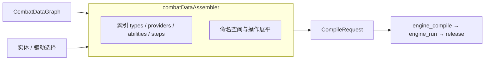

# 08 · 适配层编译规范（combat-data → CompileRequest）

> 上级索引：[README](./README.md)　|　上游：[系统总览](./01-系统总览.md)　|　相关：[前端](./02-前端设计.md)、[端到端示例](./07-端到端开发示例.md)
>
> 本章定义跨端契约链中段：如何把 **Public combat-data graph + 用户选择** 编译为通用引擎 **`CompileRequest`**，再经 `engine_compile` / `engine_run` / `engine_release_session` 执行。
>
> 实现锚点：`web/src/engine/combatDataAssembler.ts`、`genericEngineClient.ts`、`tinygoV2Bridge.ts`。

---

## 一、为什么需要这一层

配置分两层：

- **① 存储层**：PostgreSQL 最新主表 + Admin/Public combat-data API（实体、Provider、能力、效果步骤等）。
- **② 引擎层**：`CompileRequest`（及 Run 输入）——机器友好；**不含** REST 资源形状原样透传。

---

## 二、输入

### 2.1 `CombatDataGraph`

由 `combatDataLoader` / `combatDataClient` 聚合的只读图：entities、attribute/resource 值与阶段、providers 及其公式/修饰/监听/生命周期、abilities 与相位/费用/冷却、effect sequences/steps/details、types / type_relations、progression 等。

### 2.2 选择（验证页）

典型字段：`sourceEntityId`、`targetEntityId`，以及驱动计划（能力引用、优先级、时间轴）、采样与停止策略等（见 `WasmValidationGenericPage` 与 `types/genericEngine.ts`）。

---

## 三、输出：`CompileRequest`

- `schemaVersion`：通用契约版本（装配层默认与 Wasm `GenericSchemaVersion` 对齐，如 `generic-p0`）。
- 内容由 graph 展平：actors、providers、abilities、operations/modifiers/listeners、type catalog 等引擎所需结构。
- 会话签名：`computeSessionSignature` 用于缓存/复用 compile session。

具体字段以 `web/src/types/genericEngine.ts` 与 Wasm 模型为准；本章不复制引擎内部每个 Go struct。

---

## 四、ABI 调用顺序（当前唯一主路径）

| 步骤 | 导出 | 封装 |
|------|------|------|
| 1 | `engine_compile` | `genericEngineClient.compile` / bridge `compile` |
| 2 | `engine_run` | `genericEngineClient.run` |
| 3 | `engine_release_session` | `genericEngineClient.releaseSession` |

辅助导出：`memory` / `alloc` / `dealloc` / outbox 指针族。frame magic 与 kind 常量见 `tinygoV2Bridge.ts`。

> 旧宿主导出（如 `engine_init` / `engine_begin_run` / `engine_step`）**不是**当前架构文档描述的主路径；通用验证页与 `smoke:wasm-generic` 只覆盖 compile/run/release。

---

## 五、关键规则（机制摘要）

1. **实体必须存在**：source/target 在 graph 中可解析，否则装配失败。
2. **Provider / 能力命名空间**：装配时避免跨实体 ID 冲突（见 assembler 内 namespacing）。
3. **效果步骤**：每个 step 恰好一个 detail；detail 键与后端 PUT 约束一致。
4. **类型目录**：从 `types` / `type_relations` 构建引擎 type catalog。
5. **Preflight / 空图**：无实体时验证页展示空态，不伪造后端数据。

完整分支与单测：`combatDataAssembler.test.ts`、`genericEngineClient.test.ts`。

---

## 六、与后端 / DB 的边界

| 层 | 负责 |
|----|------|
| DB / 后端 | 最新主表、`change_revision`、publish → `_log`；Public GET |
| 本层 | 只读 graph → CompileRequest；不写 Admin |
| Wasm | 解释 CompileRequest；确定性运行 |

发布**不会**产出供本层直接消费的全量 Bundle JSON；本层始终从 combat-data 最新图装配。

---

## 七、文件索引

| 文件 | 职责 |
|------|------|
| `combatDataAssembler.ts` | 装配 CompileRequest / RunRequest / scenario |
| `genericEngineClient.ts` | 会话级 compile/run/release |
| `tinygoV2Bridge.ts` | frame + 导出绑定 |
| `combatDataLoader.ts` | revision-safe 拉图 + 缓存 |
| `WasmValidationGenericPage.tsx` | UI 编排 |
